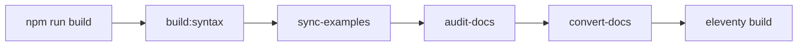

# Website Update Strategic Plan

## Overview
This document outlines the remaining tasks and implementation strategy for updating the Mlld website to use our new syntax highlighting system and modernized examples.

## Completed Items ✅
- **Prism.js Integration**: Integrated with auto-generated Mlld syntax highlighting
- **Eleventy Shortcodes**: Added `` for inline highlighting and `` for blocks
- **Build Process**: Automated copying of generated syntax files to website via `npm run build:syntax`
- **Markdown Support**: Code blocks with ` ```mlld ` automatically highlighted

## Remaining Tasks 📋

### 1. Landing Page Examples as Components (Priority: High)

#### Goal
Replace hardcoded HTML examples with reusable Mlld file components that are automatically highlighted.

#### Structure
```
website/src/
  _data/
    examples.js          # Eleventy data file to load examples
  _includes/
    components/
      mlld-example.njk   # Reusable example component
  examples/
    code-review.mld      # Actual Mlld example files
    code-review.meta.yml # Metadata (title, description, order)
    prompt-chain.mld
    prompt-chain.meta.yml
```

#### Implementation

**Data File** (`website/src/_data/examples.js`):
```javascript
const fs = require('fs').promises;
const path = require('path');
const yaml = require('js-yaml');

module.exports = async function() {
  const examplesDir = path.join(__dirname, '../examples');
  const files = await fs.readdir(examplesDir);
  
  const examples = {};
  
  for (const file of files) {
    if (file.endsWith('.mld')) {
      const name = path.basename(file, '.mld');
      const code = await fs.readFile(path.join(examplesDir, file), 'utf8');
      
      // Load metadata if exists
      let meta = {};
      try {
        const metaContent = await fs.readFile(
          path.join(examplesDir, `${name}.meta.yml`), 
          'utf8'
        );
        meta = yaml.load(metaContent);
      } catch (e) {
        // No metadata file
      }
      
      examples[name] = {
        name,
        code,
        ...meta
      };
    }
  }
  
  return examples;
};
```

**Component** (`website/src/_includes/components/mlld-example.njk`):
```njk
<div class="example-container">
  
  <div class="example-header">
    <h4>{{ example.title }}</h4>
    
    <p>{{ example.description }}</p>
    
  </div>
  
  
  <div class="example-code">
    
  </div>
  
  
  <div class="example-output">
    <h5>Output:</h5>
    <pre><code>{{ example.output }}</code></pre>
  </div>
  
  
  
  <aside class="example-note">
    {{ example.note | markdownify }}
  </aside>
  
</div>
```

**Usage in Templates**:
```njk
<!-- In index.njk -->


```

### 2. Update Website Examples from Test Cases (Priority: High)

#### Goal
Synchronize website examples with the canonical examples in `tests/cases/EXAMPLES.md`.

#### Implementation

**Sync Script** (`website/src/sync-examples.js`):
```javascript
const fs = require('fs').promises;
const path = require('path');

async function parseExamplesMarkdown() {
  const content = await fs.readFile(
    path.join(__dirname, '../../tests/cases/EXAMPLES.md'), 
    'utf8'
  );
  
  const examples = [];
  const sections = content.split(/^##\s+/m);
  
  for (const section of sections) {
    const lines = section.split('\n');
    const category = lines[0]?.trim();
    
    // Parse input/output pairs
    let currentExample = {};
    for (let i = 0; i < lines.length; i++) {
      if (lines[i].includes('**Input:**')) {
        // Extract code block
        const codeStart = lines.findIndex((l, idx) => idx > i && l.startsWith('```mlld'));
        const codeEnd = lines.findIndex((l, idx) => idx > codeStart && l.startsWith('```'));
        currentExample.input = lines.slice(codeStart + 1, codeEnd).join('\n');
      }
      
      if (lines[i].includes('**Expected Output:**')) {
        // Extract output
        const outStart = lines.findIndex((l, idx) => idx > i && l.startsWith('```'));
        const outEnd = lines.findIndex((l, idx) => idx > outStart && l.startsWith('```'));
        currentExample.output = lines.slice(outStart + 1, outEnd).join('\n');
        
        // Save example
        if (currentExample.input) {
          examples.push({
            category,
            ...currentExample
          });
          currentExample = {};
        }
      }
    }
  }
  
  return examples;
}

async function generateWebsiteExamples() {
  const examples = await parseExamplesMarkdown();
  const outputDir = path.join(__dirname, 'examples/reference');
  
  // Ensure directory exists
  await fs.mkdir(outputDir, { recursive: true });
  
  // Group by category and generate files
  for (const example of examples) {
    const filename = `${example.category}-${examples.indexOf(example)}.mld`;
    await fs.writeFile(
      path.join(outputDir, filename),
      example.input
    );
    
    // Generate metadata
    const meta = {
      title: `${example.category} Example`,
      category: example.category,
      output: example.output
    };
    
    await fs.writeFile(
      path.join(outputDir, `${filename}.meta.yml`),
      yaml.dump(meta)
    );
  }
}

// Run if called directly
if (require.main === module) {
  generateWebsiteExamples().catch(console.error);
}
```

**Build Integration**:
```json
// website/package.json
{
  "scripts": {
    "sync-examples": "node src/sync-examples.js",
    "build": "npm run sync-examples && npm run convert-docs && eleventy",
    "dev": "npm run sync-examples && npm run convert-docs && eleventy --serve"
  }
}
```

### 3. Update Documentation Syntax (Priority: Medium)

#### Goal
Ensure all documentation files use current Mlld syntax.

#### Checklist
- [ ] Remove any `#{}` variable syntax (outdated)
- [ ] Remove any `${}` variable syntax (outdated)
- [ ] Ensure all variables use `{{var}}` in templates only
- [ ] Update `@embed` directive examples
- [ ] Update `@url` directive documentation (new)
- [ ] Verify all examples in `docs/directives/*.md`

#### Audit Script
```javascript
// website/src/audit-docs.js
const glob = require('glob');
const fs = require('fs').promises;

const outdatedPatterns = [
  /\#\{[^}]+\}/g,  // #{var} syntax
  /\$\{[^}]+\}/g,  // ${var} syntax
  /@define\s+\w+\s+=/g,  // Old @define syntax
];

async function auditDocs() {
  const files = glob.sync('../docs/**/*.md');
  const issues = [];
  
  for (const file of files) {
    const content = await fs.readFile(file, 'utf8');
    
    for (const pattern of outdatedPatterns) {
      const matches = content.match(pattern);
      if (matches) {
        issues.push({
          file,
          pattern: pattern.toString(),
          matches
        });
      }
    }
  }
  
  return issues;
}
```

### 4. Build Process Enhancement (Priority: Medium)

#### Goal
Streamline the build process to handle all updates automatically.

#### Enhanced Build Pipeline


#### Implementation
```javascript
// website/build.js
const { execSync } = require('child_process');

async function build() {
  console.log('🔨 Building Mlld syntax files...');
  execSync('npm run build:syntax', { stdio: 'inherit', cwd: '..' });
  
  console.log('📚 Syncing examples...');
  execSync('node src/sync-examples.js', { stdio: 'inherit' });
  
  console.log('🔍 Auditing documentation...');
  const issues = await require('./src/audit-docs')();
  if (issues.length > 0) {
    console.warn('⚠️  Found outdated syntax in docs:', issues);
  }
  
  console.log('📄 Converting documentation...');
  execSync('node src/convertDocs.js', { stdio: 'inherit' });
  
  console.log('🏗️  Building site with Eleventy...');
  execSync('eleventy', { stdio: 'inherit' });
  
  console.log('✅ Build complete!');
}

build().catch(console.error);
```

## Next Session Action Plan

### Phase 1: Review Current State (15 min)
1. Test current Prism.js integration
2. Verify syntax highlighting works in markdown
3. Check what examples need updating

### Phase 2: Implement Example Components (1 hour)
1. Create `_data/examples.js`
2. Build `mlld-example.njk` component
3. Convert landing page to use components
4. Test with a few examples

### Phase 3: Sync Test Examples (45 min)
1. Implement `sync-examples.js`
2. Parse `EXAMPLES.md`
3. Generate website example files
4. Integrate into build process

### Phase 4: Documentation Audit (30 min)
1. Run audit script
2. Fix outdated syntax
3. Update directive documentation
4. Verify all examples work

### Phase 5: Testing & Polish (30 min)
1. Full build test
2. Visual review of all pages
3. Fix any issues
4. Document the new process

## Success Criteria

- [ ] No hardcoded syntax examples in HTML
- [ ] All examples pulled from `.mld` files
- [ ] Examples automatically highlighted
- [ ] Documentation uses current syntax
- [ ] Build process is fully automated
- [ ] Examples stay in sync with test cases

## Technical Decisions

1. **Use Eleventy Data Files**: For loading examples dynamically
2. **YAML for Metadata**: Human-readable example descriptions
3. **Separate Example Files**: Easier to maintain and test
4. **Build-time Sync**: Examples updated during build, not runtime
5. **Component-based**: Reusable example rendering

This plan provides a clear path to modernize the website while maintaining our examples in a single source of truth.