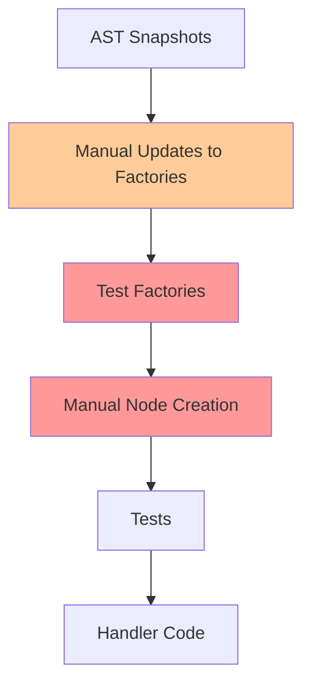
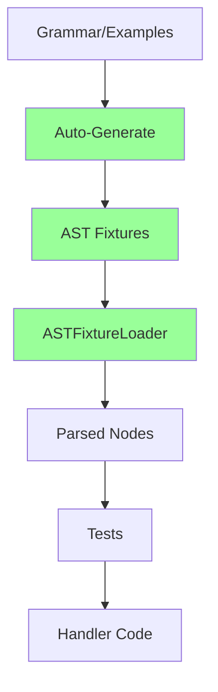
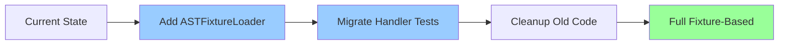

# Fixture Strategy Comparison

## Old Approach (Manual Test Factories)



**Problems:**
- Manual synchronization between snapshots and factories
- Error-prone node structure creation
- Tests drive handler implementation (backwards!)
- High maintenance burden

## New Approach (Fixture-Based)



**Benefits:**
- Single source of truth (fixtures)
- Automatic synchronization
- Real-world test cases
- Handlers drive tests (correct direction!)
- Low maintenance burden

## Migration Path



## Code Example: Before vs After

### Before (Manual Creation)
```typescript
// testFactories.ts
export function createTextDirective(options: TextDirectiveOptions) {
  return {
    type: 'Directive',
    kind: 'text',
    subtype: options.subtype,
    directive: {
      type: options.subtype,
      identifier: options.identifier,
      value: options.value // Wrong structure!
    }
    // ... lots of manual construction
  };
}

// In test
const node = createTextDirective({
  subtype: 'textAssignment',
  identifier: 'greeting',
  value: 'Hello'
});
```

### After (Fixture-Based)
```typescript
// In test
const loader = new ASTFixtureLoader();
const { ast } = await loader.parseFixture('text-assignment-1');
const node = ast[0] as DirectiveNode;

// Or for specific test case
const fixtures = loader.getFixturesByKindAndSubtype('text', 'assignment');
const testCase = fixtures.find(f => f.input.includes('greeting'));
```

## Test Coverage Comparison

### Old Approach
- Limited to manually created test cases
- May miss edge cases
- Drift from real usage over time

### New Approach
- Covers all fixtures automatically
- Real-world examples from documentation
- Stays in sync with grammar changes
- Can still create custom cases when needed

## Maintenance Effort

| Task | Old Approach | New Approach |
|------|-------------|--------------|
| Add new directive type | Update factories manually | Auto-generated from examples |
| Fix AST structure | Update all test factories | Update grammar, regenerate |
| Add test case | Write manual node creation | Add example, regenerate |
| Verify correctness | Compare with snapshots manually | Fixtures are source of truth |
| Update expectations | Change in multiple places | Update fixture expected value |

## Conclusion

The fixture-based approach transforms tests from a maintenance burden into a valuable asset that:
- Documents real usage
- Catches regressions
- Guides correct implementation
- Reduces developer friction