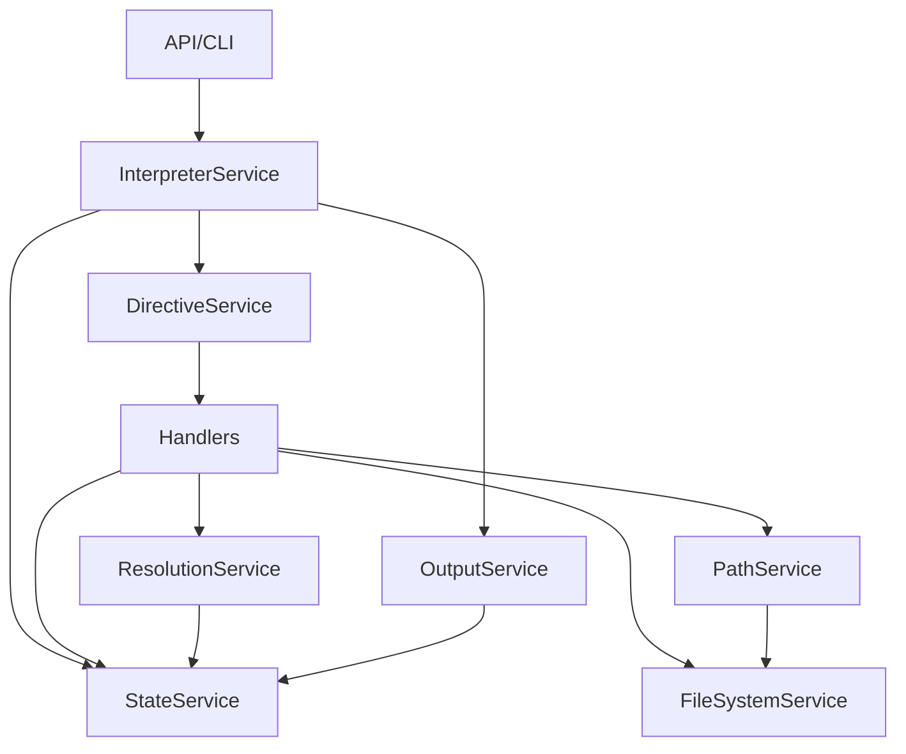

# Phase 1.1: Service Interface Analysis

## Service Dependency Graph



## Actual Method Usage by Service

### StateService (Currently ~50+ methods, Actually used: ~15)
**Core Operations**:
- `getVariable(name: string)` - Used by all handlers
- `setVariable(variable: MeldVariable)` - Used by all handlers
- `getCurrentFilePath()` / `setCurrentFilePath()` - File context
- `addNode(node: MeldNode)` - Building output
- `getTransformedNodes()` - For OutputService
- `createChildState()` / `mergeChildState()` - For imports
- `applyStateChanges()` - New pattern

**Transformation Mode**:
- `isTransformationEnabled()` / `setTransformationEnabled()`
- `transformNode(index, replacement)`

**Not Used**: Complex queries, section management, direct manipulation

### ResolutionService (Currently ~15 methods, Actually used: ~5)
**Core Operations**:
- `resolveNodes(nodes, context)` - Main workhorse
- `resolveInContext(value, context)` - String resolution
- `resolvePath(path, context)` - Path resolution
- `extractSection(content, section)` - Markdown sections

**Not Used**: Deprecated methods, validation, specific resolvers

### DirectiveService (Currently complex, Actually used: 2 methods)
- `handleDirective(node, context)` - Main dispatch
- `supportsDirective(kind)` - Capability check

### InterpreterService (Currently ~10 methods, Actually used: ~3)
- `interpret(nodes, options, state)` - Main entry
- `interpretNode(node, state, options)` - Single node
- `createChildContext()` - For imports

### OutputService (Currently ~8 methods, Actually used: 1)
- `convert(nodes, state, format, options)` - That's it!

### FileSystemService (Used by handlers)
- `readFile()` / `writeFile()`
- `executeCommand()` 
- `exists()` / `stat()`
- `getCwd()` / `dirname()`

## Data Flow Patterns

### 1. Handler Pattern
```typescript
// Current flow
Handler.handle(directive, state, context) {
  // 1. Extract values from directive AST
  // 2. Call services for resolution/execution
  // 3. Return StateChanges
  return { stateChanges: { variables: {...} } }
}
```

### 2. Resolution Pattern
```typescript
// Current flow
const context: ResolutionContext = {
  state,
  basePath: state.getCurrentFilePath(),
  currentFilePath: state.getCurrentFilePath()
};
const resolved = await resolutionService.resolveNodes(nodes, context);
```

### 3. State Management Pattern
```typescript
// New pattern
const changes = await handler.handle(directive, state, options);
await state.applyStateChanges(changes);
```

## Functionality That Belongs in Handlers

1. **Command Execution Logic**
   - Currently: FileSystemService.executeCommand()
   - Should be: RunHandler/ExecHandler handle command building

2. **Path Validation & Security**
   - Currently: PathService validates
   - Should be: PathHandler validates before setting

3. **Variable Type Validation**
   - Currently: Scattered across services
   - Should be: Each handler validates its own types

4. **Content Transformation**
   - Currently: Mixed between services
   - Should be: Handlers decide transformations

5. **Section Extraction**
   - Currently: ResolutionService.extractSection()
   - Should be: ImportHandler handles sections

## Key Insights

1. **Over-Engineering**: Most services have 3-5x more methods than actually used
2. **Wrong Abstraction**: Services contain business logic that belongs in handlers
3. **Circular Dependencies**: Services depend on each other in complex ways
4. **State Mutations**: Too many places can mutate state unpredictably

## Recommended Approach

1. **Minimal Interfaces**: Only include actually-used methods
2. **Handler Responsibility**: Move all directive-specific logic to handlers
3. **Immutable Flow**: State changes as data, not mutations
4. **Clear Boundaries**: Services coordinate, handlers implement