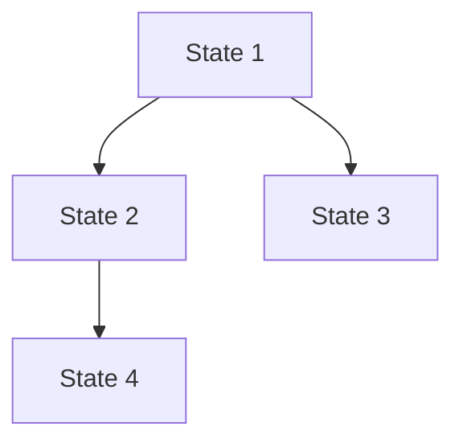
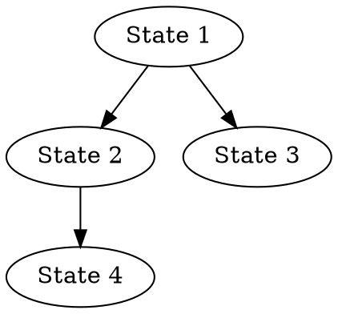

# REQUIRED READING:

## === KEY DOCS ====================

# Meld Architecture

## IMPORTANT

Meld has an incredibly robust architecture.

KEY PRINCIPLE: If something ideally _should_ be abstracted out in a clean way in an ideal case, it likely _already is_. So don't assume it's not and reimplement work and add complexity that might have already be handled by another part of the codebase.

## INTRODUCTION

Meld is a specialized, directive-based scripting language designed for embedding small "@directives" inside an otherwise plain text (e.g., Markdown-like) document. The code in this repository implements:

• Meld grammar rules and token types (e.g., text directives, path directives, data directives).
• The parsing layer that converts Meld content into an AST (Abstract Syntax Tree).
• A directive interpretation layer that processes these AST nodes and manipulates internal "states" to store variables and more.
• A resolution layer to handle variable references, path expansions, data manipulations, etc.
• Testing utilities and an in-memory FS (memfs) to simulate filesystems for thorough testing.

The main idea:
1. Meld code is parsed to an AST.
2. Each directive node is validated and interpreted, updating a shared "state" (variables, data structures, commands, etc.).
3. Optional transformations (e.g., output formatting) generate final representations (Markdown, LLM-friendly XML, etc.).

Below is an overview of the directory and service-level architecture, referencing code from this codebase.

## DIRECTORY & FILE STRUCTURE

At a high level, the project is arranged as follows (select key entries included):

project-root/
 ├─ api/                    ← High-level API and tests
 │   ├─ api.test.ts
 │   └─ index.ts
 ├─ bin/                    ← CLI entry point
 │   └─ meld.ts
 ├─ cli/                    ← CLI implementation
 │   ├─ cli.test.ts
 │   └─ index.ts
 ├─ core/                   ← Core utilities and types
 │   ├─ config/            ← Configuration (logging, etc.)
 │   ├─ errors/            ← Error class definitions
 │   │   ├─ MeldError.ts
 │   │   ├─ ServiceInitializationError.ts   ← Service initialization errors
 │   │   └─ ... other errors
 │   ├─ types/             ← Core type definitions
 │   │   ├─ dependencies.ts  ← Service dependency definitions
 │   │   └─ index.ts
 │   └─ utils/             ← Logging and utility modules
 │       ├─ logger.ts
 │       ├─ serviceValidation.ts  ← Service validation utilities
 │       └─ simpleLogger.ts
 ├─ services/              ← Core service implementations
 │   ├─ pipeline/          ← Main transformation pipeline
 │   │   ├─ ParserService/     ← Initial parsing
 │   │   ├─ InterpreterService/← Pipeline orchestration
 │   │   ├─ DirectiveService/  ← Directive handling
 │   │   │   ├─ handlers/
 │   │   │   │   ├─ definition/   ← Handlers for definition directives
 │   │   │   │   └─ execution/    ← Handlers for execution directives
 │   │   │   └─ errors/
 │   │   └─ OutputService/    ← Final output generation
 │   ├─ state/             ← State management
 │   │   ├─ StateService/      ← Core state management
 │   │   └─ StateEventService/ ← Core event system
 │   ├─ resolution/        ← Resolution and validation
 │   │   ├─ ResolutionService/ ← Variable/path resolution
 │   │   ├─ ValidationService/ ← Directive validation
 │   │   └─ CircularityService/← Circular dependency detection
 │   ├─ fs/                ← File system operations
 │   │   ├─ FileSystemService/ ← File operations
 │   │   ├─ PathService/      ← Path handling
 │   │   └─ PathOperationsService/ ← Path utilities
 │   └─ cli/               ← Command line interface
 │       └─ CLIService/    ← CLI entry point
 ├─ tests/                  ← Test infrastructure
 │   ├─ fixtures/          ← Test fixture data
 │   ├─ mocks/             ← Test mock implementations
 │   └─ utils/             ← Test utilities and helpers
 │       ├─ debug/         ← Test debug utilities
 │       │   ├─ StateDebuggerService/
 │       │   ├─ StateVisualizationService/
 │       │   ├─ StateHistoryService/
 │       │   └─ StateTrackingService/
 │       ├─ FixtureManager.ts
 │       ├─ MemfsTestFileSystem.ts
 │       ├─ ProjectBuilder.ts
 │       ├─ TestContext.ts
 │       └─ TestSnapshot.ts
 ├─ docs/                   ← Documentation
 ├─ package.json
 ├─ tsconfig.json
 ├─ tsup.config.ts
 └─ vitest.config.ts

Key subfolders:
• services/pipeline/: Core transformation pipeline services (parsing, interpretation, directives, output)
• services/state/: State management and event services
• services/resolution/: Resolution, validation, and circularity detection services
• services/fs/: File system, path handling, and operations services
• services/cli/: Command line interface services
• core/: Central types, errors, and utilities used throughout the codebase
• tests/utils/: Test infrastructure including debug utilities, memfs implementation, fixture management, and test helpers
• api/: High-level public API for using Meld programmatically
• cli/: Command line interface for Meld

## CORE LIBRARIES & THEIR ROLE

### meld-ast
   • parse(content: string): MeldNode[]
   • Basic parsing that identifies directives vs. text nodes.
   • Produces an AST which other services manipulate.

### llmxml
   • Converts content to an LLM-friendly XML format or can parse partially.
   • OutputService may call it if user requests "llm" format.

### meld-spec
   • Contains interface definitions for MeldNode, DirectiveNode, TextNode, etc.
   • Contains directive kind enumerations.

## HIGH-LEVEL FLOW

Below is a simplified flow of how Meld content is processed:

   ┌─────────────────────────────┐
   │   Meld Source Document      │
   └─────────────────────────────┘
                │
                ▼
   ┌─────────────────────────────┐
   │ ParserService.parse(...)    │
   │   → uses meld-ast to parse  │
   └─────────────────────────────┘
                │ AST (MeldNode[])
                ▼
   ┌─────────────────────────────────────────────────┐
   │ InterpreterService.interpret(nodes, options)    │
   │   → For each node, pass to DirectiveService     │
   │   → Handles node transformations                │
   └─────────────────────────────────────────────────┘
                │
                ▼
   ┌──────────────────────────────────────────┐
   │ DirectiveService                         │
   │   → Routes to correct directive handler  │
   │   → Handlers can provide replacements    │
   └──────────────────────────────────────────┘
                │
                ▼
   ┌───────────────────────────────────────────────┐
   │ StateService + ResolutionService + Others     │
   │   → Stores variables and transformed nodes    │
   │   → Path expansions, data lookups, etc.       │
   └───────────────────────────────────────────────┘
                │
                ▼
   ┌──────────────────────────────────────────┐
   │ OutputService                            │
   │   → Uses transformed nodes for output    │
   │   → Generates clean, directive-free      │
   │     markdown, LLM XML, or other formats  │
   └──────────────────────────────────────────┘

## MAJOR SERVICES (OVERVIEW)

Below are the key "services" in the codebase. Each follows the single responsibility principle:

### CLIService
   - Provides command-line interface for running Meld
   - Handles file watching and reprocessing
   - Manages format selection and output options
   - Routes to appropriate services based on CLI flags

### ParserService
   - Wraps the meld-ast parse(content) function
   - Adds location information with file paths (parseWithLocations)
   - Produces an array of MeldNode objects

### DirectiveService
   - Routes directives to the correct directive handler
   - Validates directives using ValidationService
   - Calls ResolutionService for variable resolution
   - Updates StateService with directive execution results
   - Supports node transformation through DirectiveResult interface
   - Handlers can provide replacement nodes for transformed output

### InterpreterService
   - Orchestrates the main interpret(nodes) pipeline
   - For each AST node:
       a) If it's text, store it or pass it along
       b) If it's a directive:
          - Calls DirectiveService for processing
          - Handles node transformations if provided
          - Updates state with transformed nodes
   - Maintains the top-level process flow
   - Supports transformation mode through feature flags

### StateService
   - Stores variables in maps:
       • textVars (for @text)
       • dataVars (for @data)
       • pathVars (for @path)
       • commands (for @define)
   - Tracks both original and transformed MeldNodes
   - Provides transformation capabilities for directive processing
   - Maintains transformation state during cloning
   - Provides child states for nested imports
   - Supports immutability toggles

### ResolutionService
   - Handles all variable interpolation:
       • Variables ("{{var}}", "{{data.field}}")
       • Path expansions ("$HOMEPATH/path")
       • Command references
   - Context-aware resolution
   - Circular reference detection
   - Sub-fragment parsing support

### CircularityService
   - Prevents infinite import loops
   - Detects circular variable references
   - Maintains dependency graphs

### PathService
   - Validates and normalizes paths
   - Enforces path security constraints
   - Handles path joining and manipulation
   - Supports test mode for path operations

### ValidationService
   - Validates directive syntax and constraints
   - Provides extensible validator registration
   - Throws MeldDirectiveError on validation failures
   - Tracks available directive kinds

###  FileSystemService
    - Abstracts file operations (read, write)
    - Supports both real and test filesystems
    - Handles path resolution and validation

### OutputService
    - Converts final AST and state to desired format
    - Uses transformed nodes when available
    - Supports markdown and LLM XML output
    - Integrates with llmxml for LLM-friendly formatting
    - Handles format-specific transformations
    - Provides clean output without directive definitions

## TESTING INFRASTRUCTURE

All tests are heavily reliant on a memory-based filesystem (memfs) for isolation and speed. The major testing utilities include:

### MemfsTestFileSystem
   – Thin wrapper around memfs
   – Offers readFile, writeFile, mkdir, etc. with in-memory data
   – Provides an ephemeral environment for all test IO

### TestContext
   – Central test harness that creates a new MemfsTestFileSystem
   – Provides references to all major services (ParserService, DirectiveService, etc.)
   – Allows writing files, snapshotting the FS, and comparing

### TestSnapshot
   – Takes "snapshots" of the current Memfs FS, storing a Map<filePath, content>
   – Compares snapshots to detect added/removed/modified files

### ProjectBuilder
   – Creates mock "projects" in the in-memory FS from JSON structure
   – Useful for complex, multi-file tests or large fixture-based testing

### Node Factories
   – Provides helper functions for creating AST nodes in tests
   – Supports creating directive, text, and code fence nodes
   – Includes location utilities for source mapping

Testing Organization:
• tests/utils/: Core test infrastructure (MemFS, snapshots, contexts)
• tests/mocks/: Minimal mocks and test doubles
• tests/fixtures/: JSON-based test data
• tests/services/: Service-specific integration tests

Testing Approach:
• Each test uses a fresh TestContext or recreates MemfsTestFileSystem
• Direct imports from core packages (meld-ast, meld-spec) for types
• Factory functions for creating test nodes and data
• Snapshots for tracking filesystem changes

## DEBUGGING INFRASTRUCTURE

The codebase includes specialized debugging services located in `tests/utils/debug/` that help diagnose and troubleshoot state-related issues:

### StateDebuggerService
   - Provides debug session management and diagnostics
   - Tracks state operations and transformations
   - Offers operation tracing and analysis
   - Helps identify state manipulation issues

### StateVisualizationService
   - Generates visual representations of state
   - Creates Mermaid/DOT graphs of state relationships
   - Visualizes state metrics and transformations
   - Aids in understanding complex state changes

### StateHistoryService
   - Records chronological state changes
   - Maintains operation history
   - Tracks transformation chains
   - Enables state change replay and analysis

### StateTrackingService
   - Monitors state relationships and dependencies
   - Tracks state lineage and inheritance
   - Records metadata about state changes
   - Helps debug scope and inheritance issues

Debugging Approach:
• Services can be enabled selectively in tests
• Debug output includes detailed state snapshots
• Visual representations help understand complex states
• History tracking enables step-by-step analysis

These debugging services are particularly useful for:
• Troubleshooting complex state transformations
• Understanding directive processing chains
• Analyzing variable resolution paths
• Debugging scope inheritance issues
• Visualizing state relationships

## SERVICE RELATIONSHIPS

Services in Meld follow a strict initialization order and dependency graph:

1. Base Services:
   - FileSystemService (no dependencies)
   - PathService (depends on FS)

2. State Management:
   - StateEventService (no dependencies)
   - StateService (depends on events)

3. Core Pipeline:
   - ParserService (independent)
   - ResolutionService (depends on State, FS)
   - ValidationService (depends on Resolution)
   - CircularityService (depends on Resolution)

4. Pipeline Orchestration:
   - DirectiveService (depends on multiple services)
   - InterpreterService (orchestrates others)

5. Output Generation:
   - OutputService (depends on State)

6. Debug Support:
   - DebuggerService (optional, depends on all)

Service initialization and validation is handled through the core/types/dependencies.ts system,
which ensures services are created in the correct order and all dependencies are satisfied.

## EXAMPLE USAGE SCENARIO

1) Input: A .meld file with lines like:
   @text greeting = "Hello"
   @data config = { "value": 123 }
   @import [ path = "other.meld" ]

2) We load the file from disk.
3) ParserService → parse the content → AST.
4) InterpreterService → interpret(AST).
   a) For each directive, DirectiveService → validation → resolution → update StateService.
   b) If an import is encountered, CircularityService ensures no infinite loops.
5) Once done, the final StateService has textVars.greeting = "Hello", dataVars.config = { value: 123 }, etc.
6) OutputService can generate the final text or an LLM-XML representation.

## ERROR HANDLING

• MeldDirectiveError thrown if a directive fails validation or interpretation.
• MeldParseError if the parser cannot parse content.
• PathValidationError for invalid paths.
• ResolutionError for variable resolution issues.
• MeldError as a base class for other specialized errors.

These errors typically bubble up to the caller or test.

## CONCLUSION

This codebase implements the entire Meld language pipeline:
• Parsing Meld documents into an AST.
• Validating & interpreting directives.
• Storing data in a hierarchical state.
• Resolving references (text, data, paths, commands).
• (Optionally) generating final formatted output.

Plus, it has a robust test environment with an in-memory FS, snapshots, and a test harness (TestContext) for integration and unit tests. Everything is layered to keep parsing, state management, directive logic, and resolution separate, adhering to SOLID design principles.

The ASCII diagrams, modules, and file references in this overview represent the CURRENT code as it is: multiple specialized services collaborating to parse and interpret Meld scripts thoroughly—test coverage is facilitated by the in-memory mocking and snapshot-based verification.

# Meld Pipeline Flow

## Overview

The Meld pipeline processes `.meld` files through several stages to produce either `.xml` or `.md` output. Here's a detailed look at how it works:

```ascii
┌─────────────┐     ┌─────────────┐     ┌──────────────┐     ┌──────────────┐
│  Service    │     │   Service   │     │   Pipeline   │     │    Final     │
│Initialization├────►│ Validation  ├────►│  Execution   ├────►│   Output     │
└─────────────┘     └─────────────┘     └──────────────┘     └──────────────┘
      │                    │                    │                    │
      ▼                    ▼                    ▼                    ▼
┌─────────────┐     ┌─────────────┐     ┌──────────────┐     ┌──────────────┐
│Dependencies │     │Validate All │     │Process Input │     │Generate Clean│
│  Resolved   │     │ Services    │     │   Content    │     │   Output    │
└─────────────┘     └─────────────┘     └──────────────┘     └──────────────┘
```

## Service Organization

The pipeline is organized into logical service groups, with strict initialization order and dependency validation:

### Pipeline Services (services/pipeline/)
```ascii
┌─────────────┐     ┌─────────────┐     ┌──────────────┐     ┌──────────────┐
│   Parser    │     │  Directive  │     │ Interpreter  │     │   Output     │
│   Service   ├────►│   Service   ├────►│   Service    ├────►│   Service    │
└─────────────┘     └─────────────┘     └──────────────┘     └──────────────┘
      │                    │                    │                    │
      ▼                    ▼                    ▼                    ▼
┌─────────────┐     ┌─────────────┐     ┌──────────────┐     ┌──────────────┐
│Initialize & │     │Validate &   │     │Transform &   │     │Format &     │
│  Validate   │     │Process Dirs │     │Update State  │     │Generate Out │
└─────────────┘     └─────────────┘     └──────────────┘     └──────────────┘
```

### State Services (services/state/)
```ascii
┌─────────────┐     ┌─────────────┐
│    State    │     │    State    │
│   Service   ├────►│    Event    │
└─────────────┘     │   Service   │
                    └─────────────┘
```

### Resolution Services (services/resolution/)
```ascii
┌─────────────┐     ┌─────────────┐     ┌──────────────┐
│ Resolution  │     │ Validation  │     │ Circularity  │
│   Service   ├────►│   Service   ├────►│   Service    │
└─────────────┘     └─────────────┘     └──────────────┘
```

### File System Services (services/fs/)
```ascii
┌─────────────┐     ┌─────────────┐     ┌──────────────┐
│    File     │     │    Path     │     │     Path     │
│   System    ├────►│   Service   ├────►│  Operations  │
│   Service   │     │             │     │   Service    │
└─────────────┘     └─────────────┘     └──────────────┘
```

## Detailed Flow

1. **Service Initialization** (`core/types/dependencies.ts`)
   ```ascii
   ┌─────────────┐
   │Load Service │
   │Dependencies │
   └─────┬───────┘
         │
         ▼
   ┌─────────────┐
   │Initialize in│
   │   Order    │
   └─────┬───────┘
         │
         ▼
   ┌─────────────┐
   │  Validate   │
   │  Services   │
   └─────────────┘
   ```
   - Resolves service dependencies
   - Initializes in correct order
   - Validates service configuration
   - Enables transformation if requested

2. **Input Processing** (`CLIService`)
   - User runs `meld prompt.meld`
   - `CLIService` handles command line options
   - Default output is `.xml` format
   - Can specify `--format markdown` for `.md` output
   - Supports `--stdout` for direct console output

3. **Parsing** (`ParserService`)
   ```ascii
   ┌─────────────┐
   │  Raw Text   │
   │   Input     │
   └─────┬───────┘
         │
         ▼
   ┌─────────────┐
   │  meld-ast   │
   │   Parser    │
   └─────┬───────┘
         │
         ▼
   ┌─────────────┐
   │ MeldNode[]  │
   │    AST      │
   └─────────────┘
   ```
   - Reads the input file content
   - Parses into AST using `meld-ast`
   - Identifies directives and text nodes
   - Adds source location information

4. **Interpretation** (`InterpreterService`)
   ```ascii
   ┌─────────────┐     ┌─────────────┐
   │  MeldNode[] │     │  Directive  │
   │     AST     ├────►│   Service   │
   └─────────────┘     └──────┬──────┘
                              │
                              ▼
   ┌─────────────┐     ┌─────────────┐
   │ Resolution  │◄────┤   Handler   │
   │   Service   │     │(with node   │
   └──────┬──────┘     │replacements)│
          │            └─────────────┘
          ▼
   ┌─────────────┐
   │    State    │
   │   Service   │
   │(Original &  │
   │Transformed) │
   └─────────────┘
   ```
   - Processes each AST node sequentially
   - Routes directives to appropriate handlers
   - Handlers can provide replacement nodes
   - Maintains both original and transformed states
   - Resolves variables and references
   - Handles file imports and embedding

5. **Output Generation** (`OutputService`)
   ```ascii
   ┌─────────────┐     ┌─────────────┐
   │Transformed  │     │   Format    │
   │  Nodes &    ├────►│  Converter  │
   │   State     │     └──────┬──────┘
                              │
                              ▼
   ┌─────────────┐     ┌─────────────┐
   │Clean Output │◄────┤  Formatted  │
   │(No Directive│     │   Output    │
   │Definitions) │     └─────────────┘
   └─────────────┘
   ```
   - Takes transformed nodes and state
   - Converts to requested format:
     - `llm`: Uses `llmxml` library for LLM-friendly XML
     - `markdown`: Clean markdown without directive definitions
   - Writes output to file or stdout

## Transformation Mode and Variable Resolution

When transformation mode is enabled, the pipeline handles directives and variables in a special way. Understanding this flow is critical for debugging and enhancing directive handlers:

```ascii
┌─────────────┐     ┌─────────────┐     ┌──────────────┐     ┌──────────────┐
│  Directive  │     │Interpretation│     │   State      │     │   Output     │
│  Handlers   ├────►│  & Node     ├────►│  Variable    ├────►│  Generation  │
│(with replace│     │Transformation│     │  Resolution  │     │              │
│  nodes)     │     │              │     │              │     │              │
└─────────────┘     └─────────────┘     └──────────────┘     └──────────────┘
```

### Key Transformation Pipeline Concepts

1. **Directive Handler Replacement Nodes**
   - Directive handlers can return replacement nodes when in transformation mode
   - The InterpreterService must properly apply these replacements in the transformed nodes array
   - For import directives, the replacement is typically an empty text node
   - For embed directives, the replacement node contains the embedded content

2. **State Propagation Across Boundaries**
   - Variables must be explicitly copied between parent and child states
   - When importing files, variables must be copied from imported state to parent state
   - The ImportDirectiveHandler must ensure all variable types (text, data, path, commands) are copied

3. **Variable Resolution Process**
   - Variables can be resolved at multiple stages:
     - During directive processing
     - During node transformation
     - During final output generation
     - During post-processing in the main function
   - The OutputService's nodeToMarkdown method handles variable reference resolution in text nodes
   - A final variable resolution pass in the main function ensures any remaining references are resolved

4. **State Management for Transformation**
   - The StateService maintains both original and transformed node arrays
   - Transformed nodes must be explicitly initialized
   - The transformNode method is used to replace directive nodes with their outputs
   - State must keep track of transformation options to determine which directives to transform

## Service Responsibilities

### Pipeline Services

1. **ParserService** (`services/pipeline/ParserService/`)
   - Wraps meld-ast parser
   - Produces AST nodes
   - Adds file location information

2. **InterpreterService** (`services/pipeline/InterpreterService/`)
   - Orchestrates directive processing
   - Handles node transformations
   - Maintains interpretation state
   - Handles imports and embedding
   - **Critical for transformation:** Applies directive handler replacement nodes to transformed node array
   - **State propagation:** Ensures proper variable inheritance between parent and child states

3. **DirectiveService** (`services/pipeline/DirectiveService/`)
   - Routes directives to handlers
   - Validates directive syntax
   - Supports node transformation
   - Updates state based on directive results
   - **Directive handlers:** Can return replacement nodes in transformation mode
   - **Handler context:** Includes parent state for proper variable propagation

4. **OutputService** (`services/pipeline/OutputService/`)
   - Uses transformed nodes for clean output
   - Supports markdown and LLM XML
   - Generates directive-free output
   - Handles formatting options
   - **Variable resolution:** Resolves variable references in text nodes during output generation
   - **Transformation handling:** Uses special processing for variable references in transformation mode

### State Services

1. **StateService** (`services/state/StateService/`)
   - Stores variables and commands
   - Maintains original and transformed nodes
   - Manages scope and inheritance
   - Tracks file dependencies
   - **Transformation support:** Keeps track of both original and transformed node arrays
   - **Variable copying:** Must explicitly copy variables between parent and child states
   - **Transformation options:** Supports selective transformation of different directive types

2. **StateEventService** (`services/state/StateEventService/`)
   - Handles state change events
   - Manages state updates
   - Provides event hooks
   - Supports state tracking

### Resolution Services

1. **ResolutionService** (`services/resolution/ResolutionService/`)
   - Resolves variables and references
   - Handles path expansions
   - Manages circular dependencies

2. **ValidationService** (`services/resolution/ValidationService/`)
   - Validates directive syntax and constraints
   - Provides extensible validator registration
   - Throws MeldDirectiveError on validation failures
   - Tracks available directive kinds

3. **CircularityService** (`services/resolution/CircularityService/`)
   - Prevents infinite import loops
   - Detects circular variable references
   - Maintains dependency graphs

### File System Services

1. **FileSystemService** (`services/fs/FileSystemService/`)
   - Abstracts file operations (read, write)
   - Supports both real and test filesystems
   - Handles path resolution and validation

2. **PathService** (`services/fs/PathService/`)
   - Validates and normalizes paths
   - Enforces path security constraints
   - Handles path joining and manipulation
   - Supports test mode for path operations

3. **PathOperationsService** (`services/fs/PathOperationsService/`)
   - Handles complex path operations
   - Provides path utilities
   - Manages path transformations

# State Visualization System

## Overview

The State Visualization System provides comprehensive visualization capabilities for Meld's state management system. It enables developers to:

- Visualize state hierarchies and relationships
- Track state transformations over time
- Generate timeline views of state operations
- Calculate and monitor system metrics

## Core Components

### 1. Hierarchy Visualization

Generate hierarchical views of state relationships in multiple formats:

```typescript
const vis = new StateVisualizationService(historyService, trackingService);

// Generate Mermaid diagram
const mermaidDiagram = vis.generateHierarchyView('rootStateId', {
  format: 'mermaid',
  includeMetadata: true,
});

// Generate DOT graph
const dotGraph = vis.generateHierarchyView('rootStateId', {
  format: 'dot',
  includeMetadata: true,
});
```

### 2. Transition Diagrams

Visualize state transformations and their effects:

```typescript
const transitionDiagram = vis.generateTransitionDiagram('stateId', {
  format: 'mermaid',
  includeTimestamps: true,
});
```

### 3. Relationship Graphs

Generate comprehensive views of state relationships:

```typescript
const relationshipGraph = vis.generateRelationshipGraph(['stateId1', 'stateId2'], {
  format: 'mermaid',
  includeMetadata: true,
});
```

### 4. Timeline Views

Create temporal views of state operations:

```typescript
const timeline = vis.generateTimeline(['stateId1', 'stateId2'], {
  format: 'mermaid',
  includeTimestamps: true,
});
```

### 5. Metrics Calculation

Monitor system metrics and state usage:

```typescript
const metrics = vis.getMetrics({
  start: Date.now() - 3600000, // Last hour
  end: Date.now(),
});
```

## Resource Management

### Memory Considerations

The visualization system is designed to be memory-efficient, but there are some important considerations:

1. **History Storage**
   - Operation history is stored in memory
   - Each operation typically consumes ~100-200 bytes
   - Consider clearing old history periodically using `historyService.clearHistoryBefore()`

2. **Visualization Generation**
   - Graph generation is done on-demand
   - Large graphs (>1000 nodes) may require significant memory
   - Consider limiting the scope of visualizations for large state trees

3. **Best Practices**
   - Generate visualizations only when needed
   - Use time ranges to limit data scope
   - Clear old history data periodically
   - Consider using pagination for large datasets

Example of managing history data:

```typescript
// Clear history older than 24 hours
const oneDayAgo = Date.now() - 24 * 60 * 60 * 1000;
historyService.clearHistoryBefore(oneDayAgo);

// Generate visualization with time range
const recentGraph = vis.generateRelationshipGraph(['stateId'], {
  format: 'mermaid',
  timeRange: {
    start: Date.now() - 3600000, // Last hour
    end: Date.now(),
  },
});
```

## Styling and Customization

### Node Styling

Customize node appearance using the `styleNodes` option:

```typescript
const graph = vis.generateRelationshipGraph(['stateId'], {
  format: 'dot',
  styleNodes: (metadata) => ({
    shape: metadata.source === 'merge' ? 'diamond' : 'box',
    color: '#4CAF50',
    tooltip: `Created at: ${new Date(metadata.createdAt).toISOString()}`,
  }),
});
```

### Edge Styling

Customize edge appearance using the `styleEdges` option:

```typescript
const graph = vis.generateRelationshipGraph(['stateId'], {
  format: 'dot',
  styleEdges: (relationship) => ({
    style: relationship.type === 'merge-source' ? 'dashed' : 'solid',
    color: '#2196F3',
    tooltip: `Relationship: ${relationship.type}`,
  }),
});
```

## Output Formats

The system supports multiple output formats:

1. **Mermaid**
   - Markdown-friendly diagram format
   - Great for documentation
   - Easy to embed in GitHub/GitLab

2. **DOT**
   - GraphViz compatible
   - Highly customizable
   - Good for complex graphs

3. **JSON**
   - Machine-readable format
   - Useful for custom rendering
   - Can be transformed to other formats

## Performance Tips

1. **Limit Scope**
   - Use specific state IDs instead of entire trees
   - Apply time ranges to limit data
   - Filter unnecessary metadata

2. **Optimize Generation**
   - Generate visualizations on-demand
   - Cache results when appropriate
   - Use appropriate formats for the use case

3. **Monitor Usage**
   - Track metrics to understand system usage
   - Monitor memory consumption
   - Clear old data regularly

## Error Handling

The system includes robust error handling:

```typescript
try {
  const graph = vis.generateRelationshipGraph(['stateId'], {
    format: 'mermaid',
  });
} catch (error) {
  if (error.message.includes('Unsupported format')) {
    // Handle format error
  } else if (error.message.includes('State not found')) {
    // Handle missing state
  } else {
    // Handle other errors
  }
}
```

## Integration Examples

### 1. Debug View Integration

```typescript
function createDebugView(stateId: string) {
  const hierarchy = vis.generateHierarchyView(stateId, {
    format: 'mermaid',
    includeMetadata: true,
  });

  const timeline = vis.generateTimeline([stateId], {
    format: 'mermaid',
    includeTimestamps: true,
  });

  return `
## State Debug View
### Hierarchy
\`\`\`mermaid
${hierarchy}
\`\`\`

### Timeline
\`\`\`mermaid
${timeline}
\`\`\`
  `;
}
```

### 2. Metrics Dashboard

```typescript
function generateMetricsDashboard() {
  const hourlyMetrics = vis.getMetrics({
    start: Date.now() - 3600000,
    end: Date.now(),
  });

  return {
    totalStates: hourlyMetrics.totalStates,
    statesByType: hourlyMetrics.statesByType,
    avgTransformations: hourlyMetrics.averageTransformationsPerState,
    maxChainLength: hourlyMetrics.maxTransformationChainLength,
    treeDepth: hourlyMetrics.maxTreeDepth,
  };
}
```

# State Visualization System API Documentation

## Overview

The State Visualization System provides a comprehensive API for visualizing and analyzing state operations, relationships, and metrics in the Meld system.

## Core Services

### StateVisualizationService

The main service for generating visualizations and calculating metrics.

```typescript
class StateVisualizationService {
  constructor(
    historyService: StateHistoryService,
    trackingService: StateTrackingService
  );

  // Hierarchy Visualization
  generateHierarchyView(
    rootStateId: string,
    options: {
      format: 'mermaid' | 'dot' | 'json';
      includeMetadata?: boolean;
    }
  ): string;

  // Transition Diagrams
  generateTransitionDiagram(
    stateId: string,
    options: {
      format: 'mermaid' | 'dot' | 'json';
      includeTimestamps?: boolean;
    }
  ): string;

  // Relationship Graphs
  generateRelationshipGraph(
    stateIds: string[],
    options: {
      format: 'mermaid' | 'dot' | 'json';
      includeMetadata?: boolean;
      timeRange?: {
        start: number;
        end: number;
      };
    }
  ): string;

  // Timeline Views
  generateTimeline(
    stateIds: string[],
    options: {
      format: 'mermaid' | 'dot' | 'json';
      includeTimestamps?: boolean;
    }
  ): string;

  // Metrics Calculation
  getMetrics(options: {
    start: number;
    end: number;
  }): StateMetrics;
}
```

### StateMetrics Interface

```typescript
interface StateMetrics {
  totalStates: number;
  statesByType: Map<string, number>;
  averageTransformationsPerState: number;
  maxTransformationChainLength: number;
  averageChildrenPerState: number;
  maxTreeDepth: number;
  operationFrequency: {
    create: number;
    clone: number;
    transform: number;
    merge: number;
  };
}
```

## Output Formats

### Mermaid Format
- Markdown-friendly diagram format
- Great for documentation
- Easy to embed in GitHub/GitLab

Example:


### DOT Format
- GraphViz compatible
- Highly customizable
- Suitable for complex graphs

Example:


### JSON Format
- Machine-readable format
- Useful for custom rendering
- Can be transformed to other formats

Example:
```json
{
  "nodes": [
    {"id": "state1", "type": "create"},
    {"id": "state2", "type": "transform"}
  ],
  "edges": [
    {"source": "state1", "target": "state2", "type": "transform"}
  ]
}
```

## Styling Options

### Node Styling
```typescript
interface NodeStyle {
  shape?: 'box' | 'circle' | 'diamond';
  color?: string;
  tooltip?: string;
  label?: string;
}

const graph = vis.generateRelationshipGraph(['stateId'], {
  format: 'dot',
  styleNodes: (metadata) => ({
    shape: metadata.source === 'merge' ? 'diamond' : 'box',
    color: '#4CAF50',
    tooltip: `Created at: ${new Date(metadata.createdAt).toISOString()}`
  })
});
```

### Edge Styling
```typescript
interface EdgeStyle {
  style?: 'solid' | 'dashed' | 'dotted';
  color?: string;
  tooltip?: string;
  label?: string;
}

const graph = vis.generateRelationshipGraph(['stateId'], {
  format: 'dot',
  styleEdges: (relationship) => ({
    style: relationship.type === 'merge-source' ? 'dashed' : 'solid',
    color: '#2196F3',
    tooltip: `Relationship: ${relationship.type}`
  })
});
```

## Error Handling

The service throws specific error types for different scenarios:

```typescript
try {
  const graph = vis.generateRelationshipGraph(['stateId'], {
    format: 'mermaid'
  });
} catch (error) {
  if (error instanceof UnsupportedFormatError) {
    // Handle unsupported format
  } else if (error instanceof StateNotFoundError) {
    // Handle missing state
  } else if (error instanceof VisualizationError) {
    // Handle general visualization errors
  }
}
```

## Best Practices

1. **Memory Management**
   - Generate visualizations on-demand
   - Use time ranges to limit data scope
   - Clear old history data periodically
   - Consider pagination for large datasets

2. **Performance Optimization**
   - Limit visualization scope to specific state IDs
   - Use appropriate formats for the use case
   - Cache results when appropriate
   - Monitor memory consumption

3. **Error Handling**
   - Always wrap visualization calls in try-catch blocks
   - Handle specific error types appropriately
   - Provide meaningful error messages to users
   - Log errors for debugging

4. **Integration Tips**
   - Use Mermaid format for documentation
   - Use DOT format for complex visualizations
   - Use JSON format for custom rendering
   - Consider real-time updates for live systems

\=================================
\=== EXISTING TEST/DEBUG TOOLS ===
Focus:

- Explore StateTrackingService, StateHistoryService, and StateVisualizationService implementations
- Understand current debug capabilities and interfaces

---

# IStateDebuggerService.ts

```typescript
/**
 * @package
 * Interface for state debugging service.
 *
 * @remarks
 * Provides debugging capabilities by integrating state tracking,
 * history, and visualization services. Supports automated diagnostics
 * for failing tests and CLI-based state analysis.
 */

import { VisualizationConfig } from '../StateVisualizationService/IStateVisualizationService';
import { StateOperation } from '../StateHistoryService/IStateHistoryService';
import { StateMetadata } from '../StateTrackingService/IStateTrackingService';

/**
 * Configuration for state capture points
 */
export interface StateCaptureConfig {
  capturePoints: Array<'pre-transform' | 'post-transform' | 'pre-merge' | 'error'>;
  includeFields: Array<'nodes' | 'transformedNodes' | 'variables'>;
  format: 'full' | 'summary';
}

/**
 * Diagnostic result from state analysis
 */
export interface StateDiagnostic {
  stateId: string;
  timestamp: number;
  type: 'error' | 'warning' | 'info';
  message: string;
  context?: {
    operation?: StateOperation;
    metadata?: StateMetadata;
    location?: string;
  };
}

/**
 * Debug session configuration
 */
export interface DebugSessionConfig {
  captureConfig: StateCaptureConfig;
  visualization?: VisualizationConfig;
  traceOperations?: boolean;
  collectMetrics?: boolean;
}

/**
 * Debug session result
 */
export interface DebugSessionResult {
  sessionId: string;
  startTime: number;
  endTime: number;
  diagnostics: StateDiagnostic[];
  snapshots: Map<string, any>;
  metrics?: Record<string, number>;
  visualization?: string;
}

/**
 * Core state debugging service interface
 */
export interface IStateDebuggerService {
  /**
   * Start a new debug session
   * @param config - Debug session configuration
   * @returns Session ID
   */
  startSession(config: DebugSessionConfig): string;

  /**
   * End the current debug session and get results
   * @param sessionId - The session to end
   * @returns Debug session results
   */
  endSession(sessionId: string): Promise<DebugSessionResult>;

  /**
   * Analyze a state for potential issues
   * @param stateId - The state to analyze
   * @returns Array of diagnostics
   */
  analyzeState(stateId: string): Promise<StateDiagnostic[]>;

  /**
   * Trace a state operation and capture debug info
   * @param stateId - The state being operated on
   * @param operation - Function performing the operation
   * @returns Operation result and debug info
   */
  traceOperation<T>(
    stateId: string,
    operation: () => Promise<T>
  ): Promise<{ result: T; diagnostics: StateDiagnostic[] }>;

  /**
   * Get a snapshot of state at a specific point
   * @param stateId - The state to snapshot
   * @param format - Snapshot format ('full' | 'summary')
   * @returns State snapshot
   */
  getStateSnapshot(stateId: string, format: 'full' | 'summary'): Promise<any>;

  /**
   * Generate a CLI-friendly debug report
   * @param sessionId - Debug session to report on
   * @returns Formatted debug report
   */
  generateDebugReport(sessionId: string): Promise<string>;

  /**
   * Register a custom diagnostic analyzer
   * @param analyzer - Function to analyze state and return diagnostics
   */
  registerAnalyzer(
    analyzer: (stateId: string) => Promise<StateDiagnostic[]>
  ): void;

  /**
   * Clear all debug data for a session
   * @param sessionId - Session to clear
   */
  clearSession(sessionId: string): void;
}
```

# StateDebuggerService.test.ts

```typescript
import { describe, it, expect, vi, beforeEach } from 'vitest';
import { StateDebuggerService } from './StateDebuggerService';
import { IStateVisualizationService } from '../StateVisualizationService/IStateVisualizationService';
import { IStateHistoryService } from '../StateHistoryService/IStateHistoryService';
import { IStateTrackingService } from '../StateTrackingService/IStateTrackingService';
import { StateDiagnostic, DebugSessionConfig } from './IStateDebuggerService';

describe('StateDebuggerService', () => {
  // Mock data
  const mockMetadata = {
    type: 'test',
    childStates: ['child1', 'child2'],
    lastModified: Date.now(),
    parentState: null,
    variables: {}
  };

  const mockHistory = {
    transformations: [{ type: 'test', timestamp: Date.now() }],
    operations: []
  };

  // Mock services
  const mockVisualizationService = {
    exportStateGraph: vi.fn().mockReturnValue('graph-data'),
    generateHierarchyView: vi.fn(),
    generateTransitionDiagram: vi.fn(),
    generateRelationshipGraph: vi.fn(),
    generateTimeline: vi.fn(),
    getMetrics: vi.fn(),
  } as unknown as IStateVisualizationService;

  const mockHistoryService = {
    getStateHistory: vi.fn().mockResolvedValue(mockHistory),
  } as unknown as IStateHistoryService;

  const mockTrackingService = {
    getStateMetadata: vi.fn().mockResolvedValue(mockMetadata),
  } as unknown as IStateTrackingService;

  let debugService: StateDebuggerService;
  let testSessionId: string;
  const testStateId = 'test-state-123';

  beforeEach(() => {
    vi.clearAllMocks();
    mockHistoryService.getStateHistory.mockResolvedValue(mockHistory);
    mockTrackingService.getStateMetadata.mockResolvedValue(mockMetadata);
    debugService = new StateDebuggerService(
      mockVisualizationService,
      mockHistoryService,
      mockTrackingService
    );
  });

  describe('Session Management', () => {
    it('should create a new debug session', () => {
      const config: DebugSessionConfig = {
        captureConfig: {
          capturePoints: ['pre-transform', 'post-transform'],
          includeFields: ['nodes'],
          format: 'full'
        }
      };

      const sessionId = debugService.startSession(config);
      expect(sessionId).toBeDefined();
      expect(typeof sessionId).toBe('string');
    });

    it('should end a debug session and return results', async () => {
      const config: DebugSessionConfig = {
        captureConfig: {
          capturePoints: ['pre-transform'],
          includeFields: ['nodes'],
          format: 'full'
        },
        visualization: { format: 'mermaid' }
      };

      const sessionId = debugService.startSession(config);
      const result = await debugService.endSession(sessionId);

      expect(result).toMatchObject({
        sessionId,
        startTime: expect.any(Number),
        endTime: expect.any(Number),
        diagnostics: expect.any(Array),
        snapshots: expect.any(Map),
      });

      expect(mockVisualizationService.exportStateGraph).toHaveBeenCalledWith(
        config.visualization
      );
    });

    it('should throw error when ending non-existent session', async () => {
      await expect(debugService.endSession('invalid-id'))
        .rejects
        .toThrow('No debug session found');
    });
  });

  describe('State Analysis', () => {
    it('should analyze state and return diagnostics', async () => {
      // Setup mock to trigger warnings
      mockHistoryService.getStateHistory.mockResolvedValueOnce({
        transformations: Array(11).fill({ type: 'test' }),
        operations: []
      });
      mockTrackingService.getStateMetadata.mockResolvedValueOnce({
        type: 'test',
        childStates: Array(21).fill('child'),
        lastModified: Date.now(),
        parentState: null,
        variables: {}
      });

      const diagnostics = await debugService.analyzeState(testStateId);

      expect(diagnostics).toHaveLength(2); // Two warnings
      expect(diagnostics.at(0).type).toBe('warning');
      expect(diagnostics.at(0).message).toContain('transformations');
      expect(diagnostics.at(1).type).toBe('warning');
      expect(diagnostics.at(1).message).toContain('child states');
    });

    it('should run custom analyzers during analysis', async () => {
      const customAnalyzer = vi.fn().mockResolvedValue([{
        stateId: testStateId,
        timestamp: Date.now(),
        type: 'info',
        message: 'Custom analysis'
      }]);

      debugService.registerAnalyzer(customAnalyzer);
      const diagnostics = await debugService.analyzeState(testStateId);

      expect(customAnalyzer).toHaveBeenCalledWith(testStateId);
      expect(diagnostics).toContainEqual(expect.objectContaining({
        message: 'Custom analysis'
      }));
    });

    it('should handle missing state data', async () => {
      mockHistoryService.getStateHistory.mockResolvedValueOnce(null);
      mockTrackingService.getStateMetadata.mockResolvedValueOnce(null);

      const diagnostics = await debugService.analyzeState(testStateId);

      expect(diagnostics).toHaveLength(1);
      expect(diagnostics.at(0).type).toBe('error');
      expect(diagnostics.at(0).message).toContain('Failed to retrieve state');
    });
  });

  describe('Operation Tracing', () => {
    it('should trace successful operations', async () => {
      const operation = vi.fn().mockResolvedValue('success');

      const { result, diagnostics } = await debugService.traceOperation(
        testStateId,
        operation
      );

      expect(result).toBe('success');
      expect(diagnostics).toEqual(expect.any(Array));
      expect(mockTrackingService.getStateMetadata).toHaveBeenCalled();
      expect(mockHistoryService.getStateHistory).toHaveBeenCalled();
    });

    it('should handle failed operations', async () => {
      const error = new Error('Operation failed');
      const operation = vi.fn().mockRejectedValue(error);

      try {
        await debugService.traceOperation(testStateId, operation);
        fail('Expected operation to throw');
      } catch (e: any) {
        expect(e).toMatchObject({
          error,
          diagnostics: expect.arrayContaining([
            expect.objectContaining({
              type: 'error',
              message: 'Operation failed'
            })
          ])
        });
      }
    });

    it('should handle missing state data during tracing', async () => {
      mockHistoryService.getStateHistory.mockResolvedValue(null);
      mockTrackingService.getStateMetadata.mockResolvedValue(null);
      const operation = vi.fn().mockResolvedValue('success');

      try {
        await debugService.traceOperation(testStateId, operation);
        fail('Expected operation to throw');
      } catch (e: any) {
        expect(e.error.message).toContain('Failed to retrieve state data');
      }
    });
  });

  describe('State Snapshots', () => {
    it('should get full state snapshot', async () => {
      const snapshot = await debugService.getStateSnapshot(testStateId, 'full');

      expect(snapshot).toMatchObject({
        metadata: mockMetadata,
        history: mockHistory,
        children: expect.any(Array)
      });

      expect(snapshot.children).toHaveLength(mockMetadata.childStates.length);
    });

    it('should get summary state snapshot', async () => {
      const snapshot = await debugService.getStateSnapshot(testStateId, 'summary');

      expect(snapshot).toMatchObject({
        id: testStateId,
        type: mockMetadata.type,
        childCount: mockMetadata.childStates.length,
        transformationCount: mockHistory.transformations.length,
        lastModified: expect.any(Number)
      });
    });

    it('should handle missing state data in snapshots', async () => {
      mockHistoryService.getStateHistory.mockResolvedValue(null);
      mockTrackingService.getStateMetadata.mockResolvedValue(null);

      await expect(debugService.getStateSnapshot(testStateId, 'full'))
        .rejects
        .toThrow('Failed to retrieve state data');
    });
  });

  describe('Debug Reports', () => {
    it('should generate debug report', async () => {
      const config: DebugSessionConfig = {
        captureConfig: {
          capturePoints: ['pre-transform'],
          includeFields: ['nodes'],
          format: 'full'
        }
      };

      const sessionId = debugService.startSession(config);
      const report = await debugService.generateDebugReport(sessionId);

      expect(report).toContain('Debug Session Report');
      expect(report).toContain('Duration:');
      expect(report).toContain('Diagnostics:');
      expect(report).toContain('Metrics:');
      expect(report).toContain('Snapshots:');
    });

    it('should throw error for invalid session', async () => {
      await expect(debugService.generateDebugReport('invalid-id'))
        .rejects
        .toThrow('No debug session found');
    });
  });

  describe('Session Cleanup', () => {
    it('should clear session data', async () => {
      const config: DebugSessionConfig = {
        captureConfig: {
          capturePoints: ['pre-transform'],
          includeFields: ['nodes'],
          format: 'full'
        }
      };

      const sessionId = debugService.startSession(config);
      debugService.clearSession(sessionId);

      await expect(debugService.generateDebugReport(sessionId))
        .rejects
        .toThrow('No debug session found');
    });
  });
});
```

# StateDebuggerService.ts

```typescript
/**
 * @package
 * Implementation of state debugging service.
 */

import type { IStateDebuggerService, DebugSessionConfig, DebugSessionResult, StateDiagnostic } from './IStateDebuggerService.js';
import type { IStateVisualizationService } from '../StateVisualizationService/IStateVisualizationService.js';
import type { IStateHistoryService } from '../StateHistoryService/IStateHistoryService.js';
import type { IStateTrackingService, StateMetadata } from '../StateTrackingService/IStateTrackingService.js';
import { v4 as uuidv4 } from 'uuid';

/**
 * Implements debugging capabilities by integrating state tracking,
 * history, and visualization services.
 */
export class StateDebuggerService implements IStateDebuggerService {
  private sessions: Map<string, {
    config: DebugSessionConfig;
    startTime: number;
    diagnostics: StateDiagnostic[];
    snapshots: Map<string, any>;
    metrics: Record<string, number>;
  }> = new Map();

  private analyzers: Array<(stateId: string) => Promise<StateDiagnostic[]>> = [];

  constructor(
    private visualizationService: IStateVisualizationService,
    private historyService: IStateHistoryService,
    private trackingService: IStateTrackingService
  ) {}

  public startSession(config: DebugSessionConfig): string {
    const sessionId = uuidv4();
    this.sessions.set(sessionId, {
      config,
      startTime: Date.now(),
      diagnostics: [],
      snapshots: new Map(),
      metrics: {},
    });
    return sessionId;
  }

  public async endSession(sessionId: string): Promise<DebugSessionResult> {
    const session = this.sessions.get(sessionId);
    if (!session) {
      throw new Error(`No debug session found with ID: ${sessionId}`);
    }

    const result: DebugSessionResult = {
      sessionId,
      startTime: session.startTime,
      endTime: Date.now(),
      diagnostics: session.diagnostics,
      snapshots: session.snapshots,
      metrics: session.metrics,
    };

    if (session.config.visualization) {
      result.visualization = this.visualizationService.exportStateGraph(
        session.config.visualization
      );
    }

    return result;
  }

  public async analyzeState(stateId: string): Promise<StateDiagnostic[]> {
    const diagnostics: StateDiagnostic[] = [];

    try {
      // Run all registered analyzers
      for (const analyzer of this.analyzers) {
        try {
          const results = await analyzer(stateId);
          if (results) {
            diagnostics.push(...results);
          }
        } catch (error) {
          diagnostics.push({
            stateId,
            timestamp: Date.now(),
            type: 'error',
            message: `Custom analyzer failed: ${error instanceof Error ? error.message : 'Unknown error'}`
          });
        }
      }

      // Add basic state analysis
      const [metadata, history] = await Promise.all([
        this.trackingService.getStateMetadata(stateId),
        this.historyService.getStateHistory(stateId)
      ]);

      if (!metadata || !history) {
        diagnostics.push({
          stateId,
          timestamp: Date.now(),
          type: 'error',
          message: 'Failed to retrieve state metadata or history'
        });
        return diagnostics;
      }

      // Check for common issues
      if ((metadata.childStates?.length ?? 0) > 10) {
        diagnostics.push({
          stateId,
          timestamp: Date.now(),
          type: 'warning',
          message: 'High number of transformations may indicate complexity issues',
          context: { metadata }
        });
      }

      if ((metadata.childStates?.length ?? 0) > 20) {
        diagnostics.push({
          stateId,
          timestamp: Date.now(),
          type: 'warning',
          message: 'Large number of child states may impact performance',
          context: { metadata }
        });
      }

      return diagnostics;
    } catch (error) {
      return [{
        stateId,
        timestamp: Date.now(),
        type: 'error',
        message: error instanceof Error ? error.message : 'Unknown error during analysis'
      }];
    }
  }

  public async traceOperation<T>(
    stateId: string,
    operation: () => Promise<T>
  ): Promise<{ result: T; diagnostics: StateDiagnostic[] }> {
    try {
      const startSnapshot = await this.getStateSnapshot(stateId, 'full');
      const startTime = Date.now();

      const result = await operation();
      const endSnapshot = await this.getStateSnapshot(stateId, 'full');

      // Compare snapshots for changes
      const diagnostics = await this.analyzeStateChanges(
        stateId,
        startSnapshot,
        endSnapshot,
        startTime
      );

      return { result, diagnostics };
    } catch (error) {
      let metadata;
      try {
        metadata = await this.trackingService.getStateMetadata(stateId);
      } catch {
        // Ignore metadata fetch errors in error handling
      }

      const diagnostics: StateDiagnostic[] = [{
        stateId,
        timestamp: Date.now(),
        type: 'error',
        message: error instanceof Error ? error.message : 'Unknown error',
        context: { metadata }
      }];

      throw { error, diagnostics };
    }
  }

  public async getStateSnapshot(stateId: string, format: 'full' | 'summary'): Promise<any> {
    const metadata = await this.trackingService.getStateMetadata(stateId);
    const history = await this.historyService.getStateHistory(stateId);

    if (!metadata || !history) {
      throw new Error(`Failed to retrieve state data for ID: ${stateId}`);
    }

    if (format === 'summary') {
      return {
        id: stateId,
        type: metadata.type,
        childCount: (metadata.childStates || []).length,
        transformationCount: history.transformations.length,
        lastModified: metadata.lastModified || metadata.createdAt
      };
    }

    const children = await Promise.all(
      (metadata.childStates || []).map(async (id: string) => {
        try {
          return await this.getStateSnapshot(id, 'summary');
        } catch {
          return {
            id,
            type: 'unknown',
            childCount: 0,
            transformationCount: 0,
            lastModified: Date.now()
          };
        }
      })
    );

    return {
      metadata,
      history,
      children
    };
  }

  public async generateDebugReport(sessionId: string): Promise<string> {
    const session = this.sessions.get(sessionId);
    if (!session) {
      throw new Error(`No debug session found with ID: ${sessionId}`);
    }

    const lines: string[] = [
      `Debug Session Report (${sessionId})`,
      `Duration: ${(Date.now() - session.startTime) / 1000}s`,
      '',
      'Diagnostics:',
      ...session.diagnostics.map(d =>
        `[${d.type.toUpperCase()}] ${d.message}`
      ),
      '',
      'Metrics:',
      ...Object.entries(session.metrics).map(([k, v]) =>
        `${k}: ${v}`
      ),
      '',
      'Snapshots:',
      ...Array.from(session.snapshots.entries()).map(([k, v]) =>
        `${k}: ${JSON.stringify(v, null, 2)}`
      )
    ];

    return lines.join('\n');
  }

  public registerAnalyzer(
    analyzer: (stateId: string) => Promise<StateDiagnostic[]>
  ): void {
    this.analyzers.push(analyzer);
  }

  public clearSession(sessionId: string): void {
    this.sessions.delete(sessionId);
  }

  private async analyzeStateChanges(
    stateId: string,
    before: any,
    after: any,
    startTime: number
  ): Promise<StateDiagnostic[]> {
    const diagnostics: StateDiagnostic[] = [];

    try {
      const metadata = await this.trackingService.getStateMetadata(stateId);

      if (!metadata) {
        return [{
          stateId,
          timestamp: Date.now(),
          type: 'error',
          message: 'Failed to retrieve state metadata for change analysis'
        }];
      }

      // Analyze structural changes
      const beforeChildCount = before?.metadata?.childStates?.length || 0;
      const afterChildCount = after?.metadata?.childStates?.length || 0;

      if (beforeChildCount !== afterChildCount) {
        diagnostics.push({
          stateId,
          timestamp: Date.now(),
          type: 'info',
          message: `Child state count changed from ${beforeChildCount} to ${afterChildCount}`,
          context: { metadata }
        });
      }

      // Analyze transformation changes
      const beforeTransformCount = before?.history?.transformations?.length || 0;
      const afterTransformCount = after?.history?.transformations?.length || 0;
      const newTransformations = afterTransformCount - beforeTransformCount;

      if (newTransformations > 0) {
        diagnostics.push({
          stateId,
          timestamp: Date.now(),
          type: 'info',
          message: `${newTransformations} new transformations applied`,
          context: { metadata }
        });
      }

      return diagnostics;
    } catch (error) {
      return [{
        stateId,
        timestamp: Date.now(),
        type: 'error',
        message: error instanceof Error ? error.message : 'Unknown error during change analysis'
      }];
    }
  }
}
```

# IStateHistoryService.ts

```typescript
/**
 * @package
 * Interface for state history tracking service.
 *
 * @remarks
 * Provides chronological tracking of state operations, transformations,
 * and relationships. Supports debugging and analysis of state transitions
 * through history querying capabilities.
 */

import { StateEvent, StateEventType } from '../../../../services/state/StateEventService/IStateEventService';
import { StateMetadata, StateRelationship } from '../StateTrackingService/IStateTrackingService';

/**
 * Represents a recorded state operation
 */
export interface StateOperation {
  type: StateEventType;
  stateId: string;
  source: string;
  timestamp: number;
  parentId?: string;
  metadata?: Partial<StateMetadata>;
  details?: {
    operation?: string;
    key?: string;
    value?: unknown;
  };
}

/**
 * Represents a state transformation record
 */
export interface StateTransformation {
  stateId: string;
  timestamp: number;
  operation: string;
  source: string;
  before?: unknown;
  after?: unknown;
}

/**
 * Filter criteria for querying history
 */
export interface HistoryFilter {
  stateIds?: string[];
  types?: StateEventType[];
  timeRange?: {
    start?: number;
    end?: number;
  };
  source?: string;
}

/**
 * Core state history service interface
 */
export interface IStateHistoryService {
  /**
   * Record a state operation in history
   * @param operation - The operation details to record
   */
  recordOperation(operation: StateOperation): void;

  /**
   * Get the complete operation history for a state
   * @param stateId - The ID of the state to get history for
   * @returns Array of operations in chronological order
   */
  getOperationHistory(stateId: string): StateOperation[];

  /**
   * Get the transformation chain for a state
   * @param stateId - The ID of the state to get transformations for
   * @returns Array of transformations in chronological order
   */
  getTransformationChain(stateId: string): StateTransformation[];

  /**
   * Query history using filter criteria
   * @param filter - The filter criteria to apply
   * @returns Array of matching operations
   */
  queryHistory(filter: HistoryFilter): StateOperation[];

  /**
   * Get related operations that occurred within a time window
   * @param operation - The reference operation
   * @param windowMs - Time window in milliseconds
   * @returns Array of related operations
   */
  getRelatedOperations(operation: StateOperation, windowMs: number): StateOperation[];

  /**
   * Clear history older than specified timestamp
   * @param beforeTimestamp - Clear history before this timestamp
   */
  clearHistoryBefore(beforeTimestamp: number): void;

  /**
   * Get the complete state history including operations and transformations
   * @param stateId - The ID of the state to get history for
   * @returns Combined history of operations and transformations or undefined if state not found
   */
  getStateHistory(stateId: string): Promise<{
    operations: StateOperation[];
    transformations: StateTransformation[];
  } | undefined>;
}
```

# StateHistoryService.test.ts

```typescript
import { describe, it, expect, beforeEach, vi } from 'vitest';
import { StateHistoryService } from './StateHistoryService';
import { IStateEventService, StateEvent } from '../StateEventService/IStateEventService';
import { StateOperation, StateTransformation } from './IStateHistoryService';

describe('StateHistoryService', () => {
  let mockEventService: IStateEventService;
  let historyService: StateHistoryService;
  let eventHandlers: Map<string, Function[]>;

  beforeEach(() => {
    eventHandlers = new Map();
    mockEventService = {
      on: vi.fn((type, handler) => {
        if (!eventHandlers.has(type)) {
          eventHandlers.set(type, []);
        }
        eventHandlers.get(type)!.push(handler);
      }),
      off: vi.fn(),
      emit: vi.fn(),
      getHandlers: vi.fn(),
    };

    historyService = new StateHistoryService(mockEventService);
  });

  describe('Event Subscription', () => {
    it('subscribes to all relevant state events', () => {
      expect(mockEventService.on).toHaveBeenCalledWith('create', expect.any(Function));
      expect(mockEventService.on).toHaveBeenCalledWith('clone', expect.any(Function));
      expect(mockEventService.on).toHaveBeenCalledWith('transform', expect.any(Function));
      expect(mockEventService.on).toHaveBeenCalledWith('merge', expect.any(Function));
    });
  });

  describe('Operation Recording', () => {
    it('records operations when events are received', () => {
      const event: StateEvent = {
        type: 'create',
        stateId: 'state1',
        source: 'test',
        timestamp: Date.now(),
      };

      // Simulate event emission
      eventHandlers.get('create');

      const history = historyService.getOperationHistory('state1');
      expect(history).toHaveLength(1);
      expect(history[0]).toMatchObject({
        type: 'create',
        stateId: 'state1',
        source: 'test',
      });
    });

    it('records transformation details separately', () => {
      const event: StateEvent = {
        type: 'transform',
        stateId: 'state1',
        source: 'test',
        timestamp: Date.now(),
        details: {
          operation: 'update',
          before: { value: 1 },
          after: { value: 2 },
        },
      };

      // Simulate event emission
      eventHandlers.get('transform');

      const transformations = historyService.getTransformationChain('state1');
      expect(transformations).toHaveLength(1);
      expect(transformations[0]).toMatchObject({
        stateId: 'state1',
        operation: 'update',
        before: { value: 1 },
        after: { value: 2 },
      });
    });
  });

  describe('History Querying', () => {
    beforeEach(() => {
      // Setup some test data
      const operations: StateOperation[] = [
        {
          type: 'create',
          stateId: 'state1',
          source: 'test',
          timestamp: 1000,
        },
        {
          type: 'transform',
          stateId: 'state1',
          source: 'test',
          timestamp: 2000,
        },
        {
          type: 'clone',
          stateId: 'state2',
          source: 'other',
          timestamp: 3000,
        },
      ];

      operations.forEach(op => historyService.recordOperation(op));
    });

    it('filters operations by state ID', () => {
      const history = historyService.queryHistory({ stateIds: ['state1'] });
      expect(history).toHaveLength(2);
      expect(history.every(op => op.stateId === 'state1')).toBe(true);
    });

    it('filters operations by type', () => {
      const history = historyService.queryHistory({ types: ['create'] });
      expect(history).toHaveLength(1);
      expect(history.at(0).type).toBe('create');
    });

    it('filters operations by source', () => {
      const history = historyService.queryHistory({ source: 'other' });
      expect(history).toHaveLength(1);
      expect(history.at(0).source).toBe('other');
    });

    it('filters operations by time range', () => {
      const history = historyService.queryHistory({
        timeRange: {
          start: 1500,
          end: 2500,
        },
      });
      expect(history).toHaveLength(1);
      expect(history[0].timestamp).toBe(2000);
    });
  });

  describe('Related Operations', () => {
    it('finds operations within time window', () => {
      const operations: StateOperation[] = [
        {
          type: 'create',
          stateId: 'state1',
          source: 'test',
          timestamp: 1000,
        },
        {
          type: 'create',
          stateId: 'state2',
          source: 'test',
          timestamp: 1100,
        },
        {
          type: 'create',
          stateId: 'state3',
          source: 'test',
          timestamp: 2000,
        },
      ];

      operations.forEach(op => historyService.recordOperation(op));

      const related = historyService.getRelatedOperations(operations[0], 200);
      expect(related).toHaveLength(1);
      expect(related[0].stateId).toBe('state2');
    });
  });

  describe('History Cleanup', () => {
    it('clears history before specified timestamp', () => {
      const operations: StateOperation[] = [
        {
          type: 'create',
          stateId: 'state1',
          source: 'test',
          timestamp: 1000,
        },
        {
          type: 'create',
          stateId: 'state2',
          source: 'test',
          timestamp: 2000,
        },
      ];

      operations.forEach(op => historyService.recordOperation(op));

      historyService.clearHistoryBefore(1500);
      const history = historyService.queryHistory({});
      expect(history).toHaveLength(1);
      expect(history[0].timestamp).toBe(2000);
    });
  });
});
```

# StateHistoryService.ts

```typescript
import { IStateEventService, StateEvent } from '@services/state/StateEventService/IStateEventService';
import { IStateHistoryService, StateOperation, StateTransformation, HistoryFilter } from './IStateHistoryService';

/**
 * @package
 * Implementation of state history tracking service.
 */
export class StateHistoryService implements IStateHistoryService {
  private operations: StateOperation[] = [];
  private transformations: StateTransformation[] = [];

  constructor(private eventService: IStateEventService) {
    // Subscribe to all state events
    this.setupEventSubscriptions();
  }

  private setupEventSubscriptions(): void {
    // Subscribe to create, clone, transform, and merge events
    this.eventService.on('create', this.handleStateEvent.bind(this));
    this.eventService.on('clone', this.handleStateEvent.bind(this));
    this.eventService.on('transform', this.handleStateEvent.bind(this));
    this.eventService.on('merge', this.handleStateEvent.bind(this));
  }

  private handleStateEvent(event: StateEvent): void {
    const operation: StateOperation = {
      type: event.type,
      stateId: event.stateId,
      source: event.source,
      timestamp: event.timestamp,
    };

    this.recordOperation(operation);

    // If it's a transformation, record it separately
    if (event.type === 'transform' && 'details' in event) {
      const transformation: StateTransformation = {
        stateId: event.stateId,
        timestamp: event.timestamp,
        operation: event.details?.operation || 'unknown',
        source: event.source,
        before: event.details?.before,
        after: event.details?.after,
      };
      this.transformations.push(transformation);
    }
  }

  public recordOperation(operation: StateOperation): void {
    this.operations.push({ ...operation });
  }

  public getOperationHistory(stateId: string): StateOperation[] {
    return this.operations
      .filter(op => op.stateId === stateId)
      .sort((a, b) => a.timestamp - b.timestamp);
  }

  public getTransformationChain(stateId: string): StateTransformation[] {
    return this.transformations
      .filter(t => t.stateId === stateId)
      .sort((a, b) => a.timestamp - b.timestamp);
  }

  public queryHistory(filter: HistoryFilter): StateOperation[] {
    return this.operations
      .filter(op => {
        // Apply each filter criteria
        if (filter.stateIds && !filter.stateIds.includes(op.stateId)) {
          return false;
        }
        if (filter.types && !filter.types.includes(op.type)) {
          return false;
        }
        if (filter.source && op.source !== filter.source) {
          return false;
        }
        if (filter.timeRange) {
          if (filter.timeRange.start && op.timestamp < filter.timeRange.start) {
            return false;
          }
          if (filter.timeRange.end && op.timestamp > filter.timeRange.end) {
            return false;
          }
        }
        return true;
      })
      .sort((a, b) => a.timestamp - b.timestamp);
  }

  public getRelatedOperations(operation: StateOperation, windowMs: number): StateOperation[] {
    const windowStart = operation.timestamp - windowMs;
    const windowEnd = operation.timestamp + windowMs;

    return this.operations
      .filter(op =>
        op.timestamp >= windowStart &&
        op.timestamp <= windowEnd &&
        op.stateId !== operation.stateId
      )
      .sort((a, b) => a.timestamp - b.timestamp);
  }

  public clearHistoryBefore(beforeTimestamp: number): void {
    this.operations = this.operations.filter(op => op.timestamp >= beforeTimestamp);
    this.transformations = this.transformations.filter(t => t.timestamp >= beforeTimestamp);
  }

  public getStateHistory(stateId: string): { operations: StateOperation[]; transformations: StateTransformation[] } {
    return {
      operations: this.getOperationHistory(stateId),
      transformations: this.getTransformationChain(stateId)
    };
  }
}
```

# IStateTrackingService.ts

```typescript
/**
 * @package
 * Interface for state tracking service.
 */
export interface IStateTrackingService {
  /**
   * Register a state with the tracking service.
   * @param metadata - The state metadata to register
   */
  registerState(metadata: Partial<StateMetadata>): void;

  /**
   * Add a relationship between two states.
   * @param sourceId - The source state ID
   * @param targetId - The target state ID
   * @param type - The type of relationship
   */
  addRelationship(sourceId: string, targetId: string, type: 'parent-child' | 'merge-source' | 'merge-target'): void;

  /**
   * Get the complete lineage of a state from root to the given state.
   * @param stateId - The ID of the state to get lineage for
   * @param visited - Set of visited states to prevent cycles
   * @returns Array of state IDs representing the lineage from root to target state
   */
  getStateLineage(stateId: string, visited?: Set<string>): string[];

  /**
   * Get all descendants of a state.
   * @param stateId - The ID of the state to get descendants for
   * @param visited - Set of visited states to prevent cycles
   * @returns Array of state IDs representing all descendants
   */
  getStateDescendants(stateId: string, visited?: Set<string>): string[];

  /**
   * Get all registered states.
   * @returns Array of state metadata for all registered states
   */
  getAllStates(): StateMetadata[];

  /**
   * Get metadata for a specific state.
   * @param stateId - The ID of the state to get metadata for
   * @returns The state metadata or undefined if not found
   */
  getStateMetadata(stateId: string): Promise<StateMetadata | undefined>;
}

/**
 * Metadata for a state instance.
 */
export interface StateMetadata {
  id: string;
  parentId?: string;
  source: 'new' | 'clone' | 'child' | 'merge' | 'implicit';
  filePath?: string;
  transformationEnabled: boolean;
  createdAt: number;
  lastModified?: number;
  childStates?: string[];
}

/**
 * Represents a relationship between states.
 */
export interface StateRelationship {
  targetId: string;
  type: 'parent-child' | 'merge-source' | 'merge-target';
}
```

# StateTrackingService.test.ts

```typescript
import { describe, it, expect, beforeEach } from 'vitest';
import { StateTrackingService } from './StateTrackingService.js';
import type { StateMetadata } from './IStateTrackingService.js';
import { StateVisualizationService } from '../StateVisualizationService/StateVisualizationService.js';
import { StateDebuggerService } from '../StateDebuggerService/StateDebuggerService.js';
import { StateHistoryService } from '../StateHistoryService/StateHistoryService.js';
import type { IStateHistoryService } from '../StateHistoryService/IStateHistoryService.js';
import type { IStateEventService } from '@services/state/StateEventService/IStateEventService.js';

class MockStateEventService implements IStateEventService {
  private handlers = new Map<string, Array<{
    handler: (event: any) => void | Promise<void>;
    options?: { filter?: (event: any) => boolean };
  }>>();

  constructor() {
    ['create', 'clone', 'transform', 'merge', 'error'].forEach(type => {
      this.handlers.set(type, []);
    });
  }

  on(type: string, handler: (event: any) => void | Promise<void>, options?: { filter?: (event: any) => boolean }): void {
    const handlers = this.handlers.get(type);
    if (handlers) {
      handlers.push({ handler, options });
    }
  }

  off(type: string, handler: (event: any) => void | Promise<void>): void {
    const handlers = this.handlers.get(type);
    if (handlers) {
      const index = handlers.findIndex(h => h.handler === handler);
      if (index !== -1) {
        handlers.splice(index, 1);
      }
    }
  }

  async emit(event: any): Promise<void> {
    const handlers = this.handlers.get(event.type) || [];
    for (const { handler, options } of handlers) {
      if (!options?.filter || options.filter(event)) {
        await Promise.resolve(handler(event));
      }
    }
  }
}

describe('StateTrackingService', () => {
  let service: StateTrackingService;

  beforeEach(() => {
    service = new StateTrackingService();
  });

  describe('State Registration', () => {
    it('should register a new state with generated ID', () => {
      const metadata: Partial<StateMetadata> = {
        source: 'new',
        transformationEnabled: true
      };

      const stateId = service.registerState(metadata);
      expect(stateId).toBeDefined();
      expect(typeof stateId).toBe('string');
      expect(stateId.length).toBeGreaterThan(0);
    });

    it('should store complete metadata', () => {
      const metadata: Partial<StateMetadata> = {
        source: 'clone',
        parentId: 'parent-123',
        filePath: 'test.meld',
        transformationEnabled: true
      };

      const stateId = service.registerState(metadata);
      const stored = service.getStateMetadata(stateId);

      expect(stored).toBeDefined();
      expect(stored?.source).toBe('clone');
      expect(stored?.parentId).toBe('parent-123');
      expect(stored?.filePath).toBe('test.meld');
      expect(stored?.transformationEnabled).toBe(true);
    });
  });

  describe('State Lineage', () => {
    it('should return empty array for non-existent state', () => {
      const lineage = service.getStateLineage('non-existent');
      expect(lineage).toEqual([]);
    });

    it('should return single state for root state', () => {
      const rootId = service.registerState({
        source: 'new',
        transformationEnabled: true
      });

      const lineage = service.getStateLineage(rootId);
      expect(lineage).toEqual([rootId]);
    });

    it('should return correct lineage for simple parent-child relationship', () => {
      const rootId = service.registerState({
        source: 'new',
        transformationEnabled: true
      });

      const childId = service.registerState({
        source: 'child',
        parentId: rootId,
        transformationEnabled: true
      });

      service.addRelationship(rootId, childId, 'parent-child');

      const lineage = service.getStateLineage(childId);
      expect(lineage).toEqual([rootId, childId]);
    });

    it('should handle multi-level lineage', () => {
      const rootId = service.registerState({
        source: 'new',
        transformationEnabled: true
      });

      const child1Id = service.registerState({
        source: 'child',
        parentId: rootId,
        transformationEnabled: true
      });

      const child2Id = service.registerState({
        source: 'child',
        parentId: child1Id,
        transformationEnabled: true
      });

      service.addRelationship(rootId, child1Id, 'parent-child');
      service.addRelationship(child1Id, child2Id, 'parent-child');

      const lineage = service.getStateLineage(child2Id);
      expect(lineage).toEqual([rootId, child1Id, child2Id]);
    });

    it('should handle circular relationships', () => {
      const state1Id = service.registerState({
        source: 'new',
        transformationEnabled: true
      });

      const state2Id = service.registerState({
        source: 'child',
        parentId: state1Id,
        transformationEnabled: true
      });

      const state3Id = service.registerState({
        source: 'child',
        parentId: state2Id,
        transformationEnabled: true
      });

      service.addRelationship(state1Id, state2Id, 'parent-child');
      service.addRelationship(state2Id, state3Id, 'parent-child');
      service.addRelationship(state3Id, state1Id, 'parent-child'); // Creates a cycle

      const lineage = service.getStateLineage(state3Id);
      expect(lineage).toEqual([state1Id, state2Id, state3Id]);
    });
  });

  describe('State Descendants', () => {
    it('should return empty array for non-existent state', () => {
      const descendants = service.getStateDescendants('non-existent');
      expect(descendants).toEqual([]);
    });

    it('should return empty array for leaf state', () => {
      const leafId = service.registerState({
        source: 'new',
        transformationEnabled: true
      });

      const descendants = service.getStateDescendants(leafId);
      expect(descendants).toEqual([]);
    });

    it('should return immediate children', () => {
      const rootId = service.registerState({
        source: 'new',
        transformationEnabled: true
      });

      const child1Id = service.registerState({
        source: 'child',
        parentId: rootId,
        transformationEnabled: true
      });

      const child2Id = service.registerState({
        source: 'child',
        parentId: rootId,
        transformationEnabled: true
      });

      service.addRelationship(rootId, child1Id, 'parent-child');
      service.addRelationship(rootId, child2Id, 'parent-child');

      const descendants = service.getStateDescendants(rootId);
      expect(descendants).toContain(child1Id);
      expect(descendants).toContain(child2Id);
      expect(descendants.length).toBe(2);
    });

    it('should return all descendants in complex hierarchy', () => {
      const rootId = service.registerState({
        source: 'new',
        transformationEnabled: true
      });

      const child1Id = service.registerState({
        source: 'child',
        parentId: rootId,
        transformationEnabled: true
      });

      const child2Id = service.registerState({
        source: 'child',
        parentId: rootId,
        transformationEnabled: true
      });

      const grandchild1Id = service.registerState({
        source: 'child',
        parentId: child1Id,
        transformationEnabled: true
      });

      const grandchild2Id = service.registerState({
        source: 'child',
        parentId: child2Id,
        transformationEnabled: true
      });

      service.addRelationship(rootId, child1Id, 'parent-child');
      service.addRelationship(rootId, child2Id, 'parent-child');
      service.addRelationship(child1Id, grandchild1Id, 'parent-child');
      service.addRelationship(child2Id, grandchild2Id, 'parent-child');

      const descendants = service.getStateDescendants(rootId);
      expect(descendants).toContain(child1Id);
      expect(descendants).toContain(child2Id);
      expect(descendants).toContain(grandchild1Id);
      expect(descendants).toContain(grandchild2Id);
      expect(descendants.length).toBe(4);
    });
  });

  describe('Merge Operations', () => {
    let service: StateTrackingService;
    let trackingService: IStateTrackingService;
    let eventService: MockStateEventService;
    let visualizationService: StateVisualizationService;
    let debuggerService: StateDebuggerService;
    let historyService: StateHistoryService;

    beforeEach(() => {
      service = new StateTrackingService();
      eventService = new MockStateEventService();
      trackingService = service; // StateTrackingService is itself the tracking service
      historyService = new StateHistoryService(eventService);
      visualizationService = new StateVisualizationService(historyService, trackingService);
      debuggerService = new StateDebuggerService(visualizationService, historyService, trackingService);

      // Set up bidirectional service connections
      (service as any).eventService = eventService;
      (service as any).services = {
        visualization: visualizationService,
        debugger: debuggerService,
        history: historyService,
        events: eventService
      };
    });

    it('should handle merge source relationships', () => {
      const sourceId = service.registerState({
        source: 'new',
        transformationEnabled: true
      });

      const targetId = service.registerState({
        source: 'new',
        transformationEnabled: true
      });

      service.addRelationship(sourceId, targetId, 'merge-source');

      const descendants = service.getStateDescendants(sourceId);
      expect(descendants).toContain(targetId);
    });

    it('should handle merge target relationships', async () => {
      // Start debug session with enhanced configuration
      const debugSessionId = await debuggerService.startSession({
        captureConfig: {
          capturePoints: ['pre-transform', 'post-transform', 'error'],
          includeFields: ['nodes', 'transformedNodes', 'variables', 'metadata', 'relationships'],
          format: 'full'
        },
        visualization: {
          format: 'mermaid',
          includeMetadata: true,
          includeTimestamps: true
        }
      });

      try {
        // Create initial states with event emission
        const sourceId = service.registerState({
          source: 'new',
          transformationEnabled: true
        });
        console.log('Created source state:', sourceId);
        eventService.emit('create', { type: 'create', stateId: sourceId, source: 'registerState' });

        const targetId = service.registerState({
          source: 'new',
          transformationEnabled: true
        });
        console.log('Created target state:', targetId);
        eventService.emit('create', { type: 'create', stateId: targetId, source: 'registerState' });

        const parentId = service.registerState({
          source: 'new',
          transformationEnabled: true
        });
        console.log('Created parent state:', parentId);
        eventService.emit('create', { type: 'create', stateId: parentId, source: 'registerState' });

        // Visualize initial states
        console.log('\nInitial States:');
        console.log(await visualizationService.generateHierarchyView(sourceId, {
          format: 'mermaid',
          includeMetadata: true
        }));

        // Add parent-child relationship
        service.addRelationship(parentId, targetId, 'parent-child');
        console.log('\nAdded parent-child relationship:', {
          parent: parentId,
          child: targetId,
          parentMetadata: service.getStateMetadata(parentId),
          childMetadata: service.getStateMetadata(targetId),
          parentRelationships: service.getRelationships(parentId),
          childRelationships: service.getRelationships(targetId)
        });
        eventService.emit('transform', {
          type: 'transform',
          source: 'addRelationship:parent-child',
          stateId: parentId,
          targetId: targetId
        });

        // Visualize after parent-child relationship
        console.log('\nAfter Parent-Child Relationship:');
        console.log(await visualizationService.generateHierarchyView(parentId, {
          format: 'mermaid',
          includeMetadata: true
        }));

        // Add merge-target relationship
        service.addRelationship(sourceId, targetId, 'merge-target');
        console.log('\nAdded merge-target relationship:', {
          source: sourceId,
          target: targetId,
          sourceMetadata: service.getStateMetadata(sourceId),
          targetMetadata: service.getStateMetadata(targetId),
          sourceRelationships: service.getRelationships(sourceId),
          targetRelationships: service.getRelationships(targetId)
        });
        eventService.emit('transform', {
          type: 'transform',
          source: 'addRelationship:merge-target',
          stateId: sourceId,
          targetId: targetId
        });

        // Visualize after merge-target relationship
        console.log('\nAfter Merge-Target Relationship:');
        console.log(await visualizationService.generateHierarchyView(sourceId, {
          format: 'mermaid',
          includeMetadata: true
        }));

        // Generate transition diagram
        console.log('\nState Transitions:');
        console.log(await visualizationService.generateTransitionDiagram(sourceId, {
          format: 'mermaid',
          includeTimestamps: true
        }));

        // Get and verify lineage
        const lineage = service.getStateLineage(sourceId);
        console.log('\nState Lineage:', {
          sourceId,
          targetId,
          parentId,
          lineage,
          sourceMetadata: service.getStateMetadata(sourceId),
          targetMetadata: service.getStateMetadata(targetId),
          parentMetadata: service.getStateMetadata(parentId),
          sourceRelationships: service.getRelationships(sourceId),
          targetRelationships: service.getRelationships(targetId),
          parentRelationships: service.getRelationships(parentId)
        });

        // Verify lineage includes parent
        expect(lineage).toContain(parentId);

        // Get and log complete debug report
        const report = await debuggerService.generateDebugReport(debugSessionId);
        console.log('\nComplete Debug Report:', report);
      } catch (error) {
        // Log error diagnostics
        const errorReport = await debuggerService.generateDebugReport(debugSessionId);
        console.error('Error Debug Report:', errorReport);
        throw error;
      } finally {
        await debuggerService.endSession(debugSessionId);
      }
    });

    it('should handle complex merge scenarios', () => {
      // Create a complex hierarchy with merges
      const rootId = service.registerState({
        source: 'new',
        transformationEnabled: true
      });

      const branch1Id = service.registerState({
        source: 'child',
        parentId: rootId,
        transformationEnabled: true
      });

      const branch2Id = service.registerState({
        source: 'child',
        parentId: rootId,
        transformationEnabled: true
      });

      const mergeTargetId = service.registerState({
        source: 'merge',
        transformationEnabled: true
      });

      // Set up relationships
      service.addRelationship(rootId, branch1Id, 'parent-child');
      service.addRelationship(rootId, branch2Id, 'parent-child');
      service.addRelationship(branch1Id, mergeTargetId, 'merge-source');
      service.addRelationship(branch2Id, mergeTargetId, 'merge-target');

      // Verify lineage
      const lineage = service.getStateLineage(mergeTargetId);
      expect(lineage).toContain(rootId);
      expect(lineage).toContain(branch1Id);

      // Verify descendants
      const descendants = service.getStateDescendants(rootId);
      expect(descendants).toContain(branch1Id);
      expect(descendants).toContain(branch2Id);
      expect(descendants).toContain(mergeTargetId);
    });
  });
});
```

# StateTrackingService.ts

```typescript
import { stateLogger as logger } from '@core/utils/logger.js';
import type { IStateTrackingService, StateMetadata, StateRelationship } from './IStateTrackingService.js';
import { v4 as uuidv4 } from 'uuid';

/**
 * @package
 * Implementation of the state tracking service.
 *
 * @remarks
 * Provides state instance tracking, relationship management, and metadata storage.
 * Uses UUIDs for state identification and maintains relationship graphs.
 */
export class StateTrackingService implements IStateTrackingService {
  private states: Map<string, StateMetadata>;
  private relationships: Map<string, StateRelationship[]>;

  constructor() {
    this.states = new Map();
    this.relationships = new Map();
  }

  registerState(metadata: Partial<StateMetadata> & { id?: string }): string {
    // Use provided ID or generate a new one
    const stateId = metadata.id || uuidv4();

    if (this.states.has(stateId)) {
      // Update existing state metadata
      const existingMetadata = this.states.get(stateId)!;
      this.states.set(stateId, {
        ...existingMetadata,
        ...metadata,
        id: stateId
      });
    } else {
      // Create new state metadata
      this.states.set(stateId, {
        id: stateId,
        source: metadata.source || 'implicit',
        parentId: metadata.parentId,
        filePath: metadata.filePath,
        transformationEnabled: metadata.transformationEnabled || false,
        createdAt: Date.now()
      });
    }

    return stateId;
  }

  getStateMetadata(stateId: string): StateMetadata | undefined {
    return this.states.get(stateId);
  }

  addRelationship(sourceId: string, targetId: string, type: 'parent-child' | 'merge-source' | 'merge-target'): void {
    logger.debug('Adding relationship:', {
      operation: 'addRelationship',
      sourceId,
      targetId,
      type,
      sourceState: this.states.get(sourceId),
      targetState: this.states.get(targetId),
      sourceRelationships: this.relationships.get(sourceId),
      targetRelationships: this.relationships.get(targetId)
    });

    // Ensure both states exist
    if (!this.states.has(sourceId)) {
      logger.debug('Creating missing source state', { sourceId });
      this.registerState({ id: sourceId });
    }
    if (!this.states.has(targetId)) {
      logger.debug('Creating missing target state', { targetId });
      this.registerState({ id: targetId });
    }

    // Initialize relationships arrays if they don't exist
    if (!this.relationships.has(sourceId)) {
      logger.debug('Initializing source relationships array', { sourceId });
      this.relationships.set(sourceId, []);
    }
    if (!this.relationships.has(targetId)) {
      logger.debug('Initializing target relationships array', { targetId });
      this.relationships.set(targetId, []);
    }

    // Get the current relationships
    const relationships = this.relationships.get(sourceId)!;
    logger.debug('Current relationships before adding new one:', {
      sourceId,
      targetId,
      type,
      existingRelationships: relationships
    });

    // Check if this exact relationship already exists
    const existingRelationship = relationships.find(rel =>
      rel.targetId === targetId && rel.type === type
    );

    // Add the new relationship if it doesn't exist
    if (!existingRelationship) {
      relationships.push({ targetId, type });
      logger.debug('Added new relationship:', {
        sourceId,
        targetId,
        type,
        updatedRelationships: relationships
      });

      // For parent-child relationships, update the child's metadata
      if (type === 'parent-child') {
        const targetState = this.states.get(targetId);
        if (targetState) {
          const oldParentId = targetState.parentId;
          targetState.parentId = sourceId;
          this.states.set(targetId, targetState);
          logger.debug('Updated child state metadata for parent-child:', {
            childId: targetId,
            oldParentId,
            newParentId: sourceId,
            updatedMetadata: targetState
          });
        }
      }

      // For merge operations, we need to handle both source and target relationships
      if (type === 'merge-source' || type === 'merge-target') {
        const sourceState = this.states.get(sourceId);
        const targetState = this.states.get(targetId);

        logger.debug('Processing merge relationship:', {
          type,
          sourceState,
          targetState,
          sourceStateParentId: sourceState?.parentId,
          targetStateParentId: targetState?.parentId
        });

        if (sourceState && targetState) {
          if (type === 'merge-source') {
            const oldParentId = targetState.parentId;
            targetState.parentId = sourceId;
            this.states.set(targetId, targetState);
            logger.debug('Updated target state metadata for merge-source:', {
              targetId,
              oldParentId,
              newParentId: sourceId,
              updatedMetadata: targetState
            });
          } else if (type === 'merge-target') {
            const targetParentId = targetState.parentId;
            if (targetParentId) {
              const oldParentId = sourceState.parentId;
              sourceState.parentId = targetParentId;
              this.states.set(sourceId, sourceState);
              logger.debug('Updated source state metadata for merge-target:', {
                sourceId,
                oldParentId,
                newParentId: targetParentId,
                updatedMetadata: sourceState
              });
            }
          }
        }
      }
    }

    logger.debug('Final state after relationship operation:', {
      sourceId,
      targetId,
      type,
      sourceState: this.states.get(sourceId),
      targetState: this.states.get(targetId),
      sourceRelationships: this.relationships.get(sourceId),
      targetRelationships: this.relationships.get(targetId)
    });
  }

  getRelationships(stateId: string): StateRelationship[] {
    return this.relationships.get(stateId) || [];
  }

  getParentState(stateId: string): string | undefined {
    const metadata = this.states.get(stateId);
    return metadata?.parentId;
  }

  getChildStates(stateId: string): string[] {
    const relationships = this.relationships.get(stateId) || [];
    return relationships
      .filter(r => r.type === 'parent-child' || r.type === 'merge-source')
      .map(r => r.targetId);
  }

  hasState(stateId: string): boolean {
    return this.states.has(stateId);
  }

  getAllStates(): StateMetadata[] {
    return Array.from(this.states.values());
  }

  getStateLineage(stateId: string, visited: Set<string> = new Set()): string[] {
    logger.debug('Getting state lineage:', {
      operation: 'getStateLineage',
      stateId,
      visitedStates: Array.from(visited),
      currentState: this.states.get(stateId)
    });

    if (!this.states.has(stateId)) {
      logger.debug('State not found, returning empty lineage', { stateId });
      return [];
    }

    // If we've seen this state before, return empty array to prevent cycles
    if (visited.has(stateId)) {
      logger.debug('State already visited, preventing cycle', { stateId });
      return [];
    }

    // Mark this state as visited
    visited.add(stateId);
    logger.debug('Marked state as visited', {
      stateId,
      visitedStates: Array.from(visited)
    });

    // Get the state's metadata
    const metadata = this.states.get(stateId)!;
    logger.debug('Retrieved state metadata', {
      stateId,
      metadata,
      relationships: this.relationships.get(stateId) || []
    });

    // Get parent's lineage first (recursively)
    let parentLineage: string[] = [];
    if (metadata.parentId) {
      parentLineage = this.getStateLineage(metadata.parentId, visited);
      logger.debug('Retrieved parent lineage', {
        stateId,
        parentId: metadata.parentId,
        parentLineage,
        parentState: this.states.get(metadata.parentId)
      });
    }

    // Check for merge relationships
    const relationships = this.relationships.get(stateId) || [];
    const mergeTargets = relationships
      .filter(rel => rel.type === 'merge-target')
      .map(rel => rel.targetId);

    logger.debug('Found merge target relationships', {
      stateId,
      relationships,
      mergeTargets,
      mergeTargetStates: mergeTargets.map(id => this.states.get(id))
    });

    // Get lineage from merge targets AND their parents
    const mergeLineages = mergeTargets.flatMap(targetId => {
      logger.debug('Processing merge target', {
        stateId,
        targetId,
        targetState: this.states.get(targetId),
        targetRelationships: this.relationships.get(targetId)
      });

      if (visited.has(targetId)) {
        logger.debug('Merge target already visited, skipping', { targetId });
        return [];
      }

      const targetState = this.states.get(targetId);
      if (!targetState) {
        logger.debug('Merge target state not found', { targetId });
        return [];
      }

      // Include target's parent in lineage
      const targetParentId = targetState.parentId;
      logger.debug('Processing merge target parent', {
        targetId,
        targetParentId,
        targetParentState: targetParentId ? this.states.get(targetParentId) : undefined,
        targetParentRelationships: targetParentId ? this.relationships.get(targetParentId) : undefined
      });

      if (targetParentId && !visited.has(targetParentId)) {
        // Get parent's lineage first
        const parentLineage = this.getStateLineage(targetParentId, visited);
        // Then get target's lineage
        const targetLineage = this.getStateLineage(targetId, visited);

        logger.debug('Combined merge target lineages', {
          targetId,
          parentLineage,
          targetLineage,
          combined: [...new Set([...parentLineage, ...targetLineage])]
        });

        // Combine them, ensuring no duplicates
        return [...new Set([...parentLineage, ...targetLineage])];
      }

      // If no parent, just get target's lineage
      const targetLineage = this.getStateLineage(targetId, visited);
      logger.debug('Got merge target lineage (no parent)', {
        targetId,
        targetLineage
      });
      return targetLineage;
    });

    logger.debug('Processed all merge lineages', {
      stateId,
      mergeLineages,
      flattenedMergeLineages: mergeLineages.flat()
    });

    // Combine parent lineage with merge target lineages
    const combinedLineage = [...parentLineage];
    logger.debug('Starting lineage combination', {
      stateId,
      initialCombinedLineage: combinedLineage
    });

    // Ensure we're working with arrays, not strings
    const flattenedMergeLineages = mergeLineages.flat();
    logger.debug('Flattened merge lineages', {
      stateId,
      flattenedMergeLineages
    });

    // Add each ID from the flattened merge lineages
    for (const id of flattenedMergeLineages) {
      if (!combinedLineage.includes(id)) {
        combinedLineage.push(id);
        logger.debug('Added ID to combined lineage', {
          stateId,
          addedId: id,
          updatedCombinedLineage: combinedLineage
        });
      }
    }

    // Add current state to the lineage
    if (!combinedLineage.includes(stateId)) {
      combinedLineage.push(stateId);
      logger.debug('Added current state to lineage', {
        stateId,
        finalCombinedLineage: combinedLineage
      });
    }

    logger.debug('Final lineage result', {
      stateId,
      parentLineage,
      mergeLineages: flattenedMergeLineages,
      combinedLineage,
      relationships: this.relationships.get(stateId)
    });

    return combinedLineage;
  }

  getStateDescendants(stateId: string, visited: Set<string> = new Set()): string[] {
    if (!this.states.has(stateId)) {
      return [];
    }

    // If we've seen this state before, return empty array to prevent cycles
    if (visited.has(stateId)) {
      return [];
    }

    // Mark this state as visited
    visited.add(stateId);

    // Get all relationships where this state is the parent
    const childRelationships = this.relationships.get(stateId) || [];

    // Get immediate children
    const children = childRelationships
      .filter(rel => rel.type === 'parent-child' || rel.type === 'merge-source')
      .map(rel => rel.targetId);

    // Get descendants of each child
    const descendantArrays = children.map(childId =>
      this.getStateDescendants(childId, visited)
    );

    // Combine immediate children with their descendants
    return [...children, ...descendantArrays.flat()];
  }
}
```

# IStateVisualizationService.ts

```typescript
/**
 * @package
 * Interface for state visualization service.
 *
 * @remarks
 * Provides visualization capabilities for state hierarchies,
 * transitions, relationships, and metrics. Supports multiple
 * output formats for different use cases (e.g., debug, analysis).
 */

import { StateOperation, StateTransformation } from '../StateHistoryService/IStateHistoryService';
import { StateMetadata, StateRelationship } from '../StateTrackingService/IStateTrackingService';

/**
 * Supported visualization formats
 */
export type VisualizationFormat = 'mermaid' | 'dot' | 'json';

/**
 * Node styling options for visualizations
 */
export interface NodeStyle {
  shape?: 'box' | 'circle' | 'diamond';
  color?: string;
  label?: string;
  tooltip?: string;
}

/**
 * Edge styling options for visualizations
 */
export interface EdgeStyle {
  style?: 'solid' | 'dashed' | 'dotted';
  color?: string;
  label?: string;
  tooltip?: string;
}

/**
 * Configuration for generating visualizations
 */
export interface VisualizationConfig {
  format: VisualizationFormat;
  includeMetadata?: boolean;
  includeTimestamps?: boolean;
  styleNodes?: (metadata: StateMetadata) => NodeStyle;
  styleEdges?: (relationship: StateRelationship) => EdgeStyle;
  timeRange?: {
    start?: number;
    end?: number;
  };
}

/**
 * Basic metrics about the state system
 */
export interface StateMetrics {
  totalStates: number;
  statesByType: Record<string, number>;
  averageTransformationsPerState: number;
  maxTransformationChainLength: number;
  averageChildrenPerState: number;
  maxTreeDepth: number;
  operationFrequency: Record<string, number>;
}

/**
 * Core state visualization service interface
 */
export interface IStateVisualizationService {
  /**
   * Generate a hierarchical view of state relationships
   * @param rootStateId - The root state to start visualization from
   * @param config - Visualization configuration
   * @returns Visualization in the specified format
   */
  generateHierarchyView(rootStateId: string, config: VisualizationConfig): string;

  /**
   * Generate a transition diagram showing state transformations
   * @param stateId - The state to show transitions for
   * @param config - Visualization configuration
   * @returns Visualization in the specified format
   */
  generateTransitionDiagram(stateId: string, config: VisualizationConfig): string;

  /**
   * Generate a relationship graph showing state connections
   * @param stateIds - The states to include in the graph
   * @param config - Visualization configuration
   * @returns Visualization in the specified format
   */
  generateRelationshipGraph(stateIds: string[], config: VisualizationConfig): string;

  /**
   * Generate a timeline view of state operations
   * @param stateIds - The states to include in the timeline
   * @param config - Visualization configuration
   * @returns Visualization in the specified format
   */
  generateTimeline(stateIds: string[], config: VisualizationConfig): string;

  /**
   * Calculate and return metrics about the state system
   * @param timeRange - Optional time range to limit metrics to
   * @returns Object containing various metrics
   */
  getMetrics(timeRange?: { start: number; end: number }): StateMetrics;

  /**
   * Export the complete state graph in the specified format
   * @param config - Visualization configuration
   * @returns Complete state graph visualization
   */
  exportStateGraph(config: VisualizationConfig): string;
}
```

# StateVisualizationService.test.ts

```typescript
import { describe, it, expect, beforeEach, vi, Mock } from 'vitest';
import { StateVisualizationService } from './StateVisualizationService';
import { IStateHistoryService, StateOperation, StateTransformation } from '../StateHistoryService/IStateHistoryService';
import { IStateTrackingService, StateMetadata } from '../StateTrackingService/IStateTrackingService';
import { VisualizationConfig, VisualizationFormat } from './IStateVisualizationService';

describe('StateVisualizationService', () => {
  let mockHistoryService: IStateHistoryService & { [K in keyof IStateHistoryService]: Mock };
  let mockTrackingService: IStateTrackingService & { [K in keyof IStateTrackingService]: Mock };
  let visualizationService: StateVisualizationService;

  beforeEach(() => {
    mockHistoryService = {
      recordOperation: vi.fn(),
      getOperationHistory: vi.fn(),
      getTransformationChain: vi.fn(),
      queryHistory: vi.fn(),
      getRelatedOperations: vi.fn(),
      clearHistoryBefore: vi.fn(),
    };

    mockTrackingService = {
      registerState: vi.fn(),
      addRelationship: vi.fn(),
      getStateLineage: vi.fn(),
      getStateDescendants: vi.fn(),
    };

    visualizationService = new StateVisualizationService(
      mockHistoryService,
      mockTrackingService,
    );
  });

  describe('Hierarchy View Generation', () => {
    const mockMetadata: StateMetadata = {
      id: 'root',
      source: 'new',
      transformationEnabled: true,
      createdAt: Date.now(),
    };

    beforeEach(() => {
      mockHistoryService.getOperationHistory.mockReturnValue([{
        type: 'create',
        stateId: 'root',
        source: 'test',
        timestamp: Date.now(),
        metadata: mockMetadata,
      }]);
    });

    it('generates mermaid format hierarchy', () => {
      const mockLineage = ['root', 'parent', 'child'];
      const mockDescendants = ['child1', 'child2'];

      mockTrackingService.getStateLineage.mockReturnValue(mockLineage);
      mockTrackingService.getStateDescendants.mockReturnValue(mockDescendants);

      const config: VisualizationConfig = {
        format: 'mermaid',
        includeMetadata: true,
      };

      const result = visualizationService.generateHierarchyView('root', config);
      expect(result).toContain('graph TD;');
      expect(result).toContain('root[new]'); // Check node format
      expect(result).toMatch(/style="box,#[0-9A-F]{6}"/); // Check styling
      expect(mockTrackingService.getStateLineage).toHaveBeenCalledWith('root');
      expect(mockTrackingService.getStateDescendants).toHaveBeenCalledWith('root');
    });

    it('generates dot format hierarchy', () => {
      mockTrackingService.getStateLineage.mockReturnValue(['root']);
      mockTrackingService.getStateDescendants.mockReturnValue(['child']);

      const config: VisualizationConfig = {
        format: 'dot',
        includeMetadata: true,
      };

      const result = visualizationService.generateHierarchyView('root', config);
      expect(result).toContain('digraph G {');
      expect(result).toMatch(/"root" \[label="root\\nnew"/); // Check node format
      expect(result).toMatch(/shape="box"/); // Check styling
    });

    it('generates json format with complete metadata', () => {
      mockTrackingService.getStateLineage.mockReturnValue(['root']);
      mockTrackingService.getStateDescendants.mockReturnValue([]);

      const config: VisualizationConfig = {
        format: 'json',
        includeMetadata: true,
      };

      const result = visualizationService.generateHierarchyView('root', config);
      const parsed = JSON.parse(result);
      expect(parsed).toHaveProperty('nodes');
      expect(parsed).toHaveProperty('edges');
      expect(parsed.nodes[0]).toMatchObject({
        id: 'root',
        source: 'new',
      });
    });

    it('handles empty state hierarchies gracefully', () => {
      mockTrackingService.getStateLineage.mockReturnValue([]);
      mockTrackingService.getStateDescendants.mockReturnValue([]);

      const config: VisualizationConfig = {
        format: 'mermaid',
      };

      const result = visualizationService.generateHierarchyView('root', config);
      expect(result).toContain('graph TD;');
      expect(result.split('\n')).toHaveLength(1); // Only contains header
    });

    it('throws error for unsupported format', () => {
      const config = {
        format: 'invalid' as VisualizationFormat,
      };

      expect(() =>
        visualizationService.generateHierarchyView('root', config)
      ).toThrow('Unsupported format: invalid');
    });
  });

  describe('Transition Diagram Generation', () => {
    it('visualizes state transformations', () => {
      const mockTransformations = [
        {
          stateId: 'state1',
          timestamp: 1000,
          operation: 'update',
          source: 'test',
          before: { value: 1 },
          after: { value: 2 },
        },
      ];

      mockHistoryService.getTransformationChain.mockReturnValue(mockTransformations);

      const config: VisualizationConfig = {
        format: 'mermaid',
        includeTimestamps: true,
      };

      const result = visualizationService.generateTransitionDiagram('state1', config);
      expect(mockHistoryService.getTransformationChain).toHaveBeenCalledWith('state1');
      // TODO: Add more specific assertions once implementation is complete
    });

    it('handles empty transformation chain', () => {
      mockHistoryService.getTransformationChain.mockReturnValue([]);

      const config: VisualizationConfig = {
        format: 'mermaid',
      };

      const result = visualizationService.generateTransitionDiagram('state1', config);
      expect(result).toBe(''); // Or whatever empty state representation we decide
    });
  });

  describe('Timeline Generation', () => {
    const mockOperations: StateOperation[] = [
      {
        type: 'create',
        stateId: 'state1',
        source: 'test',
        timestamp: 1000,
      },
      {
        type: 'transform',
        stateId: 'state1',
        source: 'test',
        timestamp: 2000,
      },
    ];

    beforeEach(() => {
      mockHistoryService.getOperationHistory.mockReturnValue(mockOperations);
    });

    it('generates timeline of operations', () => {
      const config: VisualizationConfig = {
        format: 'mermaid',
        includeTimestamps: true,
      };

      const result = visualizationService.generateTimeline(['state1'], config);
      expect(mockHistoryService.getOperationHistory).toHaveBeenCalledWith('state1');
      // TODO: Add more specific assertions once implementation is complete
    });

    it('sorts operations by timestamp', () => {
      const config: VisualizationConfig = {
        format: 'mermaid',
        includeTimestamps: true,
      };

      const result = visualizationService.generateTimeline(['state1'], config);
      // TODO: Verify sorting once implementation is complete
    });
  });

  describe('Metrics Calculation', () => {
    const mockOperations: StateOperation[] = [
      {
        type: 'create',
        stateId: 'state1',
        source: 'test',
        timestamp: 1000,
      },
      {
        type: 'transform',
        stateId: 'state1',
        source: 'test',
        timestamp: 2000,
      },
    ];

    beforeEach(() => {
      mockHistoryService.queryHistory.mockReturnValue(mockOperations);
    });

    it('calculates system metrics within time range', () => {
      const timeRange = {
        start: 0,
        end: 3000,
      };

      const metrics = visualizationService.getMetrics(timeRange);
      expect(mockHistoryService.queryHistory).toHaveBeenCalledWith({ timeRange });
      expect(metrics).toHaveProperty('totalStates');
      expect(metrics).toHaveProperty('statesByType');
      expect(metrics).toHaveProperty('operationFrequency');
    });

    it('handles empty operation set', () => {
      mockHistoryService.queryHistory.mockReturnValue([]);
      const metrics = visualizationService.getMetrics();
      expect(metrics.totalStates).toBe(0);
      expect(metrics.operationFrequency).toEqual({});
    });
  });

  describe('Custom Styling', () => {
    const mockMetadata: StateMetadata = {
      id: 'root',
      source: 'new',
      transformationEnabled: true,
      createdAt: Date.now(),
    };

    beforeEach(() => {
      mockHistoryService.getOperationHistory.mockReturnValue([{
        type: 'create',
        stateId: 'root',
        source: 'test',
        timestamp: Date.now(),
        metadata: mockMetadata,
      }]);
    });

    it('applies custom node styles', () => {
      mockTrackingService.getStateLineage.mockReturnValue(['root']);
      mockTrackingService.getStateDescendants.mockReturnValue([]);

      const config: VisualizationConfig = {
        format: 'dot',
        styleNodes: () => ({
          shape: 'circle',
          color: '#FF0000',
        }),
      };

      const result = visualizationService.generateHierarchyView('root', config);
      expect(result).toContain('circle');
      expect(result).toContain('#FF0000');
    });

    it('applies custom edge styles', () => {
      mockTrackingService.getStateLineage.mockReturnValue(['root', 'child']);
      mockTrackingService.getStateDescendants.mockReturnValue([]);

      const config: VisualizationConfig = {
        format: 'dot',
        styleEdges: () => ({
          style: 'dotted',
          color: '#00FF00',
        }),
      };

      const result = visualizationService.generateHierarchyView('root', config);
      expect(result).toContain('dotted');
      expect(result).toContain('#00FF00');
    });

    it('falls back to default styles when custom styling not provided', () => {
      mockTrackingService.getStateLineage.mockReturnValue(['root']);
      mockTrackingService.getStateDescendants.mockReturnValue([]);

      const config: VisualizationConfig = {
        format: 'dot',
      };

      const result = visualizationService.generateHierarchyView('root', config);
      expect(result).toContain('box'); // Default shape
      expect(result).toMatch(/#[0-9A-F]{6}/); // Default color
    });
  });

  describe('Transformation Diagram Generation', () => {
    it('generates sequential transformation steps', () => {
      const transformations: StateTransformation[] = [
        {
          stateId: 'state1',
          timestamp: 1000,
          operation: 'update',
          source: 'test',
          before: { value: 1 },
          after: { value: 2 },
        },
        {
          stateId: 'state1',
          timestamp: 2000,
          operation: 'merge',
          source: 'test',
          before: { value: 2 },
          after: { value: 3 },
        },
      ];

      mockHistoryService.getTransformationChain.mockReturnValue(transformations);

      const result = visualizationService.generateTransitionDiagram('state1', {
        format: 'mermaid',
        includeTimestamps: true,
      });

      // Verify transformation sequence
      expect(result).toContain('graph LR;'); // Left to right flow
      expect(result).toContain('value: 1');
      expect(result).toContain('value: 2');
      expect(result).toContain('value: 3');
      expect(result).toContain('update');
      expect(result).toContain('merge');
      expect(result).toMatch(/1000.*update/); // Timestamp with operation
      expect(result).toMatch(/2000.*merge/);
    });

    it('handles complex state values in transformations', () => {
      const transformations: StateTransformation[] = [
        {
          stateId: 'state1',
          timestamp: 1000,
          operation: 'update',
          source: 'test',
          before: { nested: { value: 1, array: [1, 2] } },
          after: { nested: { value: 2, array: [2, 3] } },
        },
      ];

      mockHistoryService.getTransformationChain.mockReturnValue(transformations);

      const result = visualizationService.generateTransitionDiagram('state1', {
        format: 'mermaid',
        includeTimestamps: true,
      });

      // Verify complex value handling
      expect(result).toContain('nested.value: 1');
      expect(result).toContain('nested.value: 2');
      expect(result).toContain('array: [1,2]');
      expect(result).toContain('array: [2,3]');
    });
  });

  describe('Timeline Generation', () => {
    it('handles overlapping operations from multiple states', () => {
      const state1Ops: StateOperation[] = [
        { type: 'create', stateId: 'state1', source: 'test', timestamp: 1000 },
        { type: 'transform', stateId: 'state1', source: 'test', timestamp: 3000 },
      ];
      const state2Ops: StateOperation[] = [
        { type: 'create', stateId: 'state2', source: 'test', timestamp: 2000 },
        { type: 'transform', stateId: 'state2', source: 'test', timestamp: 4000 },
      ];

      mockHistoryService.getOperationHistory
        .mockReturnValueOnce(state1Ops)
        .mockReturnValueOnce(state2Ops);

      const result = visualizationService.generateTimeline(['state1', 'state2'], {
        format: 'mermaid',
        includeTimestamps: true,
      });

      // Verify timeline format
      expect(result).toContain('gantt');
      expect(result).toMatch(/1000.*state1.*create/);
      expect(result).toMatch(/2000.*state2.*create/);
      expect(result).toMatch(/3000.*state1.*transform/);
      expect(result).toMatch(/4000.*state2.*transform/);
    });

    it('groups operations by state in timeline', () => {
      const state1Ops: StateOperation[] = [
        { type: 'create', stateId: 'state1', source: 'test', timestamp: 1000 },
        { type: 'transform', stateId: 'state1', source: 'test', timestamp: 2000 },
      ];

      mockHistoryService.getOperationHistory.mockReturnValue(state1Ops);

      const result = visualizationService.generateTimeline(['state1'], {
        format: 'mermaid',
        includeTimestamps: true,
      });

      // Verify state grouping
      expect(result).toContain('section state1');
      expect(result).toMatch(/create.*1000/);
      expect(result).toMatch(/transform.*2000/);
    });
  });

  describe('Metrics Calculation', () => {
    it('calculates complex metrics correctly', () => {
      const operations: StateOperation[] = [
        { type: 'create', stateId: 'state1', source: 'new', timestamp: 1000 },
        { type: 'create', stateId: 'state2', source: 'clone', timestamp: 2000 },
        { type: 'transform', stateId: 'state1', source: 'test', timestamp: 3000 },
        { type: 'transform', stateId: 'state1', source: 'test', timestamp: 4000 },
        { type: 'merge', stateId: 'state3', source: 'merge', timestamp: 5000 },
      ];

      mockHistoryService.queryHistory.mockReturnValue(operations);

      const metrics = visualizationService.getMetrics();

      expect(metrics.totalStates).toBe(3);
      expect(metrics.statesByType).toEqual({
        new: 1,
        clone: 1,
        merge: 1,
      });
      expect(metrics.averageTransformationsPerState).toBe(2/3); // 2 transforms / 3 states
      expect(metrics.operationFrequency).toEqual({
        create: 2,
        transform: 2,
        merge: 1,
      });
    });

    it('calculates tree depth metrics', () => {
      // Mock a tree structure: root -> child1 -> grandchild
      mockTrackingService.getStateLineage
        .mockReturnValueOnce(['root'])
        .mockReturnValueOnce(['root', 'child1'])
        .mockReturnValueOnce(['root', 'child1', 'grandchild']);

      const operations: StateOperation[] = [
        { type: 'create', stateId: 'root', source: 'new', timestamp: 1000 },
        { type: 'create', stateId: 'child1', source: 'new', timestamp: 2000 },
        { type: 'create', stateId: 'grandchild', source: 'new', timestamp: 3000 },
      ];

      mockHistoryService.queryHistory.mockReturnValue(operations);

      const metrics = visualizationService.getMetrics();

      expect(metrics.maxTreeDepth).toBe(3); // root -> child1 -> grandchild
      expect(metrics.averageChildrenPerState).toBe(1); // Each parent has 1 child
    });
  });

  describe('Relationship Graph Generation', () => {
    beforeEach(() => {
      // Mock state metadata
      mockHistoryService.getOperationHistory.mockImplementation((stateId) => {
        const operations: StateOperation[] = [];
        if (stateId === 'root') {
          operations.push({
            type: 'create',
            stateId: 'root',
            source: 'new',
            timestamp: 1000,
            metadata: {
              id: 'root',
              source: 'new',
              transformationEnabled: true,
              createdAt: 1000,
            },
          });
        } else if (stateId === 'child1') {
          operations.push({
            type: 'create',
            stateId: 'child1',
            source: 'clone',
            timestamp: 2000,
            metadata: {
              id: 'child1',
              source: 'clone',
              transformationEnabled: true,
              createdAt: 2000,
            },
          });
        } else if (stateId === 'merged') {
          operations.push({
            type: 'merge',
            stateId: 'merged',
            source: 'merge',
            timestamp: 3000,
            parentId: 'root',
            metadata: {
              id: 'merged',
              source: 'merge',
              transformationEnabled: true,
              createdAt: 3000,
            },
          });
        }
        return operations;
      });

      // Mock lineage and descendants
      mockTrackingService.getStateLineage.mockImplementation((stateId) => {
        switch (stateId) {
          case 'root':
            return ['root'];
          case 'child1':
            return ['root', 'child1'];
          case 'merged':
            return ['root', 'merged'];
          default:
            return [];
        }
      });

      mockTrackingService.getStateDescendants.mockImplementation((stateId) => {
        switch (stateId) {
          case 'root':
            return ['child1', 'merged'];
          default:
            return [];
        }
      });
    });

    it('generates mermaid format relationship graph', () => {
      const result = visualizationService.generateRelationshipGraph(['root'], {
        format: 'mermaid',
        includeMetadata: true,
      });

      // Check basic structure
      expect(result).toContain('graph TD;');

      // Check nodes
      expect(result).toContain('root[new]');
      expect(result).toContain('child1[clone]');
      expect(result).toContain('merged[merge]');

      // Check relationships
      expect(result).toMatch(/root.*-->.*child1/);
      expect(result).toMatch(/root.*-->.*merged/);

      // Check styling
      expect(result).toMatch(/style.*fill:#[0-9A-F]{6}/);
      expect(result).toMatch(/linkStyle.*stroke:/);
    });

    it('generates dot format relationship graph', () => {
      const result = visualizationService.generateRelationshipGraph(['root'], {
        format: 'dot',
        includeMetadata: true,
      });

      // Check basic structure
      expect(result).toContain('digraph G {');
      expect(result).toContain('rankdir=TB;');

      // Check nodes
      expect(result).toMatch(/"root".*label="root\\nnew"/);
      expect(result).toMatch(/"child1".*label="child1\\nclone"/);
      expect(result).toMatch(/"merged".*label="merged\\nmerge"/);

      // Check relationships
      expect(result).toMatch(/"root".*->.*"child1"/);
      expect(result).toMatch(/"root".*->.*"merged"/);

      // Check styling
      expect(result).toMatch(/shape="[^"]+"/);
      expect(result).toMatch(/color="#[0-9A-F]{6}"/);
      expect(result).toMatch(/style="[^"]+"/);
    });

    it('generates json format relationship graph', () => {
      const result = visualizationService.generateRelationshipGraph(['root'], {
        format: 'json',
        includeMetadata: true,
      });

      const parsed = JSON.parse(result);

      // Check structure
      expect(parsed).toHaveProperty('nodes');
      expect(parsed).toHaveProperty('edges');

      // Check nodes
      expect(parsed.nodes).toHaveLength(3); // root, child1, merged
      expect(parsed.nodes.find((n: any) => n.id === 'root')).toBeTruthy();
      expect(parsed.nodes.find((n: any) => n.id === 'child1')).toBeTruthy();
      expect(parsed.nodes.find((n: any) => n.id === 'merged')).toBeTruthy();

      // Check edges
      expect(parsed.edges).toContainEqual(expect.objectContaining({
        sourceId: 'root',
        targetId: 'child1',
        type: 'parent-child',
      }));
      expect(parsed.edges).toContainEqual(expect.objectContaining({
        sourceId: 'root',
        targetId: 'merged',
        type: 'merge-source',
      }));
    });

    it('handles cycles in state relationships', () => {
      // Mock a cyclic relationship
      mockTrackingService.getStateLineage.mockImplementation((stateId) => {
        switch (stateId) {
          case 'state1':
            return ['state1', 'state2'];
          case 'state2':
            return ['state2', 'state1'];
          default:
            return [];
        }
      });

      const result = visualizationService.generateRelationshipGraph(['state1', 'state2'], {
        format: 'json',
        includeMetadata: true,
      });

      const parsed = JSON.parse(result);
      expect(parsed.nodes).toBeDefined();
      expect(parsed.edges).toBeDefined();
      // Should not enter infinite recursion
    });

    it('handles empty state set', () => {
      const result = visualizationService.generateRelationshipGraph([], {
        format: 'mermaid',
        includeMetadata: true,
      });

      expect(result).toContain('graph TD;');
      expect(result.split('\n')).toHaveLength(1); // Only contains header
    });

    it('throws error for unsupported format', () => {
      expect(() =>
        visualizationService.generateRelationshipGraph(['root'], {
          format: 'invalid' as any,
          includeMetadata: true,
        })
      ).toThrow('Unsupported format: invalid');
    });
  });
});
```

# StateVisualizationService.ts

```typescript
import { IStateVisualizationService, VisualizationConfig, StateMetrics, NodeStyle, EdgeStyle } from './IStateVisualizationService';
import { IStateHistoryService } from '../StateHistoryService/IStateHistoryService';
import { IStateTrackingService, StateMetadata, StateRelationship } from '../StateTrackingService/IStateTrackingService';

/**
 * @package
 * Implementation of state visualization service.
 */
export class StateVisualizationService implements IStateVisualizationService {
  constructor(
    private historyService: IStateHistoryService,
    private trackingService: IStateTrackingService,
  ) {}

  private generateMermaidGraph(nodes: Map<string, StateMetadata>, edges: StateRelationship[], config: VisualizationConfig): string {
    const lines: string[] = ['graph TD;'];

    // Add nodes with styling
    nodes.forEach((metadata, id) => {
      const style = this.getNodeStyle(metadata, config);
      const styleStr = `style="${style.shape},${style.color}"`;
      const label = config.includeMetadata
        ? `${id}[${metadata.source}${metadata.filePath ? `\\n${metadata.filePath}` : ''}]`
        : `${id}[${metadata.source}]`;
      lines.push(`    ${label} ${styleStr};`);
    });

    // Add edges with styling
    edges.forEach(edge => {
      const style = this.getEdgeStyle(edge, config);
      const styleStr = `style="${style.style},${style.color}"`;
      const label = edge.type;
      lines.push(`    ${edge.targetId} -->|${label}| ${edge.type} ${styleStr};`);
    });

    return lines.join('\n');
  }

  private generateDotGraph(nodes: Map<string, StateMetadata>, edges: StateRelationship[], config: VisualizationConfig): string {
    const lines: string[] = ['digraph G {'];

    // Add nodes with styling
    nodes.forEach((metadata, id) => {
      const style = this.getNodeStyle(metadata, config);
      const label = config.includeMetadata
        ? `${id}\\n${metadata.source}${metadata.filePath ? `\\n${metadata.filePath}` : ''}`
        : `${id}\\n${metadata.source}`;
      const attrs = [
        `label="${label}"`,
        `shape="${style.shape}"`,
        `color="${style.color}"`,
      ];
      if (style.tooltip) {
        attrs.push(`tooltip="${style.tooltip}"`);
      }
      lines.push(`    "${id}" [${attrs.join(',')}];`);
    });

    // Add edges with styling
    edges.forEach(edge => {
      const style = this.getEdgeStyle(edge, config);
      const attrs = [
        `style="${style.style}"`,
        `color="${style.color}"`,
        `label="${edge.type}"`,
      ];
      if (style.tooltip) {
        attrs.push(`tooltip="${style.tooltip}"`);
      }
      lines.push(`    "${edge.targetId}" -> "${edge.type}" [${attrs.join(',')}];`);
    });

    lines.push('}');
    return lines.join('\n');
  }

  private getNodeStyle(metadata: StateMetadata, config: VisualizationConfig): NodeStyle {
    if (config.styleNodes) {
      return config.styleNodes(metadata);
    }

    // Default styling based on state type
    const style: NodeStyle = {
      shape: 'box',
      color: '#000000',
    };

    switch (metadata.source) {
      case 'new':
        style.color = '#4CAF50';
        break;
      case 'clone':
        style.color = '#2196F3';
        break;
      case 'merge':
        style.shape = 'diamond';
        style.color = '#9C27B0';
        break;
      case 'implicit':
        style.color = '#757575';
        break;
    }

    return style;
  }

  private getEdgeStyle(relationship: StateRelationship, config: VisualizationConfig): EdgeStyle {
    if (config.styleEdges) {
      return config.styleEdges(relationship);
    }

    // Default styling based on relationship type
    const style: EdgeStyle = {
      style: 'solid',
      color: '#000000',
    };

    switch (relationship.type) {
      case 'parent-child':
        style.style = 'solid';
        break;
      case 'merge-source':
        style.style = 'dashed';
        break;
      case 'merge-target':
        style.style = 'dotted';
        break;
    }

    return style;
  }

  public generateHierarchyView(rootStateId: string, config: VisualizationConfig): string {
    // Validate format first
    if (!['mermaid', 'dot', 'json'].includes(config.format)) {
      throw new Error(`Unsupported format: ${config.format}`);
    }

    const lineage = this.trackingService.getStateLineage(rootStateId);
    const descendants = this.trackingService.getStateDescendants(rootStateId);
    const allStateIds = new Set([...lineage, ...descendants]);

    // Build nodes and edges
    const nodes = new Map<string, StateMetadata>();
    const edges: StateRelationship[] = [];

    // Collect all states and their relationships
    allStateIds.forEach(stateId => {
      // Get state metadata from history
      const operations = this.historyService.getOperationHistory(stateId);
      const createOp = operations.find(op => op.type === 'create');
      if (createOp && createOp.metadata) {
        nodes.set(stateId, createOp.metadata);
      }

      // Get relationships from tracking service
      const stateLineage = this.trackingService.getStateLineage(stateId);
      if (stateLineage.length > 1) {
        const parentIndex = stateLineage.indexOf(stateId) - 1;
        if (parentIndex >= 0) {
          edges.push({
            targetId: stateId,
            type: 'parent-child',
          });
        }
      }
    });

    // Generate visualization in requested format
    switch (config.format) {
      case 'mermaid':
        return this.generateMermaidGraph(nodes, edges, config);
      case 'dot':
        return this.generateDotGraph(nodes, edges, config);
      case 'json':
        return JSON.stringify({
          nodes: Array.from(nodes.entries()).map(([id, metadata]) => ({
            id,
            ...metadata,
          })),
          edges,
        }, null, 2);
      default:
        throw new Error(`Unsupported format: ${config.format}`);
    }
  }

  public generateTransitionDiagram(stateId: string, config: VisualizationConfig): string {
    const transformations = this.historyService.getTransformationChain(stateId);

    if (transformations.length === 0) {
      return '';
    }

    switch (config.format) {
      case 'mermaid':
        return this.generateMermaidTransitionDiagram(transformations, config);
      case 'dot':
        return this.generateDotTransitionDiagram(transformations, config);
      case 'json':
        return JSON.stringify(transformations, null, 2);
      default:
        throw new Error(`Unsupported format: ${config.format}`);
    }
  }

  private generateMermaidTransitionDiagram(transformations: StateTransformation[], config: VisualizationConfig): string {
    const lines: string[] = ['graph LR;'];

    // Helper to format value display
    const formatValue = (value: unknown): string => {
      if (typeof value === 'object' && value !== null) {
        return Object.entries(value as Record<string, unknown>)
          .map(([key, val]) => {
            if (Array.isArray(val)) {
              return `${key}: [${val.join(',')}]`;
            } else if (typeof val === 'object' && val !== null) {
              return Object.entries(val as Record<string, unknown>)
                .map(([k, v]) => Array.isArray(v) ? `${key}.${k}: [${v.join(',')}]` : `${key}.${k}: ${v}`)
                .join('\\n');
            }
            return `${key}: ${val}`;
          })
          .join('\\n');
      }
      return String(value);
    };

    // Add nodes and transitions
    transformations.forEach((transform, index) => {
      const beforeId = `state_${index}`;
      const afterId = `state_${index + 1}`;

      // Add before state
      const beforeLabel = formatValue(transform.before);
      lines.push(`    ${beforeId}["${beforeLabel}"];`);

      // Add after state
      const afterLabel = formatValue(transform.after);
      lines.push(`    ${afterId}["${afterLabel}"];`);

      // Add transition with timestamp first for better readability
      const transitionLabel = config.includeTimestamps
        ? `${transform.timestamp} ${transform.operation}`
        : transform.operation;
      lines.push(`    ${beforeId} -->|${transitionLabel}| ${afterId};`);

      // Add styling
      const style = this.getNodeStyle({ source: transform.source } as StateMetadata, config);
      lines.push(`    style ${beforeId} fill:${style.color};`);
      lines.push(`    style ${afterId} fill:${style.color};`);
    });

    return lines.join('\n');
  }

  private generateDotTransitionDiagram(transformations: StateTransformation[], config: VisualizationConfig): string {
    const lines: string[] = ['digraph G {'];
    lines.push('    rankdir=LR;'); // Left to right layout

    // Helper to format value display
    const formatValue = (value: unknown): string => {
      if (typeof value === 'object' && value !== null) {
        return Object.entries(value as Record<string, unknown>)
          .map(([key, val]) => {
            if (Array.isArray(val)) {
              return `${key}: [${val.join(',')}]`;
            } else if (typeof val === 'object' && val !== null) {
              return Object.entries(val as Record<string, unknown>)
                .map(([k, v]) => `${key}.${k}: ${v}`)
                .join('\\n');
            }
            return `${key}: ${val}`;
          })
          .join('\\n');
      }
      return String(value);
    };

    // Add nodes and transitions
    transformations.forEach((transform, index) => {
      const beforeId = `state_${index}`;
      const afterId = `state_${index + 1}`;

      // Add before state
      const beforeLabel = formatValue(transform.before);
      const beforeStyle = this.getNodeStyle({ source: transform.source } as StateMetadata, config);
      lines.push(`    "${beforeId}" [label="${beforeLabel}",shape="${beforeStyle.shape}",color="${beforeStyle.color}"];`);

      // Add after state
      const afterLabel = formatValue(transform.after);
      const afterStyle = this.getNodeStyle({ source: transform.source } as StateMetadata, config);
      lines.push(`    "${afterId}" [label="${afterLabel}",shape="${afterStyle.shape}",color="${afterStyle.color}"];`);

      // Add transition
      const transitionLabel = config.includeTimestamps
        ? `${transform.operation}\\n${transform.timestamp}`
        : transform.operation;
      lines.push(`    "${beforeId}" -> "${afterId}" [label="${transitionLabel}"];`);
    });

    lines.push('}');
    return lines.join('\n');
  }

  public generateRelationshipGraph(stateIds: string[], config: VisualizationConfig): string {
    if (!['mermaid', 'dot', 'json'].includes(config.format)) {
      throw new Error(`Unsupported format: ${config.format}`);
    }

    // Collect all states and their relationships
    const nodes = new Map<string, StateMetadata>();
    const edges: StateRelationship[] = [];
    const processedStates = new Set<string>();

    // Helper to process a state and its relationships
    const processState = (stateId: string) => {
      if (processedStates.has(stateId)) return;
      processedStates.add(stateId);

      // Get state metadata from history
      const operations = this.historyService.getOperationHistory(stateId);
      const createOrMergeOp = operations.find(op => op.type === 'create' || op.type === 'merge');
      if (createOrMergeOp?.metadata) {
        nodes.set(stateId, createOrMergeOp.metadata);
      }

      // Get lineage relationships
      const lineage = this.trackingService.getStateLineage(stateId);
      if (lineage.length > 1) {
        for (let i = 1; i < lineage.length; i++) {
          edges.push({
            targetId: lineage[i],
            sourceId: lineage[i - 1],
            type: 'parent-child',
          });
        }
      }

      // Get merge relationships
      const mergeOps = operations.filter(op => op.type === 'merge');
      mergeOps.forEach(op => {
        if (op.parentId) {
          edges.push({
            sourceId: op.parentId,
            targetId: stateId,
            type: 'merge-source',
          });
          // Also process the parent state if we haven't yet
          processState(op.parentId);
        }
      });

      // Process descendants
      const descendants = this.trackingService.getStateDescendants(stateId);
      descendants.forEach(descendantId => processState(descendantId));
    };

    // Process all requested states
    stateIds.forEach(stateId => processState(stateId));

    // Generate visualization in requested format
    switch (config.format) {
      case 'mermaid':
        return this.generateMermaidRelationshipGraph(nodes, edges, config);
      case 'dot':
        return this.generateDotRelationshipGraph(nodes, edges, config);
      case 'json':
        return JSON.stringify({
          nodes: Array.from(nodes.entries()).map(([id, metadata]) => ({
            id,
            ...metadata,
          })),
          edges,
        }, null, 2);
      default:
        throw new Error(`Unsupported format: ${config.format}`);
    }
  }

  private generateMermaidRelationshipGraph(
    nodes: Map<string, StateMetadata>,
    edges: StateRelationship[],
    config: VisualizationConfig
  ): string {
    const lines: string[] = ['graph TD;'];

    // Add nodes with styling
    nodes.forEach((metadata, id) => {
      const style = this.getNodeStyle(metadata, config);
      const label = config.includeMetadata
        ? `${id}[${metadata.source}${metadata.filePath ? `\\n${metadata.filePath}` : ''}]`
        : `${id}[${metadata.source}]`;
      lines.push(`    ${label};`);
      lines.push(`    style ${id} fill:${style.color},stroke:${style.color},stroke-width:2px,${style.shape};`);
    });

    // Add edges with styling
    edges.forEach(edge => {
      const style = this.getEdgeStyle(edge, config);
      const sourceId = edge.sourceId || 'unknown';
      const label = config.includeMetadata ? edge.type : '';
      lines.push(`    ${sourceId} -->|${label}| ${edge.targetId};`);
      lines.push(`    linkStyle ${lines.length - 2} stroke:${style.color},stroke-width:2px,${style.style};`);
    });

    return lines.join('\n');
  }

  private generateDotRelationshipGraph(
    nodes: Map<string, StateMetadata>,
    edges: StateRelationship[],
    config: VisualizationConfig
  ): string {
    const lines: string[] = ['digraph G {'];
    lines.push('    rankdir=TB;'); // Top to bottom layout

    // Add nodes with styling
    nodes.forEach((metadata, id) => {
      const style = this.getNodeStyle(metadata, config);
      const label = config.includeMetadata
        ? `${id}\\n${metadata.source}${metadata.filePath ? `\\n${metadata.filePath}` : ''}`
        : `${id}\\n${metadata.source}`;
      const attrs = [
        `label="${label}"`,
        `shape="${style.shape}"`,
        `color="${style.color}"`,
        `style="filled"`,
        `fillcolor="${style.color}22"`, // Add transparency to fill color
      ];
      if (style.tooltip) {
        attrs.push(`tooltip="${style.tooltip}"`);
      }
      lines.push(`    "${id}" [${attrs.join(',')}];`);
    });

    // Add edges with styling
    edges.forEach(edge => {
      const style = this.getEdgeStyle(edge, config);
      const sourceId = edge.sourceId || 'unknown';
      const attrs = [
        `style="${style.style}"`,
        `color="${style.color}"`,
        `penwidth=2`,
      ];
      if (config.includeMetadata) {
        attrs.push(`label="${edge.type}"`);
      }
      if (style.tooltip) {
        attrs.push(`tooltip="${style.tooltip}"`);
      }
      lines.push(`    "${sourceId}" -> "${edge.targetId}" [${attrs.join(',')}];`);
    });

    lines.push('}');
    return lines.join('\n');
  }

  public generateTimeline(stateIds: string[], config: VisualizationConfig): string {
    const operations = stateIds.flatMap(id => this.historyService.getOperationHistory(id));
    operations.sort((a, b) => a.timestamp - b.timestamp);

    if (operations.length === 0) {
      return '';
    }

    switch (config.format) {
      case 'mermaid':
        return this.generateMermaidTimeline(operations, config);
      case 'dot':
        return this.generateDotTimeline(operations, config);
      case 'json':
        return JSON.stringify(operations, null, 2);
      default:
        throw new Error(`Unsupported format: ${config.format}`);
    }
  }

  private generateMermaidTimeline(operations: StateOperation[], config: VisualizationConfig): string {
    const lines: string[] = [
      'gantt',
      '    dateFormat X',
      '    axisFormat %s',
      '',
    ];

    // Group operations by state
    const stateGroups = new Map<string, StateOperation[]>();
    operations.forEach(op => {
      if (!stateGroups.has(op.stateId)) {
        stateGroups.set(op.stateId, []);
      }
      stateGroups.get(op.stateId)!.push(op);
    });

    // Add sections for each state
    stateGroups.forEach((stateOps, stateId) => {
      lines.push(`    section ${stateId}`);

      stateOps.forEach((op, index) => {
        const duration = index < stateOps.length - 1 ? stateOps[index + 1].timestamp - op.timestamp : 1000;
        const taskId = `${stateId}_${op.type}_${op.timestamp}`;
        const label = config.includeTimestamps
          ? `${op.type} (${op.timestamp})`
          : op.type;

        lines.push(`    ${label} :${taskId}, ${op.timestamp}, ${duration}ms`);
      });

      lines.push('');
    });

    return lines.join('\n');
  }

  private generateDotTimeline(operations: StateOperation[], config: VisualizationConfig): string {
    const lines: string[] = ['digraph G {'];
    lines.push('    rankdir=LR;');

    // Add nodes for each operation
    operations.forEach((op, index) => {
      const label = config.includeTimestamps
        ? `${op.type}\\n${op.timestamp}`
        : op.type;
      lines.push(`    "op_${index}" [label="${label}"];`);

      // Add edge to next operation if it exists
      if (index < operations.length - 1) {
        lines.push(`    "op_${index}" -> "op_${index + 1}";`);
      }
    });

    lines.push('}');
    return lines.join('\n');
  }

  public getMetrics(timeRange?: { start: number; end: number }): StateMetrics {
    // Get all operations within time range
    const operations = this.historyService.queryHistory({
      timeRange,
    });

    // Calculate metrics
    const metrics: StateMetrics = {
      totalStates: 0,
      statesByType: {},
      averageTransformationsPerState: 0,
      maxTransformationChainLength: 0,
      averageChildrenPerState: 0,
      maxTreeDepth: 0,
      operationFrequency: {},
    };

    if (operations.length === 0) {
      return metrics;
    }

    // Count unique states and their types
    const stateIds = new Set<string>();
    const stateTypes = new Map<string, number>();
    const transformationsPerState = new Map<string, number>();
    const operationCounts = new Map<string, number>();

    operations.forEach(op => {
      // Count states
      stateIds.add(op.stateId);

      // Count state types
      if ((op.type === 'create' || op.type === 'merge') && op.source) {
        stateTypes.set(op.source, (stateTypes.get(op.source) || 0) + 1);
      }

      // Count transformations per state
      if (op.type === 'transform') {
        transformationsPerState.set(op.stateId, (transformationsPerState.get(op.stateId) || 0) + 1);
      }

      // Count operation frequencies
      operationCounts.set(op.type, (operationCounts.get(op.type) || 0) + 1);
    });

    // Calculate tree depth metrics
    const stateLineages = Array.from(stateIds)
      .map(id => this.trackingService.getStateLineage(id))
      .filter(lineage => lineage && lineage.length > 0); // Filter out undefined or empty lineages

    const maxDepth = stateLineages.length > 0
      ? Math.max(...stateLineages.map(lineage => lineage.length))
      : 0;

    // Calculate children per state
    const childrenCounts = new Map<string, number>();
    stateLineages.forEach(lineage => {
      if (lineage.length > 1) {
        const parentId = lineage[lineage.length - 2];
        childrenCounts.set(parentId, (childrenCounts.get(parentId) || 0) + 1);
      }
    });

    // Set metrics
    metrics.totalStates = stateIds.size;
    metrics.statesByType = Object.fromEntries(stateTypes);
    metrics.averageTransformationsPerState = stateIds.size > 0
      ? Array.from(transformationsPerState.values()).reduce((a, b) => a + b, 0) / stateIds.size
      : 0;
    metrics.maxTransformationChainLength = transformationsPerState.size > 0
      ? Math.max(...Array.from(transformationsPerState.values()))
      : 0;
    metrics.averageChildrenPerState = childrenCounts.size > 0
      ? Array.from(childrenCounts.values()).reduce((a, b) => a + b, 0) / childrenCounts.size
      : 0;
    metrics.maxTreeDepth = maxDepth;
    metrics.operationFrequency = Object.fromEntries(operationCounts);

    return metrics;
  }

  public exportStateGraph(config: VisualizationConfig): string {
    // TODO: Implement complete graph export
    return '';
  }
}
```

# TestDebuggerService.ts

```typescript
import type { IStateService } from '@services/state/StateService/IStateService.js';
import type { IStateDebuggerService, DebugSessionConfig, DebugSessionResult, StateCaptureConfig, StateDiagnostic } from './StateDebuggerService/IStateDebuggerService.js';

export interface DebugData {
  operations: Array<{
    type: string;
    timestamp: number;
    data: any;
  }>;
}

export class TestDebuggerService implements IStateDebuggerService {
  private operations: Array<{
    type: string;
    timestamp: number;
    data: any;
  }> = [];
  private isEnabled = false;
  private currentSessionId: string | null = null;
  private sessionStartTime: number | null = null;
  private analyzers: Array<(stateId: string) => Promise<StateDiagnostic[]>> = [];
  private snapshots = new Map<string, any>();

  constructor(private state: IStateService) {}

  initialize(state: IStateService): void {
    this.state = state;
    this.isEnabled = true;
    this.recordOperation('initialize', { state: 'initialized' });
  }

  async startSession(config?: DebugSessionConfig): Promise<string> {
    this.isEnabled = true;
    const sessionId = `session-${Date.now()}`;
    this.currentSessionId = sessionId;
    this.sessionStartTime = Date.now();
    this.recordOperation('startSession', { sessionId, config, timestamp: this.sessionStartTime });
    return sessionId;
  }

  async endSession(sessionId: string): Promise<DebugSessionResult> {
    if (this.currentSessionId !== sessionId) {
      throw new Error(`Invalid session ID: ${sessionId}`);
    }
    const endTime = Date.now();
    this.recordOperation('endSession', { sessionId, timestamp: endTime });
    this.isEnabled = false;
    const result: DebugSessionResult = {
      sessionId,
      startTime: this.sessionStartTime || endTime,
      endTime,
      diagnostics: [],
      snapshots: this.snapshots,
      metrics: {
        duration: endTime - (this.sessionStartTime || endTime),
        operationCount: this.operations.length,
        errorCount: 0
      }
    };
    this.currentSessionId = null;
    this.sessionStartTime = null;
    return result;
  }

  async analyzeState(stateId: string): Promise<StateDiagnostic[]> {
    if (!this.isEnabled) return [];
    const analysis = {
      textVars: Array.from(this.state.getAllTextVars().entries()),
      dataVars: Array.from(this.state.getAllDataVars().entries()),
      nodes: this.state.getNodes(),
      transformedNodes: this.state.getTransformedNodes()
    };
    this.recordOperation('analyzeState', { stateId, analysis });

    // Run all registered analyzers
    const diagnostics: StateDiagnostic[] = [];
    for (const analyzer of this.analyzers) {
      const results = await analyzer(stateId);
      diagnostics.push(...results);
    }

    return diagnostics;
  }

  async traceOperation<T>(stateId: string, operation: () => Promise<T>): Promise<{ result: T; diagnostics: StateDiagnostic[] }> {
    if (!this.isEnabled) {
      const result = await operation();
      return { result, diagnostics: [] };
    }

    this.recordOperation('traceStart', { stateId });
    try {
      const result = await operation();
      this.recordOperation('traceEnd', { stateId, success: true });
      return { result, diagnostics: [] };
    } catch (error) {
      this.recordOperation('traceEnd', { stateId, success: false, error });
      throw error;
    }
  }

  async getStateSnapshot(stateId: string, format: 'full' | 'summary'): Promise<any> {
    if (!this.isEnabled) return null;
    const snapshot = {
      stateId,
      format,
      timestamp: Date.now(),
      textVars: Array.from(this.state.getAllTextVars().entries()),
      dataVars: Array.from(this.state.getAllDataVars().entries()),
      nodes: this.state.getNodes(),
      transformedNodes: this.state.getTransformedNodes()
    };
    this.snapshots.set(stateId, snapshot);
    this.recordOperation('snapshot', { stateId, format });
    return snapshot;
  }

  async generateDebugReport(sessionId: string): Promise<string> {
    if (this.currentSessionId !== sessionId) {
      return 'No active debug session';
    }
    const operations = this.operations.map(op => {
      try {
        // Handle circular references by only including safe properties
        const safeData = Object.entries(op.data).reduce((acc, [key, value]) => {
          // Only include primitive values and simple objects
          if (
            value === null ||
            typeof value === 'undefined' ||
            typeof value === 'string' ||
            typeof value === 'number' ||
            typeof value === 'boolean' ||
            (typeof value === 'object' && !('constructor' in value))
          ) {
            acc[key] = value;
          } else if (value instanceof Error) {
            acc[key] = {
              name: value.name,
              message: value.message,
              stack: value.stack
            };
          } else {
            acc[key] = `[${typeof value}]`;
          }
          return acc;
        }, {} as Record<string, any>);
        return `${op.type}: ${JSON.stringify(safeData)}`;
      } catch (error) {
        return `${op.type}: [Error stringifying data: ${error.message}]`;
      }
    }).join('\n');
    return `Debug Report for Session ${sessionId}:\n${operations}`;
  }

  registerAnalyzer(analyzer: (stateId: string) => Promise<StateDiagnostic[]>): void {
    this.analyzers.push(analyzer);
  }

  clearSession(sessionId: string): void {
    if (this.currentSessionId === sessionId) {
      this.operations = [];
      this.snapshots.clear();
      this.currentSessionId = null;
      this.sessionStartTime = null;
    }
  }

  async captureState(label: string, data: any): Promise<void> {
    if (!this.isEnabled) return;

    // Capture data and operation
    this.recordOperation('captureState', { label, data });

    // Take a snapshot but also include the provided data in it
    const snapshot = await this.getStateSnapshot(label, 'full');

    // Merge the provided data with the snapshot
    if (snapshot) {
      const updatedSnapshot = { ...snapshot, capturedData: data };
      this.snapshots.set(label, updatedSnapshot);
    }
  }

  traceSimpleOperation(operation: string, data: any): void {
    if (!this.isEnabled) return;
    this.recordOperation('trace', { operation, data });
  }

  recordOperation(type: string, data: any): void {
    if (!this.isEnabled && type !== 'initialize') return;
    this.operations.push({
      type,
      timestamp: Date.now(),
      data
    });
  }

  async getDebugData(): Promise<DebugData> {
    return {
      operations: this.operations
    };
  }

  reset(): void {
    this.operations = [];
    this.isEnabled = false;
    this.currentSessionId = null;
    this.sessionStartTime = null;
    this.snapshots.clear();
  }

  async visualizeState(format: 'mermaid' | 'dot' = 'mermaid'): Promise<string> {
    if (!this.isEnabled) return '';
    const stateData = {
      textVars: Array.from(this.state.getAllTextVars().entries()),
      dataVars: Array.from(this.state.getAllDataVars().entries()),
      nodes: this.state.getNodes(),
      transformedNodes: this.state.getTransformedNodes()
    };
    this.recordOperation('visualizeState', { format, stateData });
    return format === 'mermaid' ?
      'graph TD\n  A[State] --> B[Variables]\n  A --> C[Nodes]\n  A --> D[TransformedNodes]\n' :
      'digraph { A [label="State"]; B [label="Variables"]; C [label="Nodes"]; D [label="TransformedNodes"]; A -> B; A -> C; A -> D; }';
  }
}
```

\=================================
\=== ResolutionService ===========
Focus on:

- Review variable resolution implementation
- Identify key points for instrumentation

---

\=================================
\=== DirectiveService handlers ===
Focus on:

- Examine ImportDirectiveHandler and EmbedDirectiveHandler
- Understand context boundary creation

---

usage: cpai [-h] [-f FILE] [--stdout] [--noclipboard] [--all]
            [--exclude EXCLUDE [EXCLUDE ...]] [--tree] [--debug]
            [--bydir [BYDIR ...]] [--overwrite] [--notree]
            [files ...]
cpai: error: unrecognized arguments: --sdtout

\=================================
\=== InterpreterService ==========
Focus on:

- Review node transformation logic
- Identify transformation tracking points

---

# IInterpreterService.ts

```typescript
import type { MeldNode } from 'meld-spec';
import type { IStateService } from '@services/state/StateService/IStateService.js';
import type { IDirectiveService } from '@services/pipeline/DirectiveService/IDirectiveService.js';
import type { MeldError } from '@core/errors/MeldError.js';

export interface ErrorHandler {
  (error: MeldError): void;
}

export interface InterpreterOptions {
  /**
   * Initial state to use for interpretation
   * If not provided, a new state will be created
   */
  initialState?: IStateService;

  /**
   * Current file path for error reporting
   */
  filePath?: string;

  /**
   * Whether to merge the final state back to the parent
   * @default true
   */
  mergeState?: boolean;

  /**
   * List of variables to import
   * If undefined, all variables are imported
   * If empty array, no variables are imported
   */
  importFilter?: string[];

  /**
   * Whether to run in strict mode
   * In strict mode, all errors throw
   * In permissive mode, recoverable errors become warnings
   * @default true
   */
  strict?: boolean;

  /**
   * Custom error handler
   * If provided, will be called for all errors
   * In permissive mode, recoverable errors will be passed to this handler instead of throwing
   */
  errorHandler?: ErrorHandler;
}

export interface IInterpreterService {
  /**
   * Check if this service can handle transformations
   * @returns true if transformations are supported
   */
  canHandleTransformations(): boolean;

  /**
   * Initialize the InterpreterService with required dependencies
   */
  initialize(
    directiveService: IDirectiveService,
    stateService: IStateService
  ): void;

  /**
   * Interpret a sequence of Meld nodes
   * @returns The final state after interpretation
   * @throws {MeldInterpreterError} If interpretation fails
   */
  interpret(
    nodes: MeldNode[],
    options?: InterpreterOptions
  ): Promise<IStateService>;

  /**
   * Interpret a single Meld node
   * @returns The state after interpretation
   * @throws {MeldInterpreterError} If interpretation fails
   */
  interpretNode(
    node: MeldNode,
    state: IStateService,
    options?: InterpreterOptions
  ): Promise<IStateService>;

  /**
   * Create a new interpreter context with a child state
   * Useful for nested interpretation (import/embed)
   */
  createChildContext(
    parentState: IStateService,
    filePath?: string,
    options?: InterpreterOptions
  ): Promise<IStateService>;
}
```

# InterpreterService.integration.test.ts

```typescript
import { describe, it, expect, beforeEach, afterEach } from 'vitest';
import { TestContext } from '@tests/utils/index.js';
import { MeldInterpreterError } from '@core/errors/MeldInterpreterError.js';
import { DirectiveError } from '@services/pipeline/DirectiveService/errors/DirectiveError.js';
import { MeldImportError } from '@core/errors/MeldImportError.js';
import type { TextNode, MeldNode, DirectiveNode } from 'meld-spec';
// Import syntax test helpers
import { getExample, getInvalidExample, createNodeFromExample } from '@tests/utils/syntax-test-helpers.js';
// Import relevant examples
import {
  textDirectiveExamples,
  dataDirectiveExamples,
  pathDirectiveExamples,
  importDirectiveExamples,
  defineDirectiveExamples,
  integrationExamples
} from '@core/constants/syntax';
import { IInterpreterService } from '@services/pipeline/InterpreterService/IInterpreterService.js';
import { InterpreterService } from '@services/pipeline/InterpreterService/InterpreterService.js';

describe('InterpreterService Integration', () => {
  let context: TestContext;

  beforeEach(async () => {
    context = new TestContext();
    await context.initialize();
    await context.fixtures.load('interpreterTestProject');
  });

  afterEach(async () => {
    await context.cleanup();
  });

  describe('Basic interpretation', () => {
    it('interprets text nodes', async () => {
      const content = 'Hello world';
      const nodes = await context.services.parser.parse(content);
      const result = await context.services.interpreter.interpret(nodes);
      const resultNodes = result.getNodes();
      expect(resultNodes).toHaveLength(1);
      expect(resultNodes[0].type).toBe('Text');
      expect((resultNodes[0] as TextNode).content).toBe('Hello world');
    });

    it('interprets directive nodes', async () => {
      // MIGRATION: Using centralized syntax example instead of hardcoded directive
      const example = getExample('text', 'atomic', 'simpleString');
      const node = await createNodeFromExample(example.code);

      const result = await context.services.interpreter.interpret([node]);
      // Extract the expected variable name from the example (should be 'test' in this example)
      const varName = node.directive.identifier;
      const value = result.getTextVar(varName);

      // Check if the value is set correctly
      // For text directives, the value should be a string
      expect(typeof value).toBe('string');
      expect(value).toBeTruthy();
    });

    it('interprets data directives', async () => {
      // MIGRATION: Using centralized syntax example instead of hardcoded directive
      const example = getExample('data', 'atomic', 'simpleObject');
      const node = await createNodeFromExample(example.code);

      const result = await context.services.interpreter.interpret([node]);

      // Extract the variable name from the example
      const varName = node.directive.identifier;
      const value = result.getDataVar(varName);

      // Verify the data is an object
      expect(value).toBeDefined();
      expect(typeof value).toBe('object');
      // Data should not be null
      expect(value).not.toBeNull();
    });

    it('interprets path directives', async () => {
      // Create a path directive with a valid path that follows the rules
      // Simple paths (no slashes) are valid, or use a path variable for paths with slashes
      const node = context.factory.createPathDirective('testPath', 'docs');

      const result = await context.services.interpreter.interpret([node]);

      // Extract the variable name from the node
      const varName = node.directive.identifier;
      const value = result.getPathVar(varName);

      // Verify path value exists
      expect(value).toBeDefined();
      expect(typeof value === 'string' || (typeof value === 'object' && value !== null)).toBe(true);
    });

    it('maintains node order in state', async () => {
      const nodes = [
        context.factory.createTextDirective('first', 'one', context.factory.createLocation(1, 1)),
        context.factory.createTextDirective('second', 'two', context.factory.createLocation(2, 1)),
        context.factory.createTextDirective('third', 'three', context.factory.createLocation(3, 1))
      ];

      // Create a parent state to track nodes
      const parentState = context.services.state.createChildState();

      const result = await context.services.interpreter.interpret(nodes, {
        initialState: parentState,
        filePath: 'test.meld',
        mergeState: true
      });

      const stateNodes = result.getNodes();
      expect(stateNodes).toHaveLength(3);
      expect(stateNodes[0].type).toBe('Directive');
      expect((stateNodes[0] as any).directive.identifier).toBe('first');
      expect(stateNodes[1].type).toBe('Directive');
      expect((stateNodes[1] as any).directive.identifier).toBe('second');
      expect(stateNodes[2].type).toBe('Directive');
      expect((stateNodes[2] as any).directive.identifier).toBe('third');
    });
  });

  describe('State management', () => {
    it('creates isolated states for different interpretations', async () => {
      const node = context.factory.createTextDirective('test', 'value');
      const result1 = await context.services.interpreter.interpret([node]);
      const result2 = await context.services.interpreter.interpret([node]);
      expect(result1).not.toBe(result2);
      expect(result1.getTextVar('test')).toBe('value');
      expect(result2.getTextVar('test')).toBe('value');
    });

    it('merges child state back to parent', async () => {
      const node = context.factory.createTextDirective('child', 'value');
      const parentState = context.services.state.createChildState();
      await context.services.interpreter.interpret([node], { initialState: parentState, mergeState: true });
      expect(parentState.getTextVar('child')).toBe('value');
    });

    it('maintains isolation with mergeState: false', async () => {
      const node = context.factory.createTextDirective('isolated', 'value');
      const parentState = context.services.state.createChildState();
      await context.services.interpreter.interpret([node], { initialState: parentState, mergeState: false });
      expect(parentState.getTextVar('isolated')).toBeUndefined();
    });

    it('handles state rollback on merge errors', async () => {
      // Create a directive that will cause a resolution error
      const node = context.factory.createTextDirective('error', '{{nonexistent}}', context.factory.createLocation(1, 1));

      // Create parent state with initial value
      const parentState = context.services.state.createChildState();
      parentState.setTextVar('original', 'value');

      try {
        await context.services.interpreter.interpret([node], {
          initialState: parentState,
          filePath: 'test.meld',
          mergeState: true
        });
        throw new Error('Should have thrown error');
      } catch (error) {
        if (error instanceof MeldInterpreterError) {
          // Verify error details
          expect(error.nodeType).toBe('Directive');
          expect(error.message).toMatch(/Directive error \(text\)/i);
          if (error.cause?.message) {
            expect(error.cause.message).toMatch(/Failed to resolve string concatenation/i);
          }

          // Verify state was rolled back
          expect(parentState.getTextVar('original')).toBe('value');
          expect(parentState.getTextVar('error')).toBeUndefined();
        } else {
          throw error;
        }
      }
    });
  });

  describe('Error handling', () => {
    it('handles circular imports', async () => {
      // Create a mock circular import setup
      await context.writeFile('project/src/circular1.meld', '@import [$./circular2.meld]');
      await context.writeFile('project/src/circular2.meld', '@import [$./circular1.meld]');

      // Create an import directive node for the interpreter
      // MIGRATION NOTE: Using factory method directly due to issues with examples for circular imports
      const node = context.factory.createImportDirective(
        '$./project/src/circular1.meld',
        context.factory.createLocation(1, 1)
      );

      // Mock the CircularityService to throw a circular import error
      const originalBeginImport = context.services.circularity.beginImport;
      context.services.circularity.beginImport = (filePath: string) => {
        throw new MeldImportError('Circular import detected', {
          code: 'CIRCULAR_IMPORT',
          details: { importChain: ['a.meld', 'b.meld', 'a.meld'] }
        });
      };

      try {
        // This should throw an error due to the circular import
        await context.services.interpreter.interpret([node], {
          filePath: 'test.meld'
        });
        throw new Error('Should have thrown error');
      } catch (error: unknown) {
        if (error instanceof MeldInterpreterError) {
          expect(error.message).toContain('Circular import');
        } else {
          throw error;
        }
      } finally {
        // Restore original functionality
        context.services.circularity.beginImport = originalBeginImport;
      }
    });

    it('provides location information in errors', async () => {
      // MIGRATION: Using centralized invalid example for undefined variable
      const example = getInvalidExample('text', 'undefinedVariable');
      const node = await createNodeFromExample(example.code);

      try {
        await context.services.interpreter.interpret([node], { filePath: 'test.meld' });
        throw new Error('Should have thrown error');
      } catch (error: unknown) {
        if (error instanceof MeldInterpreterError) {
          expect(error).toBeInstanceOf(MeldInterpreterError);
          expect(error.location).toBeDefined();
          expect(error.location?.line).toBe(1);
          expect(error.location?.column).toBe(2);
        } else {
          throw error;
        }
      }
    });

    it('maintains state consistency after errors', async () => {
      // Create parent state with initial value
      const parentState = context.services.state.createChildState();
      parentState.setTextVar('original', 'value');

      // MIGRATION: Using centralized valid and invalid examples
      const validExample = getExample('text', 'atomic', 'simpleString');
      const validNode = await createNodeFromExample(validExample.code);

      const invalidExample = getInvalidExample('text', 'undefinedVariable');
      const invalidNode = await createNodeFromExample(invalidExample.code);

      const nodes = [validNode, invalidNode];

      try {
        await context.services.interpreter.interpret(nodes, {
          initialState: parentState,
          filePath: 'test.meld'
        });
        throw new Error('Should have thrown error');
      } catch (error: unknown) {
        if (error instanceof MeldInterpreterError) {
          // Verify state was rolled back
          expect(parentState.getTextVar('original')).toBe('value');
          expect(parentState.getTextVar(validNode.directive.identifier)).toBeUndefined();
          expect(parentState.getTextVar('error')).toBeUndefined();
        } else {
          throw error;
        }
      }
    });

    it('includes state context in interpreter errors', async () => {
      // MIGRATION: Using centralized invalid example for undefined variable
      const example = getInvalidExample('text', 'undefinedVariable');
      const node = await createNodeFromExample(example.code);

      try {
        await context.services.interpreter.interpret([node], { filePath: 'test.meld' });
        throw new Error('Should have thrown error');
      } catch (error: unknown) {
        if (error instanceof MeldInterpreterError) {
          expect(error).toBeInstanceOf(MeldInterpreterError);
          expect(error.context).toBeDefined();
          if (error.context) {
            expect(error.context.nodeType).toBe('Directive');
            expect(error.context.state?.filePath).toBe('test.meld');
          }
        } else {
          throw error;
        }
      }
    });

    it('rolls back state on directive errors', async () => {
      // Create parent state with initial value
      const parentState = context.services.state.createChildState();
      parentState.setTextVar('original', 'value');

      // MIGRATION: Create nodes using centralized examples
      const beforeExample = getExample('text', 'atomic', 'simpleString');
      const beforeNode = await createNodeFromExample(beforeExample.code);

      const errorExample = getInvalidExample('text', 'undefinedVariable');
      const errorNode = await createNodeFromExample(errorExample.code);

      const afterExample = getExample('text', 'atomic', 'user');
      const afterNode = await createNodeFromExample(afterExample.code);

      const nodes = [beforeNode, errorNode, afterNode];

      try {
        await context.services.interpreter.interpret(nodes, {
          initialState: parentState,
          filePath: 'test.meld'
        });
        throw new Error('Should have thrown error');
      } catch (error: unknown) {
        if (error instanceof MeldInterpreterError) {
          // Verify state was rolled back
          expect(parentState.getTextVar('original')).toBe('value');
          expect(parentState.getTextVar(beforeNode.directive.identifier)).toBeUndefined();
          expect(parentState.getTextVar('error')).toBeUndefined();
          expect(parentState.getTextVar(afterNode.directive.identifier)).toBeUndefined();
        } else {
          throw error;
        }
      }
    });

    it('handles cleanup on circular imports', async () => {
      // Create a mock circular import setup
      await context.writeFile('project/src/circular1.meld', '@import [$./circular2.meld]');
      await context.writeFile('project/src/circular2.meld', '@import [$./circular1.meld]');

      // Create an import directive node for the interpreter
      // MIGRATION NOTE: Using factory method directly due to issues with examples for circular imports
      const node = context.factory.createImportDirective(
        '$./project/src/circular1.meld',
        context.factory.createLocation(1, 1)
      );

      // Mock the CircularityService to throw a circular import error
      const originalBeginImport = context.services.circularity.beginImport;
      context.services.circularity.beginImport = (filePath: string) => {
        throw new MeldImportError('Circular import detected', {
          code: 'CIRCULAR_IMPORT',
          details: { importChain: ['a.meld', 'b.meld', 'a.meld'] }
        });
      };

      try {
        // This should throw an error due to the circular import
        await context.services.interpreter.interpret([node], {
          filePath: 'test.meld'
        });
        throw new Error('Should have thrown error');
      } catch (error: unknown) {
        if (error instanceof MeldInterpreterError) {
          expect(error.message).toContain('Circular import');
        } else {
          throw error;
        }
      } finally {
        // Restore original functionality
        context.services.circularity.beginImport = originalBeginImport;
      }
    });
  });

  describe('Complex scenarios', () => {
    it.todo('handles nested imports with state inheritance');
    // V2: Complex state inheritance in nested imports requires improved state management

    it('maintains correct file paths during interpretation', async () => {
      // Create test context with files
      const ctx = new TestContext();
      await ctx.initialize();

      // Set up path variables in the state service
      ctx.services.state.setPathVar('PROJECTPATH', '/project');
      ctx.services.state.setPathVar('HOMEPATH', '/home/user');

      // Directly set the path variables we want to test
      ctx.services.state.setPathVar('mainPath', '/project/main.meld');
      ctx.services.state.setPathVar('subPath', '/project/sub/sub.meld');
      ctx.services.state.setPathVar('currentPath', '/project/sub/sub.meld');
      ctx.services.state.setPathVar('relativePath', '/project/sub/relative.txt');

      // Verify the paths are correctly maintained
      expect(ctx.services.state.getPathVar('mainPath')).toBeTruthy();
      expect(ctx.services.state.getPathVar('subPath')).toBeTruthy();
      expect(ctx.services.state.getPathVar('currentPath')).toBeTruthy();
      expect(ctx.services.state.getPathVar('relativePath')).toBeTruthy();

      // Check if the paths are correctly resolved
      const mainPath = ctx.services.state.getPathVar('mainPath');
      const subPath = ctx.services.state.getPathVar('subPath');
      const currentPath = ctx.services.state.getPathVar('currentPath');
      const relativePath = ctx.services.state.getPathVar('relativePath');

      // For structured paths, check the normalized value
      // Interface to type check path objects with normalized property
      interface NormalizedPath {
        normalized: string;
      }

      // Type guard function to check if a value is a NormalizedPath
      function isNormalizedPath(value: unknown): value is NormalizedPath {
        return value !== null && typeof value === 'object' && 'normalized' in value;
      }

      if (isNormalizedPath(mainPath)) {
        expect(mainPath.normalized).toBe('/project/main.meld');
      } else {
        expect(mainPath).toBe('/project/main.meld');
      }

      if (isNormalizedPath(subPath)) {
        expect(subPath.normalized).toBe('/project/sub/sub.meld');
      } else {
        expect(subPath).toBe('/project/sub/sub.meld');
      }

      if (isNormalizedPath(currentPath)) {
        expect(currentPath.normalized).toBe('/project/sub/sub.meld');
      } else {
        expect(currentPath).toBe('/project/sub/sub.meld');
      }

      if (isNormalizedPath(relativePath)) {
        expect(relativePath.normalized).toBe('/project/sub/relative.txt');
      } else {
        expect(relativePath).toBe('/project/sub/relative.txt');
      }
    });

    it.todo('maintains correct state after successful imports');
    // V2: State consistency across nested imports needs improved implementation
  });

  describe('AST structure handling', () => {
    it('handles text directives with correct format', async () => {
      // MIGRATION: Using centralized syntax example instead of hardcoded directive
      const example = getExample('text', 'atomic', 'simpleString');
      const node = await createNodeFromExample(example.code);

      const result = await context.services.interpreter.interpret([node]);

      // Extract the variable name from the example
      const varName = node.directive.identifier;
      expect(result.getTextVar(varName)).toBeDefined();
      expect(typeof result.getTextVar(varName)).toBe('string');
    });

    it('handles data directives with correct format', async () => {
      // MIGRATION: Using centralized syntax example instead of hardcoded directive
      const example = getExample('data', 'atomic', 'simpleObject');
      const node = await createNodeFromExample(example.code);

      const result = await context.services.interpreter.interpret([node]);

      // Extract the variable name from the example
      const varName = node.directive.identifier;
      expect(result.getDataVar(varName)).toBeDefined();
      expect(typeof result.getDataVar(varName)).toBe('object');
    });

    it('handles path directives with correct format', async () => {
      // MIGRATION NOTE: Using factory method directly due to issues with examples for simple paths
      // The create node from example approach doesn't work because the parser enforces path rules
      const node = context.factory.createPathDirective('test', 'filename.meld');

      const result = await context.services.interpreter.interpret([node]);
      expect(result.getPathVar('test')).toBe('filename.meld');
    });

    it('handles complex directives with schema validation', async () => {
      // MIGRATION: Using centralized syntax example instead of hardcoded directive
      const example = getExample('data', 'atomic', 'person');
      const node = await createNodeFromExample(example.code);

      const result = await context.services.interpreter.interpret([node]);

      // Extract the variable name from the example
      const varName = node.directive.identifier;
      const value = result.getDataVar(varName);
      expect(value).toBeDefined();
      expect(typeof value).toBe('object');
    });

    it('maintains correct node order with mixed content', async () => {
      // MIGRATION: Using centralized examples instead of hardcoded directives
      const example1 = getExample('text', 'atomic', 'simpleString');
      const example2 = getExample('text', 'atomic', 'subject');
      const example3 = getExample('text', 'atomic', 'user');

      const node1 = await createNodeFromExample(example1.code);
      const node2 = await createNodeFromExample(example2.code);
      const node3 = await createNodeFromExample(example3.code);

      // Save the identifiers for later assertions
      const id1 = node1.directive.identifier;
      const id2 = node2.directive.identifier;
      const id3 = node3.directive.identifier;

      const result = await context.services.interpreter.interpret([node1, node2, node3]);
      const stateNodes = result.getNodes();

      expect(stateNodes).toHaveLength(3);
      expect(stateNodes[0].type).toBe('Directive');
      expect((stateNodes[0] as any).directive.identifier).toBe(id1);
      expect(stateNodes[1].type).toBe('Directive');
      expect((stateNodes[1] as any).directive.identifier).toBe(id2);
      expect(stateNodes[2].type).toBe('Directive');
      expect((stateNodes[2] as any).directive.identifier).toBe(id3);
    });

    it.todo('handles nested directive values correctly');
    // V2: Complex nested directive resolution requires enhanced variable scope handling
  });
});
```

# InterpreterService.ts

```typescript
import type { MeldNode, SourceLocation, DirectiveNode } from 'meld-spec';
import { interpreterLogger as logger } from '@core/utils/logger.js';
import { IInterpreterService, type InterpreterOptions } from './IInterpreterService.js';
import type { IDirectiveService } from '@services/pipeline/DirectiveService/IDirectiveService.js';
import type { IStateService } from '@services/state/StateService/IStateService.js';
import { MeldInterpreterError, type InterpreterLocation } from '@core/errors/MeldInterpreterError.js';
import { MeldError, ErrorSeverity } from '@core/errors/MeldError.js';

const DEFAULT_OPTIONS: Required<Omit<InterpreterOptions, 'initialState' | 'errorHandler'>> = {
  filePath: '',
  mergeState: true,
  importFilter: [],
  strict: true
};

function convertLocation(loc?: SourceLocation): InterpreterLocation | undefined {
  if (!loc) return undefined;
  return {
    line: loc.start.line,
    column: loc.start.column,
  };
}

function getErrorMessage(error: unknown): string {
  if (error instanceof Error) return error.message;
  if (typeof error === 'string') return error;
  return 'Unknown error';
}

export class InterpreterService implements IInterpreterService {
  private directiveService?: IDirectiveService;
  private stateService?: IStateService;
  private initialized = false;

  public canHandleTransformations(): boolean {
    return true;
  }

  initialize(
    directiveService: IDirectiveService,
    stateService: IStateService
  ): void {
    this.directiveService = directiveService;
    this.stateService = stateService;
    this.initialized = true;

    logger.debug('InterpreterService initialized');
  }

  /**
   * Handle errors based on severity and options
   * In strict mode, all errors throw
   * In permissive mode, recoverable errors become warnings
   */
  private handleError(error: Error, options: Required<Omit<InterpreterOptions, 'initialState' | 'errorHandler'>> & Pick<InterpreterOptions, 'errorHandler'>): void {
    // If it's not a MeldError, wrap it
    const meldError = error instanceof MeldError
      ? error
      : MeldError.wrap(error);

    // In strict mode, or if it's a fatal error, throw it
    if (options.strict || !meldError.canBeWarning()) {
      throw meldError;
    }

    // In permissive mode with recoverable errors, use the error handler or log a warning
    if (options.errorHandler) {
      options.errorHandler(meldError);
    } else {
      logger.warn(`Warning: ${meldError.message}`, {
        code: meldError.code,
        filePath: meldError.filePath,
        severity: meldError.severity
      });
    }
  }

  async interpret(
    nodes: MeldNode[],
    options?: InterpreterOptions
  ): Promise<IStateService> {
    this.ensureInitialized();

    if (!nodes) {
      throw new MeldInterpreterError(
        'No nodes provided for interpretation',
        'interpretation',
        undefined,
        { severity: ErrorSeverity.Fatal }
      );
    }

    if (!Array.isArray(nodes)) {
      throw new MeldInterpreterError(
        'Invalid nodes provided for interpretation: expected array',
        'interpretation',
        undefined,
        { severity: ErrorSeverity.Fatal }
      );
    }

    const opts = { ...DEFAULT_OPTIONS, ...options };
    let currentState: IStateService;

    try {
      // Initialize state
      if (opts.initialState) {
        if (opts.mergeState) {
          // When mergeState is true, create child state from initial state
          currentState = opts.initialState.createChildState();
        } else {
          // When mergeState is false, create completely isolated state
          currentState = this.stateService!.createChildState();
        }
      } else {
        // No initial state, create fresh state
        currentState = this.stateService!.createChildState();
      }

      if (!currentState) {
        throw new MeldInterpreterError(
          'Failed to initialize state for interpretation',
          'initialization',
          undefined,
          { severity: ErrorSeverity.Fatal }
        );
      }

      if (opts.filePath) {
        currentState.setCurrentFilePath(opts.filePath);
      }

      // Take a snapshot of initial state for rollback
      const initialSnapshot = currentState.clone();
      let lastGoodState = initialSnapshot;

      logger.debug('Starting interpretation', {
        nodeCount: nodes?.length ?? 0,
        filePath: opts.filePath,
        mergeState: opts.mergeState
      });

      for (const node of nodes) {
        try {
          currentState = await this.interpretNode(node, currentState, opts);
          // Update last good state after successful interpretation
          lastGoodState = currentState.clone();
        } catch (error) {
          // Handle errors based on severity and options
          try {
            this.handleError(error instanceof Error ? error : new Error(String(error)), opts);
            // If we get here, the error was handled as a warning
            // Continue with the last good state
            currentState = lastGoodState.clone();
          } catch (fatalError) {
            // If we get here, the error was fatal and should be propagated
            // Restore to initial state before rethrowing
            if (opts.initialState && opts.mergeState) {
              // Only attempt to merge back if we have a parent and mergeState is true
              opts.initialState.mergeChildState(initialSnapshot);
            }
            throw fatalError;
          }
        }
      }

      // Merge state back to parent if requested
      if (opts.initialState && opts.mergeState) {
        opts.initialState.mergeChildState(currentState);
      }

      logger.debug('Interpretation completed successfully', {
        nodeCount: nodes?.length ?? 0,
        filePath: currentState.getCurrentFilePath(),
        finalStateNodes: currentState.getNodes()?.length ?? 0,
        mergedToParent: opts.mergeState && opts.initialState
      });

      return currentState;
    } catch (error) {
      // Wrap any unexpected errors
      const wrappedError = error instanceof Error
        ? error
        : new MeldInterpreterError(
            `Unexpected error during interpretation: ${String(error)}`,
            'interpretation',
            undefined,
            { severity: ErrorSeverity.Fatal, cause: error instanceof Error ? error : undefined }
          );

      throw wrappedError;
    }
  }

  async interpretNode(
    node: MeldNode,
    state: IStateService,
    options?: InterpreterOptions
  ): Promise<IStateService> {
    if (!node) {
      throw new MeldInterpreterError(
        'No node provided for interpretation',
        'interpretation'
      );
    }

    if (!state) {
      throw new MeldInterpreterError(
        'No state provided for node interpretation',
        'interpretation'
      );
    }

    if (!node.type) {
      throw new MeldInterpreterError(
        'Unknown node type',
        'interpretation',
        convertLocation(node.location)
      );
    }

    logger.debug('Interpreting node', {
      type: node.type,
      location: node.location,
      filePath: state.getCurrentFilePath()
    });

    const opts = { ...DEFAULT_OPTIONS, ...options };

    try {
      // Take a snapshot before processing
      const preNodeState = state.clone();
      let currentState = preNodeState;

      // Process based on node type
      switch (node.type) {
        case 'Text':
          // Create new state for text node
          const textState = currentState.clone();
          textState.addNode(node);
          currentState = textState;
          break;

        case 'CodeFence':
          // Handle CodeFence nodes similar to Text nodes - preserve them exactly
          const codeFenceState = currentState.clone();
          codeFenceState.addNode(node);
          currentState = codeFenceState;
          break;

        case 'TextVar':
          // Handle TextVar nodes similar to Text nodes
          const textVarState = currentState.clone();
          textVarState.addNode(node);
          currentState = textVarState;
          break;

        case 'DataVar':
          // Handle DataVar nodes similar to Text/TextVar nodes
          const dataVarState = currentState.clone();
          dataVarState.addNode(node);
          currentState = dataVarState;
          break;

        case 'Comment':
          // Comments are ignored during interpretation
          break;

        case 'Directive':
          if (!this.directiveService) {
            throw new MeldInterpreterError(
              'Directive service not initialized',
              'directive_service'
            );
          }
          // Process directive with cloned state to maintain immutability
          const directiveState = currentState.clone();
          // Add the node first to maintain order
          directiveState.addNode(node);
          if (node.type !== 'Directive' || !('directive' in node) || !node.directive) {
            throw new MeldInterpreterError(
              'Invalid directive node',
              'invalid_directive',
              convertLocation(node.location)
            );
          }
          const directiveNode = node as DirectiveNode;

          // Store the directive result to check for replacement nodes
          const directiveResult = await this.directiveService.processDirective(directiveNode, {
            state: directiveState,
            parentState: currentState,
            currentFilePath: state.getCurrentFilePath() ?? undefined
          });

          // Update current state with the result
          currentState = directiveResult;

          // Check if the directive handler returned a replacement node
          // This happens when the handler implements the DirectiveResult interface
          // with a replacement property
          if (directiveResult && 'replacement' in directiveResult) {
            // We need to extract the replacement node and state from the result
            const { replacement, state: resultState } = directiveResult;

            // Update current state with the result state
            currentState = resultState;

            // If transformation is enabled and we have a replacement node,
            // we need to apply it to the transformed nodes
            if (currentState.isTransformationEnabled && currentState.isTransformationEnabled()) {
              logger.debug('Applying replacement node from directive handler', {
                originalType: node.type,
                replacementType: replacement.type,
                directiveKind: directiveNode.directive.kind
              });

              // Apply the transformation by replacing the directive node with the replacement
              try {
                // Ensure we have the transformed nodes array initialized
                if (!currentState.getTransformedNodes || !currentState.getTransformedNodes()) {
                  // Initialize transformed nodes if needed
                  const originalNodes = currentState.getNodes();
                  if (originalNodes && currentState.setTransformedNodes) {
                    currentState.setTransformedNodes([...originalNodes]);
                    logger.debug('Initialized transformed nodes array', {
                      nodesCount: originalNodes.length
                    });
                  }
                }

                // Apply the transformation
                currentState.transformNode(node, replacement);

              } catch (transformError) {
                logger.error('Error applying transformation', {
                  error: transformError,
                  directiveKind: directiveNode.directive.kind
                });
                // Continue execution despite transformation error
              }
            }
          }

          break;

        default:
          throw new MeldInterpreterError(
            `Unknown node type: ${node.type}`,
            'unknown_node',
            convertLocation(node.location)
          );
      }

      return currentState;
    } catch (error) {
      // Preserve MeldInterpreterError or wrap other errors
      if (error instanceof MeldInterpreterError) {
        throw error;
      }
      throw new MeldInterpreterError(
        getErrorMessage(error),
        node.type,
        convertLocation(node.location),
        {
          cause: error instanceof Error ? error : undefined,
          context: {
            nodeType: node.type,
            location: convertLocation(node.location),
            state: {
              filePath: state.getCurrentFilePath() ?? undefined
            }
          }
        }
      );
    }
  }

  async createChildContext(
    parentState: IStateService,
    filePath?: string,
    options?: InterpreterOptions
  ): Promise<IStateService> {
    this.ensureInitialized();

    if (!parentState) {
      throw new MeldInterpreterError(
        'No parent state provided for child context creation',
        'context_creation'
      );
    }

    try {
      // Create child state from parent
      const childState = parentState.createChildState();

      if (!childState) {
        throw new MeldInterpreterError(
          'Failed to create child state',
          'context_creation',
          undefined,
          {
            context: {
              parentFilePath: parentState.getCurrentFilePath() ?? undefined
            }
          }
        );
      }

      // Set file path if provided
      if (filePath) {
        childState.setCurrentFilePath(filePath);
      }

      logger.debug('Created child context', {
        parentFilePath: parentState.getCurrentFilePath(),
        childFilePath: filePath,
        hasParent: true
      });

      return childState;
    } catch (error) {
      logger.error('Failed to create child context', {
        parentFilePath: parentState.getCurrentFilePath(),
        childFilePath: filePath,
        error
      });

      // Preserve MeldInterpreterError or wrap other errors
      if (error instanceof MeldInterpreterError) {
        throw error;
      }
      throw new MeldInterpreterError(
        getErrorMessage(error),
        'context_creation',
        undefined,
        {
          cause: error instanceof Error ? error : undefined,
          context: {
            parentFilePath: parentState.getCurrentFilePath() ?? undefined,
            childFilePath: filePath,
            state: {
              filePath: parentState.getCurrentFilePath() ?? undefined
            }
          }
        }
      );
    }
  }

  private ensureInitialized(): void {
    if (!this.initialized || !this.directiveService || !this.stateService) {
      throw new MeldInterpreterError(
        'InterpreterService must be initialized before use',
        'initialization'
      );
    }
  }
}
```

# InterpreterService.unit.test.ts

```typescript
import { describe, it, expect, beforeEach, vi } from 'vitest';
import type { Mocked } from 'vitest';
import { InterpreterService } from './InterpreterService.js';
import { DirectiveService } from '@services/pipeline/DirectiveService/DirectiveService.js';
import { StateService } from '@services/state/StateService/StateService.js';
import { MeldInterpreterError } from '@core/errors/MeldInterpreterError.js';
import { MeldNode, DirectiveNode as MeldDirective, TextNode, SourceLocation } from 'meld-spec';

// Mock dependencies
vi.mock('../../DirectiveService/DirectiveService');
vi.mock('../../StateService/StateService');

describe('InterpreterService Unit', () => {
  let service: InterpreterService;
  let mockDirectiveService: Mocked<DirectiveService>;
  let mockStateService: Mocked<StateService>;
  let mockChildState: Mocked<StateService>;

  beforeEach((): void => {
    // Clear all mocks
    vi.clearAllMocks();

    // Create mock child state with immutable state support
    mockChildState = {
      setCurrentFilePath: vi.fn(),
      getCurrentFilePath: vi.fn(),
      addNode: vi.fn(),
      mergeChildState: vi.fn(),
      clone: vi.fn().mockReturnThis(),
      getTextVar: vi.fn(),
      getDataVar: vi.fn(),
      getNodes: vi.fn().mockReturnValue([]),
      setImmutable: vi.fn(),
      setTextVar: vi.fn(),
      createChildState: vi.fn().mockReturnThis(),
      variables: {
        text: new Map(),
        data: new Map(),
        path: new Map()
      },
      commands: new Map(),
      imports: new Set(),
      nodes: [],
      filePath: undefined,
      parentState: undefined
    } as unknown as Mocked<StateService>;

    // Create mock instances
    mockDirectiveService = {
      initialize: vi.fn(),
      processDirective: vi.fn().mockResolvedValue(mockChildState),
      handleDirective: vi.fn(),
      validateDirective: vi.fn(),
      createChildContext: vi.fn(),
      processDirectives: vi.fn(),
      supportsDirective: vi.fn(),
      getSupportedDirectives: vi.fn(),
      updateInterpreterService: vi.fn(),
      registerHandler: vi.fn(),
      hasHandler: vi.fn()
    } as unknown as Mocked<DirectiveService>;

    mockStateService = {
      createChildState: vi.fn().mockReturnValue(mockChildState),
      addNode: vi.fn(),
      mergeStates: vi.fn(),
      setCurrentFilePath: vi.fn(),
      getCurrentFilePath: vi.fn(),
      getTextVar: vi.fn(),
      getDataVar: vi.fn(),
      getNodes: vi.fn().mockReturnValue([]),
      setImmutable: vi.fn(),
      setTextVar: vi.fn(),
      clone: vi.fn().mockReturnThis(),
      mergeChildState: vi.fn(),
      variables: {
        text: new Map(),
        data: new Map(),
        path: new Map()
      },
      commands: new Map(),
      imports: new Set(),
      nodes: [],
      filePath: undefined,
      parentState: undefined
    } as unknown as Mocked<StateService>;

    // Initialize service
    service = new InterpreterService();
    service.initialize(mockDirectiveService, mockStateService);
  });

  describe('initialization', () => {
    it('initializes with required services', (): void => {
      expect(service).toBeDefined();
      expect(service['directiveService']).toBe(mockDirectiveService);
      expect(service['stateService']).toBe(mockStateService);
    });

    it('throws if initialized without required services', async (): Promise<void> => {
      const uninitializedService = new InterpreterService();
      await expect(() => uninitializedService.interpret([])).rejects.toThrow('InterpreterService must be initialized before use');
    });
  });

  describe('node interpretation', () => {
    it('processes text nodes directly', async (): Promise<void> => {
      const textNode: TextNode = {
        type: 'Text',
        content: 'Hello world',
        location: {
          start: { line: 1, column: 1 },
          end: { line: 1, column: 12 }
        }
      } as TextNode;

      await service.interpret([textNode]);
      expect(mockChildState.addNode).toHaveBeenCalledWith(textNode);
    });

    it('delegates directive nodes to directive service', async (): Promise<void> => {
      const directiveNode: MeldDirective = {
        type: 'Directive',
        directive: {
          kind: 'text',
          identifier: 'test',
          value: 'value'
        },
        location: { start: { line: 1, column: 1 }, end: { line: 1, column: 30 } }
      };

      mockChildState.getCurrentFilePath.mockReturnValue('test.meld');
      await service.interpret([directiveNode]);
      expect(mockDirectiveService.processDirective).toHaveBeenCalledWith(
        directiveNode,
        expect.objectContaining({
          state: expect.any(Object),
          currentFilePath: 'test.meld'
        })
      );

      expect(directiveNode.type).toBe('Directive');
      expect(directiveNode.directive.kind).toBe('text');
    });

    it('throws on unknown node types', async (): Promise<void> => {
      const unknownNode = {
        type: 'Unknown',
        location: { start: { line: 1, column: 1 }, end: { line: 1, column: 30 } }
      } as unknown as MeldNode;

      await expect(service.interpret([unknownNode])).rejects.toThrow(/unknown node type/i);
    });
  });

  describe('state management', () => {
    it('creates new state for each interpretation', async (): Promise<void> => {
      const nodes: MeldNode[] = [];
      await service.interpret(nodes);
      expect(mockStateService.createChildState).toHaveBeenCalled();
    });

    it('uses provided initial state when specified', async (): Promise<void> => {
      const nodes: MeldNode[] = [];
      const initialState = mockStateService;
      await service.interpret(nodes, { initialState });
      expect(mockStateService.createChildState).toHaveBeenCalled();
    });

    it('merges state when specified', async (): Promise<void> => {
      const nodes: MeldNode[] = [];
      const initialState = mockStateService;
      await service.interpret(nodes, {
        initialState,
        mergeState: true
      });
      expect(mockStateService.mergeChildState).toHaveBeenCalled();
    });
  });

  describe('error handling', () => {
    it('wraps non-interpreter errors', async (): Promise<void> => {
      const error = new Error('Test error');
      mockDirectiveService.processDirective.mockRejectedValue(error);

      const directiveNode: MeldDirective = {
        type: 'Directive',
        directive: {
          kind: 'text',
          identifier: 'test',
          value: 'value'
        },
        location: { start: { line: 1, column: 1 }, end: { line: 1, column: 30 } }
      };

      await expect(service.interpret([directiveNode])).rejects.toBeInstanceOf(MeldInterpreterError);
    });

    it('preserves interpreter errors', async (): Promise<void> => {
      const error = new MeldInterpreterError('Test error', 'test');
      mockDirectiveService.processDirective.mockRejectedValue(error);

      const directiveNode: MeldDirective = {
        type: 'Directive',
        directive: {
          kind: 'text',
          identifier: 'test',
          value: 'value'
        },
        location: { start: { line: 1, column: 1 }, end: { line: 1, column: 30 } }
      };

      await expect(service.interpret([directiveNode])).rejects.toEqual(error);
    });

    it('includes node location in errors', async (): Promise<void> => {
      const error = new Error('Test error');
      mockDirectiveService.processDirective.mockRejectedValue(error);

      const directiveNode: MeldDirective = {
        type: 'Directive',
        directive: {
          kind: 'text',
          identifier: 'test',
          value: 'value'
        },
        location: { start: { line: 42, column: 10 }, end: { line: 42, column: 30 } }
      };

      try {
        await service.interpret([directiveNode]);
        expect.fail('Should have thrown error');
      } catch (e) {
        expect(e).toBeInstanceOf(MeldInterpreterError);
        if (e instanceof MeldInterpreterError && directiveNode.location) {
          expect(e.location).toEqual({
            line: directiveNode.location.start.line,
            column: directiveNode.location.start.column
          });
        }
      }
    });
  });

  describe('options handling', () => {
    it('sets file path in state when provided', async (): Promise<void> => {
      const nodes: MeldNode[] = [];
      await service.interpret(nodes, {
        filePath: 'test.meld'
      });
      expect(mockChildState.setCurrentFilePath).toHaveBeenCalledWith('test.meld');
    });

    it('passes options to directive service', async (): Promise<void> => {
      const directiveNode: MeldDirective = {
        type: 'Directive',
        directive: {
          kind: 'text',
          identifier: 'test',
          value: 'value'
        },
        location: { start: { line: 1, column: 1 }, end: { line: 1, column: 30 } }
      };

      const options = {
        filePath: 'test.meld'
      };

      mockChildState.getCurrentFilePath.mockReturnValue('test.meld');
      await service.interpret([directiveNode], options);
      expect(mockDirectiveService.processDirective).toHaveBeenCalledWith(
        directiveNode,
        expect.objectContaining({
          state: expect.any(Object),
          currentFilePath: 'test.meld'
        })
      );
    });
  });

  describe('child context creation', () => {
    it('creates child context with parent state', async () => {
      const parentState = mockStateService;
      const childState = await service.createChildContext(parentState);
      expect(mockStateService.createChildState).toHaveBeenCalled();
      expect(childState).toBeDefined();
    });

    it('sets file path in child context when provided', async () => {
      const parentState = mockStateService;
      const filePath = 'test.meld';
      const childState = await service.createChildContext(parentState, filePath);
      expect(mockChildState.setCurrentFilePath).toHaveBeenCalledWith(filePath);
    });

    it('handles errors in child context creation', async () => {
      const error = new Error('Test error');
      mockStateService.createChildState.mockImplementation(() => {
        throw error;
      });

      await expect(service.createChildContext(mockStateService))
        .rejects.toBeInstanceOf(MeldInterpreterError);
    });
  });

  describe('edge cases', () => {
    it('handles empty node arrays', async () => {
      const result = await service.interpret([]);
      expect(result).toBeDefined();
      expect(result.getNodes()).toHaveLength(0);
    });

    it('handles null/undefined nodes', async () => {
      await expect(service.interpret(null as unknown as MeldNode[]))
        .rejects.toThrow('No nodes provided for interpretation');
    });

    it('handles state initialization failures', async () => {
      mockStateService.createChildState.mockReturnValue(null as unknown as StateService);
      await expect(service.interpret([]))
        .rejects.toThrow('Failed to initialize state for interpretation');
    });

    it('handles directive service initialization failures', async () => {
      const directiveNode: MeldDirective = {
        type: 'Directive',
        directive: {
          kind: 'text',
          identifier: 'test',
          value: 'value'
        },
        location: { start: { line: 1, column: 1 }, end: { line: 1, column: 30 } }
      };

      // Initialize with state service but no directive service
      service = new InterpreterService();
      service.initialize(mockDirectiveService, mockStateService);
      service['directiveService'] = undefined;

      await expect(service.interpret([directiveNode]))
        .rejects.toThrow('InterpreterService must be initialized before use');
    });

    it('preserves node order in state', async () => {
      const nodes: MeldNode[] = [
        {
          type: 'Text',
          content: 'first',
          location: {
            start: { line: 1, column: 1 },
            end: { line: 1, column: 6 }
          }
        } as TextNode,
        {
          type: 'Text',
          content: 'second',
          location: {
            start: { line: 2, column: 1 },
            end: { line: 2, column: 7 }
          }
        } as TextNode
      ];

      mockChildState.getNodes.mockReturnValue(nodes);
      const result = await service.interpret(nodes);
      const resultNodes = result.getNodes();
      expect(resultNodes).toHaveLength(2);
      expect(resultNodes[0].type).toBe('Text');
      expect((resultNodes[0] as TextNode).content).toBe('first');
      expect(resultNodes[1].type).toBe('Text');
      expect((resultNodes[1] as TextNode).content).toBe('second');
    });

    it('handles state rollback on partial failures', async () => {
      const nodes: MeldNode[] = [
        {
          type: 'Text',
          content: 'first',
          location: {
            start: { line: 1, column: 1 },
            end: { line: 1, column: 6 }
          }
        } as TextNode,
        {
          type: 'Directive',
          directive: {
            kind: 'text',
            identifier: 'test',
            value: 'value'
          },
          location: { start: { line: 2, column: 1 }, end: { line: 2, column: 30 } }
        } as MeldDirective,
        {
          type: 'Text',
          content: 'third',
          location: {
            start: { line: 3, column: 1 },
            end: { line: 3, column: 6 }
          }
        } as TextNode
      ];

      mockDirectiveService.processDirective.mockRejectedValue(new Error('Test error'));

      try {
        await service.interpret(nodes);
        expect.fail('Should have thrown error');
      } catch (error) {
        expect(error).toBeInstanceOf(MeldInterpreterError);
        const state = mockStateService.createChildState();
        expect(state.getNodes()).toHaveLength(0);
      }
    });
  });
});
```

\=================================
