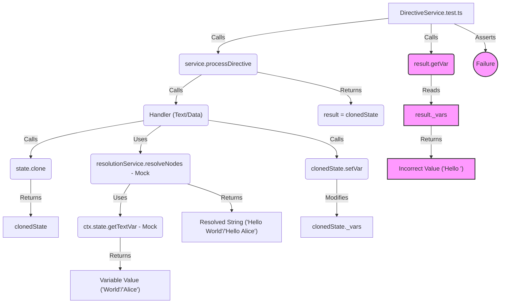

# Variable Resolution Issue in DirectiveService Tests

## 1. Issue Description

Tests within `services/pipeline/DirectiveService/DirectiveService.test.ts` are failing for directives that involve variable interpolation (`@text greeting = "Hello {{name}}"` and `@data config = { "greeting": "Hello {{user}}" }`).

The specific failures are `AssertionError`s:
- Text interpolation: `expected 'Hello ' to be 'Hello World'`
- Data interpolation: `expected { greeting: 'Hello ' } to deeply equal { greeting: 'Hello Alice' }`

These assertions check the state object returned by `DirectiveService.processDirective`. They expect the variables (`name`, `user`) to have been resolved and the corresponding values (`'World'`, `'Alice'`) to be present in the final string/object stored in the state. However, the assertions indicate that only the literal parts (`'Hello '`) are present, suggesting the variable resolution part is missing or incorrect in the final state object checked by the test.

This occurs despite:
- The `ResolutionService.resolveNodes` mock *within the test file's `beforeEach`* correctly receiving the necessary state context (containing the variables `name` and `user`).
- The `resolveNodes` mock correctly returning the fully resolved string (`'Hello World'` or `'Hello Alice'`) according to debug logs placed within the mock.
- The `DataDirectiveHandler` appearing to correctly use the resolved string internally according to debug logs placed within it.
- Multiple attempts to refactor the `clone` method of the mocked `IStateService` (`mockState`) to ensure proper state isolation and method binding for the cloned object returned by the handlers.

The core problem appears to be that the state object (`result`) returned by `DirectiveService.processDirective` and checked by the assertions does not reflect the state updates (`setTextVar`, `setDataVar`) made by the directive handlers during execution, specifically when interpolation is involved. The getters (`getTextVar`, `getDataVar`) called on the `result` object return stale or incomplete data.

## 2. Files Involved

*   **Test File:** `services/pipeline/DirectiveService/DirectiveService.test.ts` (Contains the failing tests and the complex mocking setup)
*   **Service Under Test:** `services/pipeline/DirectiveService/DirectiveService.ts` (Orchestrates directive processing)
*   **Handlers:**
    *   `services/pipeline/DirectiveService/handlers/definition/TextDirectiveHandler.ts`
    *   `services/pipeline/DirectiveService/handlers/definition/DataDirectiveHandler.ts`
*   **State Service:** `services/state/IStateService.ts` (Interface definition), `services/state/StateService/StateService.ts` (Actual implementation, though mocked in tests)
*   **Resolution Service:** `services/resolution/ResolutionService/IResolutionService.ts` (Interface), `services/resolution/ResolutionService/ResolutionService.ts` (Implementation), `services/resolution/ResolutionService/resolvers/VariableReferenceResolver.ts` (Relevant resolver), `services/resolution/ResolutionService/ResolutionContextFactory.ts`
*   **Error Types:** `core/errors/*` (Used in error handling)
*   **AST Types:** `@core/syntax/types/*`
*   **Test Utilities:** `@tests/utils/di/TestContextDI.js`, `@tests/utils/di/TestDirectiveHandlerHelper.js`, `@tests/utils/mocks/serviceMocks.js`

## 3. Data Flow Diagram (Simplified for Failing Tests)

*Note: The failure point is between K (correct internal state) and N/O (incorrect data retrieved via getter).*

## 4. Log Output Analysis (From Last Run)

**Key Logs:**

*   **Text Interpolation Test (`greeting = "Hello {{name}}"`):**
    *   `[DirectiveService.test mock] ctx.state === mockState?: true`
    *   `[DirectiveService.test mock] stateForResolve._vars before lookup: {"name":{"type":"text","value":"World"}}`
    *   `[DirectiveService.test mock] Looking up variable: name`
    *   `[DirectiveService.test mock] getTextVar result for name: {"type":"text","value":"World"}`
    *   `[DirectiveService.test mock] Appended variable name: "World", Current result: "Hello World"`
    *   `[DirectiveService.test mock] resolveNodes returning: Hello World`
    *   **Test Failure:** `expected 'Hello ' to be 'Hello World'` (Assertion checks `result.getTextVar('greeting')`)
*   **Data Interpolation Test (`config = { "greeting": "Hello {{user}}" }`):**
    *   (Inside `DataDirectiveHandler.resolveInterpolatableValuesInData` for `greeting` key):
        *   `[DirectiveService.test mock] ctx.state === mockState?: true`
        *   `[DirectiveService.test mock] stateForResolve._vars before lookup: {"user":{"type":"text","value":"Alice"}}`
        *   `[DirectiveService.test mock] resolveNodes input: [{"type":"Text","content":"Hello "},{"type":"VariableReference","identifier":"user"}]`
        *   `[DirectiveService.test mock] Looking up variable: user`
        *   `[DirectiveService.test mock] getTextVar result for user: {"type":"text","value":"Alice"}`
        *   `[DirectiveService.test mock] Appended variable user: "Alice", Current result: "Hello Alice"`
        *   `[DirectiveService.test mock] resolveNodes returning: Hello Alice`
        *   `[DEBUG] [resolveInterpolatableValuesInData] Resolved to: Hello Alice`
    *   (Back in test after `processDirective` returns):
        *   `Data Interpolation Result State Vars: { "user": { "type": "text", "value": "Alice" }, "config": { "greeting": "Hello Alice" } }`
    *   **Test Failure:** `expected { greeting: 'Hello ' } to deeply equal { greeting: 'Hello Alice' }` (Assertion checks `result.getDataVar('config')`)

**Interpretation:**

The logs clearly show:
1.  The `resolveNodes` mock is receiving the correct state context (`ctx.state` *is* the `mockState` from the test setup).
2.  The `mockState` has the necessary variables (`name`, `user`) defined before resolution.
3.  The `resolveNodes` mock successfully looks up these variables using `getTextVar` on the provided state context.
4.  The `resolveNodes` mock returns the correctly constructed, fully resolved string (`'Hello World'` or `'Hello Alice'`).
5.  The `DataDirectiveHandler` receives the correct resolved string (`'Hello Alice'`) from the recursive call.
6.  The internal `_vars` property of the final returned state object (`result`) *does* contain the correctly set/resolved values (`config: { greeting: 'Hello Alice' }`).
7.  The failure occurs when the test assertions call `result.getTextVar('greeting')` or `result.getDataVar('config')`. These getter methods on the `result` object are returning outdated/incorrect values, despite the internal `_vars` being correct just moments before.

This points definitively to a problem with the `getTextVar` and `getDataVar` methods *on the cloned state object returned by the `clone` mock*. The way they are defined or how `this` is handled within them is causing them to read from the wrong `_vars` store (likely the original `mockState._vars` before cloning or an improperly bound context) instead of the `_vars` belonging to the specific cloned instance (`result`).

## 5. Further Investigation & Findings (Post Initial Debugging)

Following the initial analysis, several additional attempts were made to rectify the mock implementation (`mockState`) in `DirectiveService.test.ts`:

*   **Mocking Strategies:** Various approaches to mocking `IStateService` were employed:
    *   Explicitly defining the mock object literal with detailed method implementations.
    *   Using `vi.fn()` wrappers and subsequently removing them to test for interference.
    *   Leveraging `vitest-mock-extended`'s `mock<IStateService>()` combined with `.mockImplementation(...)` for core methods.
*   **Cloning Logic:** The `clone` method implementation within the mock was repeatedly refined:
    *   Ensuring deep cloning of internal variables using `structuredClone(stateVars)`.
    *   Ensuring setters (`setDataVar`, `setVariable`) used `structuredClone` on the *value* being stored to prevent shared references.
    *   Ensuring methods defined within the `clone` function correctly closed over the cloned variables (`clonedVars`).
    *   Simplifying the clone logic returned by `clone` to remove potentially problematic recursive definitions.
*   **Setup/Import/Syntax:** Several unrelated issues were identified and fixed:
    *   Incorrect import paths (`@tests` alias vs. relative paths, `.js` vs `.ts` extension).
    *   Incorrect import names (`createMockXService` vs. `createXServiceMock`).
    *   Syntax errors introduced during refactoring.
    *   Incorrect `beforeEach` structure (nested blocks, order of operations).

**Outcome:** Despite these fixes and extensive refactoring of the mock state object, the core issue persisted across all attempts:

1.  **Internal State Logging:** Console logs inspecting the internal `_vars` property of the state object (`result`) returned by `service.processDirective` consistently show the *correct, fully resolved, and properly wrapped* data being stored (e.g., `config: { type: 'data', value: { greeting: "Hello Alice" } }`).
2.  **Test Assertion Failures:** The test assertions, which call the *getters* (`result.getTextVar(...)`, `result.getDataVar(...)`) on the *same returned state object* (`result`), consistently fail. 
    *   `getTextVar` returns `undefined` instead of the resolved string.
    *   `getDataVar(...).value` yields a partially resolved or incorrect value (e.g., `{ greeting: 'Hello ' }`).

**Refined Conclusion:** The persistent discrepancy strongly indicates the problem lies specifically with the implementation of the **getter methods (`getTextVar`, `getDataVar`) on the *cloned state object instance* returned by the mock `clone` function**. When the test assertion calls these getters, they are somehow accessing stale data, pointing to the wrong internal variable store, or encountering an object identity/reference issue within the mock implementation that prevents them from returning the correct, logged internal value. The issue does *not* appear to be in the `ResolutionService` mock (which logs correct resolved values) or the directive handlers themselves (which log correct values being passed to the state setters).
