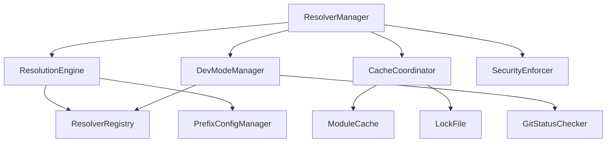

# Resolver Manager Refactoring Guide

## Executive Summary

The ResolverManager is a complex architectural component (635 lines) that manages module resolution, caching, security policies, and routing across multiple resolver types. While well-architected, it would benefit from strategic decomposition following the successful patterns from the Environment.ts refactoring. This guide provides a comprehensive roadmap for safely extracting focused components while preserving the system's sophisticated functionality.

## Current Architecture Analysis

### Core Responsibilities
The ResolverManager currently handles:
1. **Resolver Registration & Discovery** - Built-in and custom resolver management
2. **Prefix Configuration & Matching** - Complex prefix-to-resolver routing
3. **Resolution Orchestration** - Multi-tier resolution with fallbacks
4. **Caching & Lock File Integration** - Module cache coordination and integrity verification
5. **Security Policy Enforcement** - Access control and operation validation
6. **Development Mode Features** - Local fallbacks and git status checking
7. **Error Handling & Attribution** - Comprehensive error context and suggestions

### Key Complexities

#### 1. **Three-Tier Resolution Algorithm**
The resolver uses a sophisticated priority-based lookup:
```typescript
// 1. Prefix-based lookup (highest priority)
for (const prefixConfig of this.prefixConfigs) {
  if (ref.startsWith(prefixConfig.prefix)) { /* ... */ }
}

// 2. Built-in resolver lookup  
const directResolver = this.resolvers.get(resolverName);

// 3. Priority-based fallback
for (const resolver of contextResolvers) {
  if (resolver.canResolve(ref)) { /* ... */ }
}
```

#### 2. **Cache + Lock File Coordination**
Complex integrity checking with hash validation:
```typescript
// Cache hit with integrity verification
if (lockEntry?.integrity) {
  const hash = lockEntry.integrity.split(':')[1];
  const cached = await this.moduleCache.get(hash);
  // Corruption detection and recovery
}

// Cache miss - resolve, store, update lock
const content = await resolver.resolve(resolverRef, resolverConfig);
const cacheEntry = await this.moduleCache.store(content.content, source, ref);
await this.lockFile.addImport(ref, { integrity: `sha256:${cacheEntry.hash}` });
```

#### 3. **Development Mode with Git Integration**
Sophisticated local fallback system:
```typescript
// Check for local modifications
const gitStatus = await getGitStatus(localPath);
if (gitStatus === 'modified' || gitStatus === 'untracked') {
  // Warning system with helpful hints
}

// Dev mode fallback on error
if (this.devMode && errorDetails?.hasLocal) {
  // Automatic LOCAL resolver fallback with warnings
}
```

#### 4. **Security Policy Integration**
Multi-layered security enforcement:
```typescript
// Operation-level checks
if (!this.securityPolicy.allowOutputs) { /* block */ }

// Resolver-level validation
if (!this.securityPolicy.allowedResolvers?.includes(resolver.name)) { /* block */ }

// Access control delegation
if (resolver.checkAccess) {
  const hasAccess = await resolver.checkAccess(resolverRef, 'read', config);
}
```

## Recommended Refactoring Structure

### Phase 1: Extract Resolution Core (Priority 1)

```
core/resolvers/manager/
├── ResolverManager.ts              # Main coordination (~200 lines)
├── ResolutionEngine.ts             # Three-tier resolution algorithm (~150 lines)
├── ResolverRegistry.ts             # Resolver registration & discovery (~100 lines)
└── PrefixConfigManager.ts          # Prefix configuration & matching (~100 lines)
```

**ResolutionEngine.ts** - The heart of the resolution algorithm:
```typescript
interface ResolutionEngine {
  resolve(ref: string, options?: ResolverOptions): Promise<ResolutionResult>;
  findResolver(ref: string, context?: ResolutionContext): Promise<{ resolver?: Resolver, prefixConfig?: PrefixConfig }>;
}

class ResolutionEngine {
  constructor(
    private registry: ResolverRegistry,
    private prefixManager: PrefixConfigManager,
    private securityPolicy: ResolverSecurityPolicy
  ) {}

  // Implements the three-tier algorithm
  async findResolver(ref: string, context?: ResolutionContext) {
    // 1. Prefix-based lookup
    const prefixMatch = this.prefixManager.findMatchingPrefix(ref);
    
    // 2. Built-in resolver lookup
    const directMatch = this.registry.findBuiltinResolver(ref);
    
    // 3. Priority-based fallback
    const fallbackMatch = this.registry.findByPriority(ref, context);
    
    return prefixMatch || directMatch || fallbackMatch;
  }
}
```

**ResolverRegistry.ts** - Clean separation of registration concerns:
```typescript
class ResolverRegistry {
  private resolvers: Map<string, Resolver> = new Map();
  private resolversByPriority: Resolver[] = [];
  private resolverNamesCache: Set<string> = new Set();

  registerResolver(resolver: Resolver): void;
  getResolver(name: string): Resolver | undefined;
  findBuiltinResolver(ref: string): { resolver?: Resolver };
  findByPriority(ref: string, context?: ResolutionContext): { resolver?: Resolver };
  isResolverName(name: string): boolean;
  getResolversForContext(context: ResolutionContext): Resolver[];
}
```

**PrefixConfigManager.ts** - Encapsulate prefix complexity:
```typescript
class PrefixConfigManager {
  private prefixConfigs: PrefixConfig[] = [];

  configurePrefixes(prefixes: PrefixConfig[], projectRoot?: string): void;
  findMatchingPrefix(ref: string): { resolver?: Resolver, prefixConfig?: PrefixConfig };
  updatePrefixConfig(prefix: string, updates: Partial<any>): void;
  validatePrefixConfig(prefixConfig: PrefixConfig): void;
}
```

### Phase 2: Extract Caching Layer (Priority 2)

```
core/resolvers/manager/
├── ResolverCacheCoordinator.ts     # Cache + lock file integration (~150 lines)
└── types/CacheStrategy.ts          # Cache strategy interfaces (~50 lines)
```

**ResolverCacheCoordinator.ts** - Isolate caching complexity:
```typescript
interface CacheStrategy {
  shouldCache(ref: string, resolver: string): boolean;
  getCacheKey(ref: string, options?: any): string;
  validateIntegrity(content: string, expectedHash: string): boolean;
}

class ResolverCacheCoordinator {
  constructor(
    private moduleCache: ModuleCache,
    private lockFile: LockFile,
    private strategy: CacheStrategy
  ) {}

  async tryCache(ref: string): Promise<ResolutionResult | null>;
  async storeResult(ref: string, content: ResolverContent, resolverName: string): Promise<void>;
  async handleCacheCorruption(ref: string, error: Error): Promise<void>;
}
```

Benefits:
- Clean separation of caching from resolution
- Testable cache strategies
- Easier to add new cache behaviors
- Clear error handling paths

### Phase 3: Extract Development Features (Priority 3)

```
core/resolvers/manager/
├── DevModeManager.ts               # Development mode features (~100 lines)
└── GitStatusChecker.ts             # Git integration utilities (~50 lines)
```

**DevModeManager.ts** - Encapsulate development-specific logic:
```typescript
class DevModeManager {
  constructor(
    private registry: ResolverRegistry,
    private gitChecker: GitStatusChecker
  ) {}

  async checkLocalStatus(ref: string, prefixConfig: PrefixConfig): Promise<void>;
  async attemptLocalFallback(ref: string, error: MlldResolutionError, prefixConfig: PrefixConfig): Promise<ResolutionResult | null>;
  isDevModeEnabled(): boolean;
}
```

Benefits:
- Clear separation of dev vs. production concerns
- Easier testing of git integration
- Simplified main resolution flow

### Phase 4: Security & Policy Layer (Lower Priority)

```
core/resolvers/manager/
└── SecurityPolicyEnforcer.ts       # Security validation (~75 lines)
```

**SecurityPolicyEnforcer.ts** - Centralize security logic:
```typescript
class SecurityPolicyEnforcer {
  constructor(private policy: ResolverSecurityPolicy) {}

  validateOperation(operation: 'read' | 'write', resolver: Resolver): void;
  validateResolver(resolver: Resolver): void;
  validatePrefixConfig(prefixConfig: PrefixConfig): void;
  checkTimeout(operation: string): number;
}
```

## Implementation Strategy

### Critical Preservation Requirements

#### 1. **Maintain Resolution Algorithm Integrity**
The three-tier resolution is sophisticated and battle-tested:
```typescript
// PRESERVE: Exact order and fallback logic
// 1. Prefix configurations (longest first)
// 2. Built-in resolver names
// 3. Priority-based iteration

// CRITICAL: Don't change the prefix sorting
this.prefixConfigs.sort((a, b) => b.prefix.length - a.prefix.length);
```

#### 2. **Preserve Cache Integrity Logic**
The cache corruption detection is critical:
```typescript
// PRESERVE: Exact cache corruption handling
if (cacheError.message.includes('Cache corruption detected')) {
  await this.lockFile.removeImport(ref);
  logger.info(`Cleared corrupted cache entry for ${ref}`);
}
```

#### 3. **Maintain Security Model**
The multi-layered security checks must be preserved:
```typescript
// PRESERVE: Security check order and delegation
// 1. Policy-level checks first
// 2. Resolver capability validation
// 3. Individual resolver access control
```

#### 4. **Keep Development Mode Behavior**
The git status integration and local fallback are user-facing features:
```typescript
// PRESERVE: Exact warning messages and dev mode flow
console.warn(`\n${statusEmoji} Local ${statusText} version detected`);
console.warn(`   Hint:   Use --dev flag to test with local version`);
```

### Refactoring Phases

#### Phase 1: Core Resolution (Low Risk, High Value)
**Start with:** ResolverRegistry and PrefixConfigManager
- Extract pure functions first (validation, sorting, lookup)
- These have clear inputs/outputs and minimal side effects
- Comprehensive test coverage exists for these paths

**Key extraction pattern:**
```typescript
// Before (in ResolverManager)
private async findResolver(ref: string, context?: ResolutionContext) {
  // Complex logic mixed with state management
}

// After (in ResolutionEngine)
async findResolver(ref: string, context?: ResolutionContext) {
  const prefixMatch = this.prefixManager.findMatchingPrefix(ref);
  if (prefixMatch.resolver) return prefixMatch;
  
  const builtinMatch = this.registry.findBuiltinResolver(ref);
  if (builtinMatch.resolver) return builtinMatch;
  
  return this.registry.findByPriority(ref, context);
}
```

#### Phase 2: Cache Coordination (Medium Risk, High Value)
**Focus on:** Isolating cache logic while preserving all integrity checks
```typescript
// Extract with careful interface design
interface CacheCoordinator {
  tryResolveFromCache(ref: string): Promise<ResolutionResult | null>;
  storeResolutionResult(ref: string, result: ResolutionResult): Promise<void>;
}
```

#### Phase 3: Development Features (Low Risk, Medium Value)
**Safest extraction:** Development mode features are well-isolated
```typescript
// Clean extraction with clear boundaries
class DevModeManager {
  // All git status logic moves here
  // Local fallback logic becomes testable
}
```

### Integration Pattern

**New ResolverManager becomes a coordinator:**
```typescript
export class ResolverManager {
  constructor(
    private resolutionEngine: ResolutionEngine,
    private cacheCoordinator: ResolverCacheCoordinator,
    private devModeManager: DevModeManager,
    private securityEnforcer: SecurityPolicyEnforcer
  ) {}

  async resolve(ref: string, options?: ResolverOptions): Promise<ResolutionResult> {
    // 1. Security validation
    this.securityEnforcer.validateOperation('read', options);
    
    // 2. Try cache first
    const cached = await this.cacheCoordinator.tryCache(ref);
    if (cached) return cached;
    
    // 3. Resolve fresh
    const { resolver, prefixConfig } = await this.resolutionEngine.findResolver(ref, options?.context);
    const result = await this.resolutionEngine.resolve(ref, resolver, prefixConfig, options);
    
    // 4. Store in cache
    await this.cacheCoordinator.storeResult(ref, result, resolver.name);
    
    // 5. Development mode checks
    if (this.devModeManager.isEnabled()) {
      await this.devModeManager.checkLocalStatus(ref, prefixConfig);
    }
    
    return result;
  }
}
```

## Risk Mitigation

### Testing Strategy
1. **Extract tests alongside code** - Don't refactor without moving relevant tests
2. **Integration test preservation** - Keep end-to-end resolution tests intact
3. **Interface testing** - Test extracted interfaces in isolation
4. **Behavioral testing** - Verify exact same resolution results

### Rollback Planning
1. **Feature flags** - Use environment variables to switch between old/new implementations
2. **Parallel implementation** - Keep old ResolverManager alongside new structure initially
3. **Incremental migration** - Extract one component at a time with full testing

### Critical Path Protection
1. **Don't touch core resolution algorithm** during refactoring
2. **Preserve all error messages** - Users depend on specific error text
3. **Maintain performance characteristics** - Resolution speed is critical
4. **Keep all security behaviors** - No relaxation of security policies

## Expected Benefits

### Architectural Improvements
- **Single Responsibility**: Each component has one clear purpose
- **Testability**: Complex logic can be tested in isolation
- **Maintainability**: Easier to understand and modify individual components
- **Extensibility**: Clear extension points for new resolver types

### Development Experience
- **Faster debugging**: Issues isolated to specific components
- **Better code review**: Smaller, focused changes
- **Easier onboarding**: Clear component boundaries
- **Reduced coupling**: Explicit interfaces between components

### Technical Debt Reduction
- **Clear dependencies**: Explicit rather than implicit relationships
- **Better error handling**: Component-specific error attribution
- **Improved performance**: Potential for component-level caching optimizations
- **Enhanced monitoring**: Component-level metrics and logging

## Success Metrics

### Quantitative Goals
- **Line count reduction**: Target 20-30% reduction per extracted component
- **Cyclomatic complexity**: Reduce complexity score for main ResolverManager
- **Test coverage**: Maintain or improve existing coverage (currently high)
- **Performance**: No degradation in resolution speed

### Qualitative Goals  
- **Component clarity**: Each module has one clear responsibility
- **Interface simplicity**: Clean contracts between components
- **Error attribution**: Clear component identification in error messages
- **Documentation**: Self-documenting through component organization

## Component Dependencies



This dependency graph shows clear separation with minimal coupling - ideal for the phased extraction approach.

## Conclusion

The ResolverManager refactoring represents a strategic opportunity to improve one of mlld's most critical architectural components. By following the proven patterns from the Environment.ts refactoring and carefully preserving the sophisticated resolution algorithms, we can achieve significant maintainability improvements while maintaining the system's reliability and performance.

The phased approach ensures manageable risk while delivering incremental value, and the focus on component extraction rather than algorithmic changes ensures that the battle-tested resolution logic remains intact.