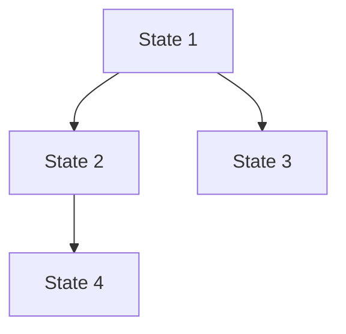
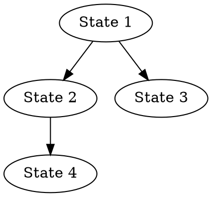

# State Visualization System

**** WARNING **** this doc contains hallucinations

## Overview

The State Visualization System provides comprehensive visualization capabilities for Meld's state management system. It enables developers to:

- Visualize state hierarchies and relationships
- Track state transformations over time
- Generate timeline views of state operations
- Calculate and monitor system metrics

## Core Components

### 1. Hierarchy Visualization

Generate hierarchical views of state relationships in multiple formats:

```typescript
const vis = new StateVisualizationService(historyService, trackingService);

// Generate Mermaid diagram
const mermaidDiagram = vis.generateHierarchyView('rootStateId', {
  format: 'mermaid',
  includeMetadata: true,
});

// Generate DOT graph
const dotGraph = vis.generateHierarchyView('rootStateId', {
  format: 'dot',
  includeMetadata: true,
});
```

### 2. Transition Diagrams

Visualize state transformations and their effects:

```typescript
const transitionDiagram = vis.generateTransitionDiagram('stateId', {
  format: 'mermaid',
  includeTimestamps: true,
});
```

### 3. Relationship Graphs

Generate comprehensive views of state relationships:

```typescript
const relationshipGraph = vis.generateRelationshipGraph(['stateId1', 'stateId2'], {
  format: 'mermaid',
  includeMetadata: true,
});
```

### 4. Timeline Views

Create temporal views of state operations:

```typescript
const timeline = vis.generateTimeline(['stateId1', 'stateId2'], {
  format: 'mermaid',
  includeTimestamps: true,
});
```

### 5. Metrics Calculation

Monitor system metrics and state usage:

```typescript
const metrics = vis.getMetrics({
  start: Date.now() - 3600000, // Last hour
  end: Date.now(),
});
```

## Resource Management

### Memory Considerations

The visualization system is designed to be memory-efficient, but there are some important considerations:

1. **History Storage**
   - Operation history is stored in memory
   - Each operation typically consumes ~100-200 bytes
   - Consider clearing old history periodically using `historyService.clearHistoryBefore()`

2. **Visualization Generation**
   - Graph generation is done on-demand
   - Large graphs (>1000 nodes) may require significant memory
   - Consider limiting the scope of visualizations for large state trees

3. **Best Practices**
   - Generate visualizations only when needed
   - Use time ranges to limit data scope
   - Clear old history data periodically
   - Consider using pagination for large datasets

Example of managing history data:

```typescript
// Clear history older than 24 hours
const oneDayAgo = Date.now() - 24 * 60 * 60 * 1000;
historyService.clearHistoryBefore(oneDayAgo);

// Generate visualization with time range
const recentGraph = vis.generateRelationshipGraph(['stateId'], {
  format: 'mermaid',
  timeRange: {
    start: Date.now() - 3600000, // Last hour
    end: Date.now(),
  },
});
```

## Styling and Customization

### Node Styling

Customize node appearance using the `styleNodes` option:

```typescript
const graph = vis.generateRelationshipGraph(['stateId'], {
  format: 'dot',
  styleNodes: (metadata) => ({
    shape: metadata.source === 'merge' ? 'diamond' : 'box',
    color: '#4CAF50',
    tooltip: `Created at: ${new Date(metadata.createdAt).toISOString()}`,
  }),
});
```

### Edge Styling

Customize edge appearance using the `styleEdges` option:

```typescript
const graph = vis.generateRelationshipGraph(['stateId'], {
  format: 'dot',
  styleEdges: (relationship) => ({
    style: relationship.type === 'merge-source' ? 'dashed' : 'solid',
    color: '#2196F3',
    tooltip: `Relationship: ${relationship.type}`,
  }),
});
```

## Output Formats

The system supports multiple output formats:

1. **Mermaid**
   - Markdown-friendly diagram format
   - Great for documentation
   - Easy to embed in GitHub/GitLab

2. **DOT**
   - GraphViz compatible
   - Highly customizable
   - Good for complex graphs

3. **JSON**
   - Machine-readable format
   - Useful for custom rendering
   - Can be transformed to other formats

## Performance Tips

1. **Limit Scope**
   - Use specific state IDs instead of entire trees
   - Apply time ranges to limit data
   - Filter unnecessary metadata

2. **Optimize Generation**
   - Generate visualizations on-demand
   - Cache results when appropriate
   - Use appropriate formats for the use case

3. **Monitor Usage**
   - Track metrics to understand system usage
   - Monitor memory consumption
   - Clear old data regularly

## Error Handling

The system includes robust error handling:

```typescript
try {
  const graph = vis.generateRelationshipGraph(['stateId'], {
    format: 'mermaid',
  });
} catch (error) {
  if (error.message.includes('Unsupported format')) {
    // Handle format error
  } else if (error.message.includes('State not found')) {
    // Handle missing state
  } else {
    // Handle other errors
  }
}
```

## Integration Examples

### 1. Debug View Integration

```typescript
function createDebugView(stateId: string) {
  const hierarchy = vis.generateHierarchyView(stateId, {
    format: 'mermaid',
    includeMetadata: true,
  });
  
  const timeline = vis.generateTimeline([stateId], {
    format: 'mermaid',
    includeTimestamps: true,
  });

  return `
## State Debug View
### Hierarchy
\`\`\`mermaid
${hierarchy}
\`\`\`

### Timeline
\`\`\`mermaid
${timeline}
\`\`\`
  `;
}
```

### 2. Metrics Dashboard

```typescript
function generateMetricsDashboard() {
  const hourlyMetrics = vis.getMetrics({
    start: Date.now() - 3600000,
    end: Date.now(),
  });

  return {
    totalStates: hourlyMetrics.totalStates,
    statesByType: hourlyMetrics.statesByType,
    avgTransformations: hourlyMetrics.averageTransformationsPerState,
    maxChainLength: hourlyMetrics.maxTransformationChainLength,
    treeDepth: hourlyMetrics.maxTreeDepth,
  };
}
```

# State Visualization System API Documentation

## Overview

The State Visualization System provides a comprehensive API for visualizing and analyzing state operations, relationships, and metrics in the Meld system.

## Core Services

### StateVisualizationService

The main service for generating visualizations and calculating metrics.

```typescript
class StateVisualizationService {
  constructor(
    historyService: StateHistoryService,
    trackingService: StateTrackingService
  );

  // Hierarchy Visualization
  generateHierarchyView(
    rootStateId: string, 
    options: {
      format: 'mermaid' | 'dot' | 'json';
      includeMetadata?: boolean;
    }
  ): string;

  // Transition Diagrams
  generateTransitionDiagram(
    stateId: string,
    options: {
      format: 'mermaid' | 'dot' | 'json';
      includeTimestamps?: boolean;
    }
  ): string;

  // Relationship Graphs
  generateRelationshipGraph(
    stateIds: string[],
    options: {
      format: 'mermaid' | 'dot' | 'json';
      includeMetadata?: boolean;
      timeRange?: {
        start: number;
        end: number;
      };
    }
  ): string;

  // Timeline Views
  generateTimeline(
    stateIds: string[],
    options: {
      format: 'mermaid' | 'dot' | 'json';
      includeTimestamps?: boolean;
    }
  ): string;

  // Metrics Calculation
  getMetrics(options: {
    start: number;
    end: number;
  }): StateMetrics;
}
```

### StateMetrics Interface

```typescript
interface StateMetrics {
  totalStates: number;
  statesByType: Map<string, number>;
  averageTransformationsPerState: number;
  maxTransformationChainLength: number;
  averageChildrenPerState: number;
  maxTreeDepth: number;
  operationFrequency: {
    create: number;
    clone: number;
    transform: number;
    merge: number;
  };
}
```

## Output Formats

### Mermaid Format
- Markdown-friendly diagram format
- Great for documentation
- Easy to embed in GitHub/GitLab

Example:


### DOT Format
- GraphViz compatible
- Highly customizable
- Suitable for complex graphs

Example:


### JSON Format
- Machine-readable format
- Useful for custom rendering
- Can be transformed to other formats

Example:
```json
{
  "nodes": [
    {"id": "state1", "type": "create"},
    {"id": "state2", "type": "transform"}
  ],
  "edges": [
    {"source": "state1", "target": "state2", "type": "transform"}
  ]
}
```

## Styling Options

### Node Styling
```typescript
interface NodeStyle {
  shape?: 'box' | 'circle' | 'diamond';
  color?: string;
  tooltip?: string;
  label?: string;
}

const graph = vis.generateRelationshipGraph(['stateId'], {
  format: 'dot',
  styleNodes: (metadata) => ({
    shape: metadata.source === 'merge' ? 'diamond' : 'box',
    color: '#4CAF50',
    tooltip: `Created at: ${new Date(metadata.createdAt).toISOString()}`
  })
});
```

### Edge Styling
```typescript
interface EdgeStyle {
  style?: 'solid' | 'dashed' | 'dotted';
  color?: string;
  tooltip?: string;
  label?: string;
}

const graph = vis.generateRelationshipGraph(['stateId'], {
  format: 'dot',
  styleEdges: (relationship) => ({
    style: relationship.type === 'merge-source' ? 'dashed' : 'solid',
    color: '#2196F3',
    tooltip: `Relationship: ${relationship.type}`
  })
});
```

## Error Handling

The service throws specific error types for different scenarios:

```typescript
try {
  const graph = vis.generateRelationshipGraph(['stateId'], {
    format: 'mermaid'
  });
} catch (error) {
  if (error instanceof UnsupportedFormatError) {
    // Handle unsupported format
  } else if (error instanceof StateNotFoundError) {
    // Handle missing state
  } else if (error instanceof VisualizationError) {
    // Handle general visualization errors
  }
}
```

## Best Practices

1. **Memory Management**
   - Generate visualizations on-demand
   - Use time ranges to limit data scope
   - Clear old history data periodically
   - Consider pagination for large datasets

2. **Performance Optimization**
   - Limit visualization scope to specific state IDs
   - Use appropriate formats for the use case
   - Cache results when appropriate
   - Monitor memory consumption

3. **Error Handling**
   - Always wrap visualization calls in try-catch blocks
   - Handle specific error types appropriately
   - Provide meaningful error messages to users
   - Log errors for debugging

4. **Integration Tips**
   - Use Mermaid format for documentation
   - Use DOT format for complex visualizations
   - Use JSON format for custom rendering
   - Consider real-time updates for live systems 