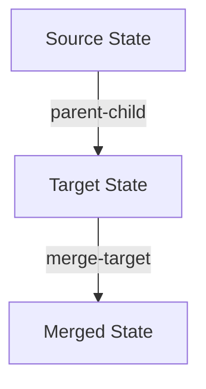

# State Visualization System

## Overview

The State Visualization System provides visualization capabilities for Meld's state management system. It works in conjunction with the `StateTrackingService`, `StateHistoryService`, and `StateDebuggerService` to:

- Visualize state hierarchies and relationships
- Track state transformations over time
- Debug state operations with detailed logging
- Monitor state changes and relationships

## Core Services

The visualization system consists of several cooperating services:

### Service Setup

Here's the typical setup pattern used in our tests and application:

```typescript
import { StateTrackingService } from './services/StateTrackingService/StateTrackingService.js';
import { StateVisualizationService } from './services/StateVisualizationService/StateVisualizationService.js';
import { StateDebuggerService } from './services/StateDebuggerService/StateDebuggerService.js';
import { StateHistoryService } from './services/StateHistoryService/StateHistoryService.js';
import type { IStateEventService } from './services/StateEventService/IStateEventService.js';

// Initialize core services
const trackingService = new StateTrackingService();
const eventService = new MockStateEventService(); // Or your actual event service
const historyService = new StateHistoryService(eventService);
const visualizationService = new StateVisualizationService(historyService, trackingService);
const debuggerService = new StateDebuggerService(visualizationService, historyService, trackingService);

// Set up bidirectional service connections
(trackingService as any).services = {
  visualization: visualizationService,
  debugger: debuggerService,
  history: historyService,
  events: eventService
};
```

### 1. State Tracking

The `StateTrackingService` is the foundation, managing state relationships and metadata:

```typescript
// Register states
const sourceId = trackingService.registerState({
  source: 'new',
  transformationEnabled: true
});

const targetId = trackingService.registerState({
  source: 'new',
  transformationEnabled: true
});

// Create relationships
trackingService.addRelationship(sourceId, targetId, 'parent-child');
```

### 2. State Visualization

The `StateVisualizationService` generates visual representations of state relationships:

```typescript
// Start a debug session with visualization
const debugSessionId = await debuggerService.startSession({
  captureConfig: {
    capturePoints: ['pre-transform', 'post-transform', 'error'],
    includeFields: ['nodes', 'transformedNodes', 'variables', 'metadata', 'relationships'],
    format: 'full'
  },
  visualization: {
    format: 'mermaid',
    includeMetadata: true,
    includeTimestamps: true
  }
});

// Generate hierarchy visualization
const hierarchyView = await visualizationService.generateHierarchyView(rootStateId, {
  format: 'mermaid',
  includeMetadata: true
});

// Generate transition diagram
const transitionView = await visualizationService.generateTransitionDiagram(stateId, {
  format: 'mermaid',
  includeTimestamps: true
});
```

### 3. State Debugging

The `StateDebuggerService` provides detailed debugging capabilities:

```typescript
try {
  // Start debug session
  const debugSessionId = await debuggerService.startSession({
    captureConfig: {
      capturePoints: ['pre-transform', 'post-transform', 'error'],
      includeFields: ['nodes', 'transformedNodes', 'variables', 'metadata', 'relationships'],
      format: 'full'
    }
  });

  // Perform operations...

  // Generate debug report
  const report = await debuggerService.generateDebugReport(debugSessionId);
  console.log('Debug Report:', report);
} catch (error) {
  // Get error diagnostics
  const errorReport = await debuggerService.generateDebugReport(debugSessionId);
  console.error('Error Report:', errorReport);
} finally {
  await debuggerService.endSession(debugSessionId);
}
```

## Visualization Formats

The system supports Mermaid diagram format for visualization:



### Relationship Types

The system visualizes different types of relationships:

1. Parent-Child: Solid lines
   ```typescript
   trackingService.addRelationship(parentId, childId, 'parent-child');
   ```

2. Merge Source: Dashed lines
   ```typescript
   trackingService.addRelationship(sourceId, targetId, 'merge-source');
   ```

3. Merge Target: Dotted lines
   ```typescript
   trackingService.addRelationship(sourceId, targetId, 'merge-target');
   ```

## State History

The `StateHistoryService` tracks operations and state changes:

```typescript
// History is automatically captured through the event service
eventService.emit('transform', {
  type: 'transform',
  source: 'addRelationship:parent-child',
  stateId: parentId,
  targetId: childId
});
```

## Best Practices

1. **Service Setup**
   - Always initialize services in the correct order
   - Establish proper bidirectional connections
   - Use the debug session for complex operations

2. **Visualization**
   - Use Mermaid format for readable diagrams
   - Include metadata for better context
   - Add timestamps for temporal tracking

3. **Debugging**
   - Start debug sessions for complex operations
   - Capture pre and post transform states
   - Generate debug reports for analysis

4. **Error Handling**
   - Always wrap debug sessions in try-catch
   - Generate error reports when issues occur
   - End debug sessions in finally blocks

## Example: Complex State Operation

Here's a complete example of tracking and visualizing a merge operation:

```typescript
// Start debug session
const debugSessionId = await debuggerService.startSession({
  captureConfig: {
    capturePoints: ['pre-transform', 'post-transform', 'error'],
    includeFields: ['nodes', 'transformedNodes', 'variables', 'metadata', 'relationships'],
    format: 'full'
  }
});

try {
  // Create states
  const sourceId = trackingService.registerState({
    source: 'new',
    transformationEnabled: true
  });
  
  const targetId = trackingService.registerState({
    source: 'new',
    transformationEnabled: true
  });

  // Create relationship
  trackingService.addRelationship(sourceId, targetId, 'merge-target');

  // Visualize the result
  const hierarchy = await visualizationService.generateHierarchyView(sourceId, {
    format: 'mermaid',
    includeMetadata: true
  });

  console.log('State Hierarchy:', hierarchy);

  // Get debug report
  const report = await debuggerService.generateDebugReport(debugSessionId);
  console.log('Operation Report:', report);
} finally {
  await debuggerService.endSession(debugSessionId);
}
```

This documentation reflects our actual implementation and usage patterns, based on the code in our services directory. 