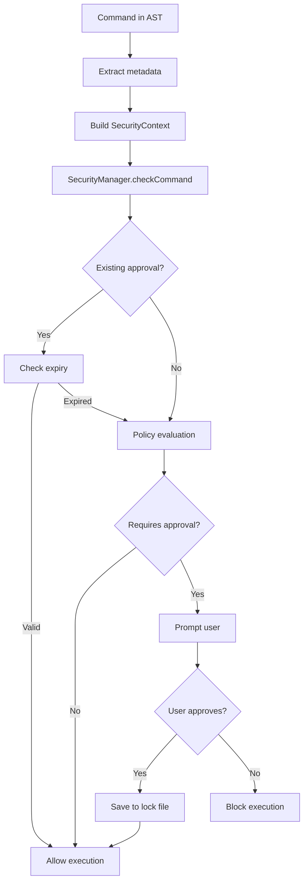
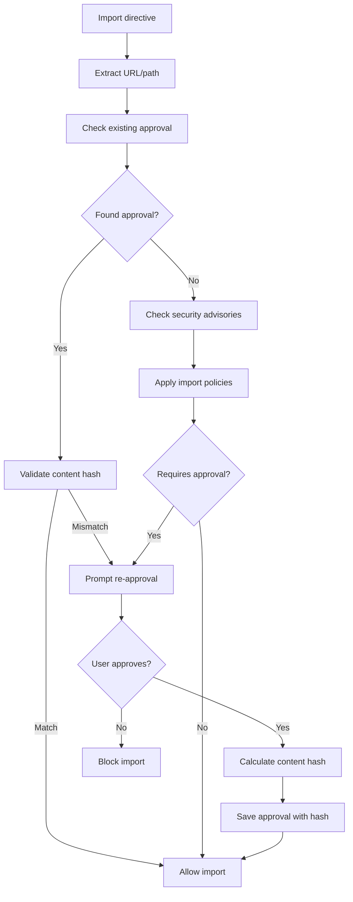

# Security Architecture

This document describes the technical implementation of mlld's security system for developers and contributors.

## Architecture Overview

mlld's security system is built on a layered architecture with multiple subsystems working together:

```
┌─────────────────────────────────────────────────────────────┐
│                    User Interface Layer                    │
│  ┌─────────────────┐  ┌─────────────────┐  ┌─────────────────┐ │
│  │ mlld CLI       │  │ Approval Prompts│  │ Error Messages │ │
│  └─────────────────┘  └─────────────────┘  └─────────────────┘ │
└─────────────────────────────────────────────────────────────┘
                              │
┌─────────────────────────────────────────────────────────────┐
│                   Integration Layer                        │
│  ┌─────────────────┐  ┌─────────────────┐  ┌─────────────────┐ │
│  │ Environment    │  │ Evaluators     │  │ URLCache       │ │
│  │ (operations)   │  │ (AST metadata) │  │ (TTL/trust)    │ │
│  └─────────────────┘  └─────────────────┘  └─────────────────┘ │
└─────────────────────────────────────────────────────────────┘
                              │
┌─────────────────────────────────────────────────────────────┐
│                   Security Core Layer                      │
│                    SecurityManager                         │
│  ┌─────────────────────────────────────────────────────────┐ │
│  │              Security Decision Engine               │ │
│  │ ┌─────────────┐ ┌─────────────┐ ┌─────────────┐      │ │
│  │ │Command      │ │Import       │ │Path         │      │ │
│  │ │Analysis     │ │Resolution   │ │Validation   │      │ │
│  │ └─────────────┘ └─────────────┘ └─────────────┘      │ │
│  └─────────────────────────────────────────────────────────┘ │
└─────────────────────────────────────────────────────────────┘
                              │
┌─────────────────────────────────────────────────────────────┐
│                   Subsystem Layer                          │
│  ┌─────────────┐ ┌─────────────┐ ┌─────────────┐ ┌─────────┐ │
│  │PolicyManager│ │TaintTracker │ │AuditLogger  │ │ Cache   │ │
│  └─────────────┘ └─────────────┘ └─────────────┘ └─────────┘ │
│  ┌─────────────┐ ┌─────────────┐ ┌─────────────┐ ┌─────────┐ │
│  │CommandAnal. │ │URLValidator │ │PathValidator│ │Registry │ │
│  └─────────────┘ └─────────────┘ └─────────────┘ └─────────┘ │
└─────────────────────────────────────────────────────────────┘
                              │
┌─────────────────────────────────────────────────────────────┐
│                   Persistence Layer                        │
│  ┌─────────────────┐  ┌─────────────────┐  ┌─────────────────┐ │
│  │ Project LockFile│  │ Global LockFile │  │ Audit Logs     │ │
│  │ (decisions)     │  │ (user prefs)    │  │ (history)      │ │
│  └─────────────────┘  └─────────────────┘  └─────────────────┘ │
└─────────────────────────────────────────────────────────────┘
```

## Core Components

### SecurityManager

**Location**: `security/SecurityManager.ts`

Central coordinator for all security operations. Implements singleton pattern for system-wide consistency.

**Key responsibilities:**
- Command security checks with approval flow
- Import validation and approval persistence  
- Path access control with pattern matching
- Taint tracking across operations
- Lock file management for decisions
- Security context building and evaluation

**Integration points:**
- Environment constructor (dependency injection)
- All evaluators (security context passing)
- URLCache (TTL/trust enforcement)

### Policy System

**Location**: `security/policy/`

Configurable policy engine for security decisions:

```typescript
interface SecurityPolicy {
  commands: {
    allowNetworkAccess: boolean;
    allowFileSystem: boolean;
    blockedPatterns: string[];
    requireApproval: boolean;
  };
  imports: {
    allowedDomains: string[];
    requireSignatures: boolean;
    maxContentSize: number;
  };
  paths: {
    allowedDirectories: string[];
    blockedDirectories: string[];
    requireApproval: boolean;
  };
}
```

**Policy evaluation flow:**
1. Load global policies from `~/.config/mlld/mlld.lock.json`
2. Merge with project policies from `./mlld.lock.json`  
3. Apply inline directive metadata (`trust`, `ttl`)
4. Evaluate against operation context
5. Return `SecurityDecision` with approval requirements

### Lock File System

**Location**: `core/registry/LockFile.ts`

Enhanced lock file system supporting security decision persistence:

```typescript
interface LockFileData {
  version: string;
  imports: Record<string, LockEntry>;
  security?: {
    approvedCommands?: Record<string, CommandApproval>;
    approvedUrls?: Record<string, ImportApproval>;
    approvedPaths?: Record<string, PathApproval>;
    policies?: SecurityPolicy;
    trustedDomains?: string[];
  };
}
```

**Features:**
- **Command approvals**: Exact matches and pattern matching
- **Import approvals**: URL-based with content hash validation
- **Path approvals**: Path prefixes with read/write granularity
- **TTL expiry**: Time-based approval expiration
- **Audit metadata**: Timestamps, users, context information

### Taint Tracking

**Location**: `security/taint/TaintTracker.ts`

Tracks data provenance through the evaluation pipeline:

```typescript
enum TaintLevel {
  TRUSTED = 'trusted',           // System or pre-approved sources
  USER_INPUT = 'user_input',     // From stdin or environment
  FILE_SYSTEM = 'file_system',   // From local files
  NETWORK = 'network',           // From remote URLs
  COMMAND_OUTPUT = 'command_output', // From executed commands
  LLM_OUTPUT = 'llm_output',     // From AI model responses
  MIXED = 'mixed'                // Multiple sources combined
}
```

**Taint propagation:**
- Variables inherit taint from their sources
- Commands inherit taint from interpolated variables
- Tainted operations require elevated approval
- Taint information included in security decisions

## Integration Points

### Environment Operations

**Location**: `interpreter/env/Environment.ts`

All Environment operations integrate with SecurityManager:

```typescript
// Command execution with security check
async executeCommand(command: string, options?, context?): Promise<string> {
  const securityManager = this.getSecurityManager();
  if (securityManager) {
    const decision = await securityManager.checkCommand(command, context);
    if (!decision.allowed) {
      throw new MlldCommandExecutionError(decision.reason);
    }
  }
  // ... execute command
}

// File reading with path validation
async readFile(pathOrUrl: string): Promise<string> {
  const securityManager = this.getSecurityManager();
  if (securityManager) {
    const allowed = await securityManager.checkPath(resolvedPath, 'read');
    if (!allowed) {
      throw new MlldFileSystemError(`Read access denied: ${pathOrUrl}`);
    }
  }
  // ... read file
}

// URL fetching with import approval
async fetchURL(url: string, forImport: boolean = false): Promise<string> {
  const securityManager = this.getSecurityManager();
  if (forImport && securityManager) {
    const approved = await securityManager.approveImport(url, content, []);
    if (!approved) {
      throw new MlldImportError('Import not approved');
    }
  }
  // ... fetch URL
}
```

### AST Metadata Extraction

**Location**: `interpreter/eval/*.ts`

Evaluators extract security metadata from AST nodes:

```typescript
// Extract trust and TTL from directive metadata
const mlldTrustLevel = directive.meta?.trust;
const ttlOption = directive.meta?.ttl;

// Build security context for operations
const securityContext = {
  file: env.getCurrentFilePath(),
  line: directive.location?.start?.line,
  directive: 'run',
  mlldTrust: mlldTrustLevel,
  metadata: {
    ...(ttlOption && { ttl: ttlOption })
  }
};

// Pass context to security manager
const decision = await securityManager.checkCommand(command, securityContext);
```

### URLCache Integration

**Location**: `interpreter/cache/URLCache.ts`

URLCache enforces TTL and trust policies:

```typescript
async fetchURL(url: string, security?: SecurityOptions): Promise<string> {
  const ttl = security?.ttl || this.getDefaultTTL();
  const trust = security?.trust || 'verify';

  // Check trust level for remote URLs
  await this.checkTrust(url, trust);

  // Check cache based on TTL
  const cached = await this.checkCache(url, ttl);
  if (cached && !this.isCacheExpired(entry, ttl)) {
    return cached;
  }

  // Fetch fresh content
  const content = await this.fetchFresh(url);
  await this.cacheContent(url, content, ttl, trust, configuredBy);
  
  return content;
}
```

## Security Decision Flow

### Command Execution Flow



### Import Approval Flow



## Security Context Building

Security contexts provide rich information for decision making:

```typescript
interface SecurityContext {
  file?: string;              // Current mlld file
  line?: number;              // Line number in file
  directive?: string;         // Directive type (run, import, path)
  user?: string;              // Current user
  metadata?: {                // Inline directive metadata
    ttl?: TTLOption;
    trust?: TrustLevel;
    requireHash?: boolean;
  };
  mlldTrust?: TrustLevel;     // Raw mlld trust syntax
}
```

**Context sources:**
- **AST location**: File path, line numbers from parser
- **Directive metadata**: Trust/TTL from grammar parsing
- **Environment state**: Current user, working directory
- **Runtime context**: Parent operations, taint information

## Trust Level Mapping

mlld syntax trust levels are mapped to security policy trust levels:

```typescript
private mapMlldTrustToSecurityTrust(mlldTrust: TrustLevel): PolicyTrustLevel {
  switch (mlldTrust) {
    case 'always':
      return 'high';      // Always trusted = high trust (no approval)
    case 'verify': 
      return 'verify';    // Verify = verify (requires approval)
    case 'never':
      return 'block';     // Never = block (not allowed)
    default:
      return 'verify';    // Default to verify for safety
  }
}
```

This mapping allows the grammar to use user-friendly terms while the security system uses precise policy terminology.

## TTL Processing

TTL (Time-To-Live) options control caching and approval duration:

### TTL Types

```typescript
interface TTLOption {
  type: 'duration' | 'special';
  value?: number;              // Numeric value for duration
  unit?: string;               // Time unit (h, d, w, etc.)
  seconds?: number;            // Computed seconds for comparison
}
```

### Special TTL Values

- **`live`** (`type: 'special', value: 0`): Always fetch fresh, no caching
- **`static`** (`type: 'special', value: -1`): Cache forever, never expire

### Duration Processing

```typescript
private convertToSeconds(value: number, unit: string): number {
  switch (unit.toLowerCase()) {
    case 'h': case 'hour': case 'hours':
      return value * 3600;
    case 'd': case 'day': case 'days':
      return value * 86400;
    case 'w': case 'week': case 'weeks':
      return value * 604800;
    // ... more units
  }
}
```

## Error Handling and Security

### Security Exceptions

```typescript
// Command execution denied
throw new MlldCommandExecutionError(
  `Security: ${decision.reason}`,
  context?.sourceLocation,
  {
    command,
    exitCode: 1,
    stderr: decision.reason,
    directiveType: context?.directiveType
  }
);

// Import blocked
throw new MlldImportError(
  'Import blocked due to security policy',
  {
    code: 'SECURITY_BLOCKED',
    details: { filePath: url, advisories }
  }
);

// Path access denied
throw new MlldFileSystemError(
  `Security: Read access denied for ${path}`
);
```

### Graceful Degradation

Security failures are designed to fail safely:
- **Default deny**: Unknown operations require approval
- **Clear messaging**: Security errors explain why and how to fix
- **Bypass options**: Test environments can disable security
- **Audit trails**: All decisions are logged for review

## Testing Strategy

### Test Environments

Multiple test environment types for different scenarios:

```typescript
// Unit tests - Mock SecurityManager
const mockSecurityManager = new MockSecurityManager();
mockSecurityManager.setApprovalFor('npm test', true);

// Integration tests - Real SecurityManager with test lock files
const testLockFile = new LockFile('/tmp/test-mlld.lock.json');
const securityManager = SecurityManager.getInstance('/tmp/test-project');

// E2E tests - Fixture-based testing with security scenarios
const securityFixtures = [
  'security-trust-levels',
  'security-ttl-durations', 
  'security-approval-flow'
];
```

### Mock Components

```typescript
class MockSecurityManager {
  private approvals = new Map<string, boolean>();
  private calls: SecurityCall[] = [];

  setApprovalFor(operation: string, approved: boolean): void {
    this.approvals.set(operation, approved);
  }

  async checkCommand(command: string, context?: SecurityContext): Promise<SecurityDecision> {
    this.calls.push({ type: 'command', operation: command, context });
    const approved = this.approvals.get(command) ?? false;
    return { allowed: approved, reason: approved ? 'Mock approval' : 'Mock denial' };
  }

  getSecurityCalls(): SecurityCall[] {
    return [...this.calls];
  }
}
```

### Test Patterns

**Command Security Testing:**
```typescript
it('should block dangerous commands', async () => {
  const env = createSecurityTestEnvironment();
  const mockSecurity = env.getSecurityManager() as MockSecurityManager;
  
  mockSecurity.setApprovalFor('rm -rf /', false);
  
  await expect(env.executeCommand('rm -rf /')).rejects.toThrow('Security');
  
  const calls = mockSecurity.getSecurityCalls();
  expect(calls).toHaveLength(1);
  expect(calls[0].operation).toBe('rm -rf /');
});
```

**TTL/Trust Integration Testing:**
```typescript
it('should respect trust levels in directives', async () => {
  const mlldCode = `
    @run trust always [echo "safe"]
    @run trust never [rm file]
  `;
  
  const result = await interpret(mlldCode, { fileSystem, pathService });
  
  // Should execute 'always' command without prompting
  // Should block 'never' command completely
  expect(result).toContain('safe');
  expect(result).not.toContain('rm file');
});
```

## Performance Considerations

### Security Check Overhead

Security checks are designed to be lightweight:
- **Cache lookups**: O(1) hash table lookups for existing approvals  
- **Policy evaluation**: Compiled rules, not interpreted on each check
- **Lazy loading**: Security subsystems loaded only when needed
- **Batched operations**: Multiple checks combined where possible

### Lock File Performance

- **Dirty tracking**: Only save lock files when changes occur
- **Atomic writes**: Use temp files + rename for safe updates
- **Lazy persistence**: Batch multiple approvals before writing
- **Expiry cleanup**: Background cleanup of expired entries

### Memory Usage

- **Singleton pattern**: SecurityManager shared across environments
- **Weak references**: Avoid memory leaks in long-running processes
- **Cache limits**: Bounded caches with LRU eviction
- **Taint cleanup**: Remove taint data for completed operations

## Configuration and Deployment

### Environment Variables

```bash
# Security system control
export MLLD_SECURITY_ENABLED=true          # Enable/disable security
export MLLD_AUTO_APPROVE=false             # Auto-approve in CI/test

# Audit and logging
export MLLD_AUDIT_LOG=~/.mlld/audit.log    # Audit log location
export MLLD_LOG_LEVEL=info                 # Security logging level

# Lock file locations
export MLLD_GLOBAL_LOCK=~/.config/mlld/mlld.lock.json
export MLLD_PROJECT_LOCK=./mlld.lock.json

# Testing overrides  
export MLLD_MOCK_SECURITY=true             # Use mock SecurityManager
export MLLD_SKIP_APPROVAL=true             # Skip approval prompts
```

### CI/CD Integration

```yaml
# GitHub Actions example
env:
  MLLD_AUTO_APPROVE: true     # Auto-approve in CI
  MLLD_AUDIT_LOG: /dev/null   # Disable audit logging

# Pre-approve common commands in lock file
- name: Setup mlld security
  run: |
    echo '{"security":{"approvedCommands":{"npm test":{"trust":"always"}}}}' > mlld.lock.json
```

### Production Deployment

**Recommended settings:**
- `MLLD_SECURITY_ENABLED=true` (never disable in production)
- `MLLD_AUTO_APPROVE=false` (require explicit approvals)
- `MLLD_AUDIT_LOG=/var/log/mlld/audit.log` (centralized logging)
- Version control `mlld.lock.json` files for consistency
- Regular security audits with `mlld security audit`

## Future Architecture

### Planned Enhancements

1. **Remote Policy Management**: Centralized policy distribution
2. **Cryptographic Signatures**: Content signing for imports
3. **Sandboxing Integration**: OS-level isolation for commands
4. **Real-time Monitoring**: Security event streaming
5. **Machine Learning**: Anomaly detection for unusual patterns

### Extension Points

The architecture is designed for extensibility:

```typescript
// Custom security plugins
interface SecurityPlugin {
  name: string;
  checkCommand?(command: string, context: SecurityContext): Promise<SecurityDecision>;
  checkImport?(url: string, content: string): Promise<boolean>;
  checkPath?(path: string, operation: string): Promise<boolean>;
}

// Register custom plugins
securityManager.registerPlugin(new CustomSecurityPlugin());
```

### API Stability

**Stable APIs** (backward compatibility guaranteed):
- `SecurityManager.checkCommand()`
- `SecurityManager.approveImport()`
- Lock file schema (new fields only)
- AST metadata structure

**Unstable APIs** (may change):
- Internal subsystem interfaces
- Policy configuration format
- Taint tracking implementation
- Plugin registration API

## Debugging and Troubleshooting

### Debug Logging

```typescript
// Enable detailed security logging
process.env.MLLD_LOG_LEVEL = 'debug';

// Security manager debug output
if (process.env.MLLD_DEBUG_SECURITY) {
  console.log('Security check:', { command, context, decision });
}
```

### Common Issues

**"Security Manager not available":**
- Check `MLLD_SECURITY_ENABLED` environment variable
- Verify SecurityManager singleton initialization
- Look for constructor errors in Environment setup

**"Approval required but no TTY":**
- Running in CI/automated environment
- Set `MLLD_AUTO_APPROVE=true` or pre-approve in lock file
- Check stdin/stdout availability

**"Lock file corruption":**
- Backup and recreate lock file
- Check file permissions and disk space
- Verify JSON schema compliance

**"Permission denied despite approval":**
- Check for expired approvals (TTL)
- Verify content hash for imports
- Review policy configuration conflicts

### Development Tools

```bash
# Inspect security state
mlld security status --verbose

# View all approvals
mlld security audit --format=json

# Test security policies
mlld security test-policy ./test-commands.txt

# Clean up test artifacts
mlld security reset --confirm
```

This security architecture provides a robust foundation for protecting mlld users while maintaining the flexibility and usability that makes mlld powerful for automation and documentation tasks.